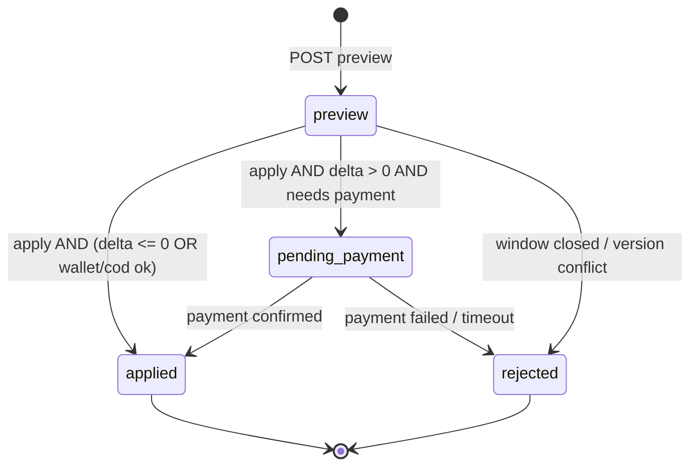

# ERVENOW Live Order™ — Version 2 Architecture

**النوع:** معمارية معتمدة — Core Platform  
**الإصدار:** 2.2  
**التاريخ:** 2026-07-03  
**الحالة:** معتمد للتنفيذ — **لا كود قبل اعتماد LOFS**  
**التحديث:** v2.2 — ERVENOW Naming Standard v1.0  
**التسمية:** [ERVENOW-NAMING-STANDARD-v1.0.md](./ERVENOW-NAMING-STANDARD-v1.0.md)  
**السابق:** Architecture Review v1 (2026-07-02) — [محادثة المراجعة](6c04d616-9c35-4c00-a073-734dec938976)  
**النطاق:** Dynamic Order Management — State-Based Decision

---

## 0. قرار الاعتماد التنفيذي

| البند | القرار |
|-------|--------|
| **اعتماد التقرير الهندسي v1** | نعم — كأساس معماري |
| **موقع الميزة** | **ERVENOW Core Platform** — لجميع الخدمات الحالية والمستقبلية |
| **الاسم التجاري** | **ERVENOW Live Order™** |
| **الاسم الداخلي** | **Live Order Engine** (`shared/domain/live-order-engine/`) |
| **مصدر القرار** | **Service Profiles** + **Capability Engine** + **State-Based Decision** — المؤقت UX فقط |
| **التنفيذ الآن** | لا — بعد اعتماد v2 وإكمال Phase 0 |

> مصطلح **Amendment** يبقى داخلياً لوصف **عملية تعديل واحدة** (`amendments`)، لكن تجربة المستخدم والوثائق العامة تستخدم **Live Order** و«**إدارة الطلب**».

---

## 1. ملخص تنفيذي

**ERVENOW Live Order™** يحوّل الطلب من سجل ثابت بعد الإنشاء إلى **طلب حي** قابل للإدارة حتى **نقطة تشغيل** محددة بالحالة — مع شفافية مالية، موافقة صريحة، وسجل كامل.

### 1.1 الواقع الحالي (Baseline)

| المرحلة | القدرة اليوم | المرجع |
|---------|--------------|--------|
| **قبل الإرسال** | تعديل كامل (بنود، موقع، دفع) | `ErvenowOrderDraft` — `shared/orderDraft/*` |
| **بعد الإرسال** | موعد خدمة / وجهة نقل فقط | `PATCH /api/order/:id/details` — `apps/order/routes.js` |
| **بعد الإرسال** | ❌ لا تعديل بنود · لا إعادة تسعير | — |

### 1.2 ما تضيفه v2

```
Service Type (order_type + service_type)
        ↓
Service Profiles
        ↓
Capability Engine        ← حالة الطلب · Lock Point · overrides شريك/منصة
        ↓
Live Order Engine        ← preview · apply
        ↓
Settlement Engine        ← الفروقات المالية
        ↓
Ledger
```

```
┌────────────────────────────────────────────────────────────────────┐
│  ERVENOW Live Order™                                                │
│                                                                     │
│  [Order] ◄── Profiles + Capability Engine ──► Lock Point           │
│       │              Live Preview ──► موافقة ──► Apply               │
│       └──────────────► delta مالي + إشعارات + سجل                   │
└────────────────────────────────────────────────────────────────────┘
```

### 1.3 بنية موجودة قابلة لإعادة الاستخدام

| القدرة | الملف | دور في Live Order |
|--------|-------|-------------------|
| آلة حالات التوصيل | `shared/utils/deliveryStateMachine.js` | Lock triggers |
| تحديث موجّه | `PATCH /api/order/:id/details` | أساس Phase 1 |
| إشعارات الحقول | `notifyOrderFieldChanges` | نمط للإشعارات |
| بث لحظي | `broadcastOrderPatch` | `live_order:applied` |
| إلغاء + استرجاع | `cancelOrderByCustomer` | نمط delta سالب |
| تسوية نهائية | `deliveredFinancialSettlement.js` | يقرأ الإصدار الأخير |
| توجيه إشعارات | `notificationEvents.js` | Smart Notifications |
| مسودة ما قبل الطلب | `shared/orderDraft/*` | **منفصلة** — لا تدمج |

---

## 2. سياسة التشغيل — State-Based Decision

### 2.1 المبدأ الإلزامي

```text
قرار الإغلاق = f(service_profile, order.delivery_status, order.data.*, capability_override)
المؤقت الظاهر = UX indicator فقط — ليس مصدر قرار

canPerform(order, action, actor) =
  1. profile.allows(action)              -- Service Profiles
  2. capabilityEngine.evaluate(...)    -- حالة + lock + overrides
  3. experienceRules.apply(...)        -- رسائل UX · عتبات (اختياري)
```

| السيناريو | السلوك |
|-----------|--------|
| انتهى العداد · الحالة لم تصل Lock Point | **يبقى التعديل مفتوحاً** |
| وصلت Lock Point · بقي وقت على العداد | **يُغلق فوراً** |
| تغيّرت الحالة أثناء جلسة تعديل | **Live Preview يُعاد حسابه** — Apply مرفوض إن أُغلقت النافذة |

### 2.2 نقطة الإغلاق (Lock Point) — افتراضيات Core

| العمودية | Lock Point الافتراضي | قابل للضبط |
|----------|----------------------|------------|
| مطاعم / متاجر | `ready` أو `picked_up` | per-merchant |
| توصيل عام | `picked_up` | per policy |
| خدمات | `in_progress` (`data.sp_status`) | per provider |
| غاز | `accepted` (مزود) | per policy |
| نقل | `on_the_way` | per policy |

### 2.3 تقدير UX (اختياري)

```javascript
// shared/domain/live-order-engine/liveOrderPolicy.js
predictLiveOrderClose(order) → {
  estimatedAt,      // للعداد — ليس قراراً
  reasonCode,       // merchant:preparing | driver:pickup | ...
  reasonMessageAr   // للواجهة
}
```

---

## 3. Service Profiles & Quantity Model

> **قرار v2.1:** Live Order Engine **لا يعتمد** على حالة الطلب ولا Capability Engine **وحدهما**.  
> كل طلب يُحلّ أولاً إلى **Service Profile** يحدد طبيعة التعديلات المسموحة قبل أي تقييم حالة أو override.

### 3.1 الهدف

```text
إضافة خدمة جديدة = إنشاء Service Profile جديد
                    — دون تعديل جوهري في Live Order Engine
```

ERVENOW منصة موحدة — الملف التعريفي يفصل **خصائص كل خدمة** عن **محرك التعديل الموحّد**.

### 3.2 حل الملف التعريفي (Profile Resolution)

```javascript
// shared/domain/live-order-engine/resolveServiceProfile.js
resolveServiceProfile(order) → ServiceProfile

// أمثلة التعيين
// order_type=restaurant        → profile: restaurant
// order_type=store             → profile: store
// order_type=store + pharmacy  → profile: pharmacy
// order_type=service           → profile: home_service
// order_type=gas_delivery      → profile: gas (+ quantity variant)
// service_type=car_transport   → profile: car_transport
// service_type=internal_delivery → profile: delivery
// (مستقبلاً) meshwar           → profile: meshwar
```

| حقل الطلب | الدور |
|-----------|--------|
| `order_type` | المحور الأساسي |
| `service_type` | تمييز فرعي (غاز · نقل · توصيل داخلي) |
| `portal_type` | مرجع للواجهة — لا يحدد Profile وحده |
| `data.service_profile_key` | override صريح إن وُجد |

### 3.3 مكوّنات Service Profile

كل profile يحدد:

| المكوّن | الوصف |
|---------|--------|
| **editable_fields** | الحقول القابلة للتعديل (`breakdown` · `scheduled_at` · `drop_*` · `data.images`) |
| **allowed_actions** | الإجراءات المسموحة على مستوى الخدمة |
| **lock_points** | نقاط الإغلاق الافتراضية per-status |
| **constraints** | قيود خاصة (صيدلية · POS · فئات محظورة) |
| **pricing_rules** | كيف يُحسب delta (بنود · لترات · أسطوانات · ثابت) |
| **quantity_model** | معنى «الكمية» لهذه الخدمة — §3.5 |
| **ui_actions** | أزرار واجهة «إدارة الطلب» |

### 3.4 جدول مرجعي — Profiles Core (v2.1)

| Profile Key | الخدمة | إضافة | حذف | تعديل الكمية | موقع | موعد | وصف | صور | ملاحظات |
|-------------|--------|:-----:|:---:|:------------:|:----:|:----:|:---:|:---:|---------|
| `restaurant` | 🍴 مطاعم | ✅ | ✅ | ✅ | ✅ | ❌ | ❌ | ❌ | أصناف ووجبات |
| `store` | 🛒 متاجر | ✅ | ✅ | ✅ | ✅ | ❌ | ❌ | ❌ | منتجات |
| `pharmacy` | 💊 صيدليات | ⚠️ | ⚠️ | ⚠️ | ✅ | ❌ | ❌ | ❌ | قيود منتج/وصفة |
| `home_service` | 🔧 خدمات منزلية | ❌ | ❌ | ❌ | ✅ | ✅ | ✅ | ✅ | لا بنود commerce |
| `delivery` | 🚚 توصيل | ❌ | ❌ | ❌ | ✅ | ✅ | ❌ | ❌ | استلام/تسليم حسب الحالة |
| `car_transport` | 🚛 نقل مركبات | ❌ | ❌ | ❌ | ✅ | ✅ | ✅ | ✅ | مركبة وبياناتها |
| `gas` | ⛽ غاز | ✅ | ⚠️ | ✅* | ✅ | ❌ | ❌ | ❌ | أسطوانات · لترات |
| `car_rental`* | 🚗 تأجير | ⚠️ | ❌ | ❌ | ✅ | ✅ | ❌ | ❌ | قبل بدء العقد |

\* `car_rental` — مستقبلاً.  
\* غاز — الكمية = عدد الأسطوانات **أو** عدد اللترات (حسب `gas_variant`).

**رموز:** ✅ مسموح · ❌ غير منطبق/ممنوع · ⚠️ مشروط (قيود profile أو Capability Engine).

### 3.5 Quantity Model

> **لا يوجد مفهوم «كمية» موحّد عبر المنصة.** كل profile يعرّف نموذجه.

```typescript
// مقترح: shared/domain/live-order-engine/quantityModel.js
type QuantityModel =
  | { type: "line_items"; unit: "meal" | "item"; min: 1; max?: number }
  | { type: "cylinders"; unit: "cylinder"; field: "data.cylinder_count" }
  | { type: "liters"; unit: "liter"; field: "data.liter_count" }
  | { type: "none" };
```

| Profile | Quantity Model | أمثلة |
|---------|----------------|-------|
| `restaurant` | `line_items` · unit `meal` | 2 وجبة · 3 أصناف |
| `store` | `line_items` · unit `item` | 5 منتجات |
| `pharmacy` | `line_items` · + `requires_prescription_flag` | ⚠️ بعض الأصناف |
| `gas` (أسطوانة) | `cylinders` | 2 أسطوانة |
| `gas` (تعبئة مركزية) | `liters` | 12 لتر |
| `home_service` | `none` | — |
| `car_transport` | `none` | — |
| `delivery` | `none` | — |

**سلوك `change_qty`:**

```text
1. resolveServiceProfile(order)
2. إن quantity_model.type === "none" → رفض فوري
3. validate ضمن min/max ووحدة profile
4. إعادة تسعير عبر profile.pricing_rules
```

### 3.6 جدول بيانات — Service Profiles

```sql
service_profiles (
  id UUID PK,
  profile_key TEXT UNIQUE NOT NULL,   -- restaurant | store | gas | ...
  display_name_ar TEXT NOT NULL,
  display_name_en TEXT,
  order_types TEXT[] NOT NULL,        -- مطابقة order_type
  service_types TEXT[],               -- مطابقة اختيارية
  allowed_actions JSONB NOT NULL,
  editable_fields JSONB NOT NULL,
  lock_points JSONB NOT NULL,         -- { default: "picked_up", per_status: {...} }
  quantity_model JSONB NOT NULL,
  pricing_rules JSONB NOT NULL,       -- { engine: "line_items" | "gas_meter" | "flat" }
  constraints JSONB DEFAULT '{}',     -- pharmacy_rules, category_blocks, ...
  ui_config JSONB DEFAULT '{}',
  version INT DEFAULT 1,
  active BOOLEAN DEFAULT true,
  created_at TIMESTAMPTZ,
  updated_at TIMESTAMPTZ
)
```

**بذور Phase 0:** إدراج الـ 8 profiles من §3.4 — قراءة فقط من الكود؛ التعديل عبر Admin (Phase 5).

### 3.7 تقييم الحالة (داخل Capability Engine)

```javascript
// shared/domain/live-order-engine/capability-engine.js
evaluateState(order, profile, action) → {
  allowed: boolean,
  reasonCode: string,
  lockAt: string | null
}
```

| المدخل | المصدر |
|--------|--------|
| هل الإجراء في `profile.allowed_actions`? | Service Profile |
| هل الحالة تجاوزت `profile.lock_points`? | Fulfillment FSM |
| Smart Lock (Phase 6) | `profile.constraints` + `lock_rules` |

### 3.8 API

| Method | Path | Phase | الغرض |
|--------|------|-------|--------|
| GET | `/api/admin/service-profiles` | 0 | قائمة profiles |
| GET | `/api/admin/service-profiles/{key}` | 0 | تفاصيل profile |
| PUT | `/api/admin/service-profiles/{key}` | 5 | تحديث (Admin) |
| GET | `/api/orders/{id}/service-profile` | 1 | profile الفعّال للطلب |

### 3.9 إضافة خدمة مستقبلية (مثال: Meshwar)

```text
1. INSERT service_profiles (profile_key: meshwar, ...)
2. ربط order_type / service_type في resolveServiceProfile
3. (اختياري) capability_rules override per partner
4. لا تغيير في Live Order Engine core
```

---

## 4. Capability Engine — طبقة مستقلة

> **Phase 5** — لكن **schemaها يُعرَّف في Phase 0**.  
> Capability Engine = تقييم الإمكانيات (حالة الطلب · Lock Point · Smart Lock) + **overrides** الشريك — فوق Service Profiles.

### 4.1 الفصل المعماري

```
┌─────────────────────────┐
│  Service Profiles       │  ← نوع الخدمة · Quantity · Pricing · Lock defaults
└───────────┬─────────────┘
            ▼
┌─────────────────────────┐
│  Capability Engine      │  ← حالة · lock · capability_rules overrides
└───────────┬─────────────┘
            │ canPerform(order, action, actor)
            ▼
┌─────────────────────────┐
│  Live Order Engine      │  ← preview · apply
└───────────┬─────────────┘
            ▼
┌─────────────────────────┐
│  Settlement Engine      │  ← الفروقات المالية
└───────────┬─────────────┘
            ▼
┌─────────────────────────┐
│  Fulfillment FSM        │  ← delivery_status
└─────────────────────────┘
```

### 4.2 نموذج الإمكانيات — طبقة Override

الإمكانيات **الافتراضية** تأتي من **Service Profiles** (§3.4).  
Capability Engine يضيف/يقيّد فوقها:

| Scope | مثال |
|-------|------|
| `merchant_id` | مطعم يغلق عند `preparing` بدل `ready` |
| `provider_id` | مزود غاز يرفض حذف أسطوانة |
| `platform` | حد `max_amendments` عام |

**لا تُكرَّر** تعريف `add_item` / `change_schedule` هنا — تُورث من profile ما لم يُoverride.

### 4.3 مستويات السياسة (Scope)

```text
service_profiles (Core — §3)
  └── capability_rules (override)
        └── scope: platform | merchant_id | provider_id
              └── Smart Lock lock_rules (Phase 6)
  └── experience_rules (رسائل · UX)
```

### 4.4 جداول مقترحة

```sql
capability_rules (
  id UUID PK,
  profile_key TEXT,                 -- FK منطقي → service_profiles
  scope_type TEXT NOT NULL,         -- platform | merchant_id | provider_id
  scope_id TEXT,
  allowed_actions JSONB,            -- null = inherit profile; array = override
  lock_at_status TEXT,
  lock_rules JSONB,             -- Smart Lock rules (Phase 6)
  max_amendments INT,
  max_add_amount NUMERIC,
  requires_merchant_approval BOOLEAN DEFAULT false,
  active BOOLEAN DEFAULT true,
  updated_by UUID,
  updated_at TIMESTAMPTZ
)

experience_rules (
  id UUID PK,
  profile_key TEXT,
  rule_key TEXT NOT NULL,
  rule_value JSONB NOT NULL,
  active BOOLEAN DEFAULT true,
  updated_at TIMESTAMPTZ
)
```

### 4.5 API إدارة (Admin)

| Method | Path | الغرض |
|--------|------|--------|
| GET | `/api/admin/capability-rules` | قائمة + فلاتر |
| PUT | `/api/admin/capability-rules/:id` | تحديث |
| POST | `/api/admin/capability-rules` | override جديد |
| GET | `/api/admin/capability-rules/effective/{orderId}` | ما يُطبَّق على طلب |
| GET/PUT | `/api/admin/experience-rules` | قواعد تجربة المستخدم |

### 4.6 دالة مركزية

```javascript
// shared/domain/live-order-engine/capability-engine.js
canPerform(order, action, actor) → {
  profile: ServiceProfile,
  allowed: boolean,
  reasonCode: string,
  reasonMessageAr: string,
  lockAt: string | null,
  source: "profile" | "capability" | "capability_override" | "denied"
}

// 1. resolveServiceProfile(order)
// 2. profile.allows(action)
// 3. capabilityEngine.evaluateState(order, profile, action)
// 4. capabilityEngine.resolveOverride(order, action, actor)
```

---

## 5. Live Preview — موافقة قبل التطبيق

> **إلزامي لكل تعديل** — لا Apply بدون Preview + Confirm.

### 5.1 تدفق UX

```text
1. العميل يختار إجراء (حذف / إضافة / موقع / …)
2. POST /api/orders/{id}/amendments/preview  →  diff + financial_delta
3. واجهة «قبل / بعد» + رسالة مالية
4. العميل يؤكد
5. POST /api/orders/{id}/amendments/apply     →  idempotency_key
```

### 5.2 نموذج الاستجابة (Preview)

```json
{
  "preview_id": "uuid",
  "expires_at": "2026-07-02T12:05:00Z",
  "before": { "total": 95.00, "breakdown_summary": "…" },
  "after":  { "total": 78.00, "breakdown_summary": "…" },
  "financial": {
    "delta": -17.00,
    "direction": "credit_wallet",
    "message_ar": "سيتم تحويل 17 ريال إلى محفظتك."
  },
  "payment_required": false,
  "window_open": true,
  "lock_reason": null
}
```

### 5.3 رسائل مالية معيارية

| delta | direction | message_ar (قالب) |
|-------|-----------|-------------------|
| `< 0` | `credit_wallet` | سيتم تحويل **{amount}** ريال إلى محفظتك. |
| `> 0` | `charge_wallet` | سيتم تحصيل **{amount}** ريال كمبلغ إضافي. |
| `> 0` | `charge_cod` | سيُضاف **{amount}** ريال إلى المبلغ المستحق عند التسليم. |
| `> 0` | `payment_session` | سيتم فتح جلسة دفع بقيمة **{amount}** ريال. |
| `= 0` | `none` | لا يوجد فرق مالي — سيتم تطبيق التعديل مباشرة. |

### 5.4 قواعد Apply

- `preview_id` صالح ≤ **5 دقائق** (TTL تقني — ليس Lock Point).
- إذا تغيّرت `delivery_status` أو `amendment_version` بين Preview و Apply → **409 Conflict** + إعادة Preview.
- إذا `delta > 0` وفشل الدفع → amendment `pending_payment` — **لا** تعديل على `breakdown`.

---

## 6. Smart Lock — إغلاق جزئي (Phase 6)

> **لا يُنفَّذ في Phases 0–5.** يُصمَّم schema `lock_rules` الآن لتجنب migration كاسر.

### 6.1 المفهوم

الإغلاق **ليس دائماً للطلب بالكامل**. يمكن قفل **أجزاء** حسب حالة التشغيل وسياسة الشريك.

**مثال (مطعم):**

```text
بدأ تجهيز «كبسة» → remove_item(كبسة) = LOCKED
                    → add_item(مشروبات, سلطات, حلويات) = ALLOWED
```

### 6.2 نموذج lock_rules (JSONB)

```json
{
  "rules": [
    {
      "when_status": "preparing",
      "when_items_in_status": ["preparing"],
      "lock_actions_on": ["remove_item", "change_qty"],
      "lock_item_ids": ["line-uuid-1"],
      "allow_actions": ["add_item"],
      "allow_categories": ["beverages", "salads", "desserts"]
    }
  ]
}
```

### 6.3 متطلبات Phase 6

- تتبع حالة **البند** (`line_status`) في `breakdown` أو جدول `order_line_items`.
- Merchant Portal: تحديث `preparing` per line (أو تكامل مطبخ).
- Capability Engine يقيّم Smart Lock قبل Live Preview.

---

## 7. سجل التعديلات — Amendment History

### 7.1 للعميل — صفحة «سجل التعديلات»

**المسار:** `/my-orders/:id/amendments` (أو تبويب داخل تفاصيل الطلب)

| العمود | المحتوى |
|--------|---------|
| وقت التعديل | `applied_at` |
| النوع | إضافة / حذف / كمية / موقع / … |
| قبل / بعد | ملخص قابل للقراءة |
| الفرق المالي | delta + اتجاه |
| حالة السداد | `paid` · `credited` · `pending` · `cod_outstanding` |

### 7.2 للإدارة — سجل تفصيلي

- Timeline كامل في `admin/modules/orders.js` → تبويب **Live Order**
- payload JSONB قبل/بعد
- `actor`, `idempotency_key`, ledger refs
- Force lock/unlock مع `ervenow_audit_events`

### 7.3 جداول البيانات

```sql
-- سجل append-only
amendments (
  id UUID PK,
  order_id UUID FK → orders NOT NULL,
  amendment_number INT NOT NULL,
  amendment_type TEXT NOT NULL,
  payload JSONB NOT NULL,           -- before/after diff
  financial_delta NUMERIC NOT NULL DEFAULT 0,
  financial_direction TEXT,         -- credit_wallet | charge_wallet | cod | none
  payment_status TEXT,              -- paid | pending | failed | credited | n/a
  status TEXT NOT NULL,             -- preview | pending_payment | applied | rejected | rolled_back
  requested_by UUID,
  preview_id UUID,
  idempotency_key TEXT UNIQUE,
  lock_reason_at_apply TEXT,
  applied_at TIMESTAMPTZ,
  created_at TIMESTAMPTZ DEFAULT now()
)

amendment_snapshots (
  id UUID PK,
  order_id UUID FK,
  amendment_id UUID FK,
  version INT,
  breakdown JSONB,
  order_total NUMERIC,
  delivery_fee NUMERIC,
  vat_amount NUMERIC,
  total_with_vat NUMERIC,
  created_at TIMESTAMPTZ
)
```

### 7.4 أعمدة إضافية على `orders`

| عمود | الغرض |
|------|--------|
| `amendment_version INT DEFAULT 1` | Optimistic concurrency |
| `amendment_locked_at TIMESTAMPTZ` | وقت الإغلاق |
| `amendment_lock_reason TEXT` | `status:ready` · `driver:pickup` · … |
| `last_amendment_at TIMESTAMPTZ` | للواجهات |
| `amendment_count INT DEFAULT 0` | حدود السياسة |

---

## 8. الإشعارات الذكية — Smart Notifications

> **لا تصل جميع التعديلات لجميع الأطراف.** كل طرف يستقبل ما يخصه فقط.

### 8.1 مصفوفة التوجيه

| الحدث | العميل | التاجر | المندوب | الإدارة |
|-------|:------:|:------:|:-------:|:-------:|
| `live_order.applied` (نجاح) | ✅ | — | — | — |
| `live_order.financial` (delta ≠ 0) | ✅ | — | — | ✅ |
| `live_order.items_changed` | ✅ ملخص | ✅ تفصيل | — | — |
| `live_order.destination_changed` | ✅ | ⚠️ إن relevant | ✅ | — |
| `live_order.schedule_changed` | ✅ | — | — | — |
| `live_order.locked` | ✅ + سبب | ✅ | ⚠️ | — |
| `live_order.exception` | ✅ | ✅ | ✅ | ✅ |
| `live_order.manual_override` | ✅ | ✅ | ✅ | ✅ |

### 8.2 أحداث جديدة في `notificationEvents.js`

```javascript
"customer.live_order.applied":     { target_portal: "customer", … },
"customer.live_order.financial":   { target_portal: "customer", … },
"merchant.live_order.items":       { target_portal: "merchant", … },
"driver.live_order.destination":   { target_portal: "driver", … },
"admin.live_order.financial":      { target_portal: "admin", … },
"admin.live_order.exception":      { target_portal: "admin", … },
```

### 8.3 محتوى الإشعار (أمثلة)

| الطرف | عنوان | body |
|-------|-------|------|
| **عميل** | تم تعديل طلبك | الإجمالي الجديد **{total}** ر.س · {payment_message} |
| **تاجر** | تحديث على طلب #{n} | {added/removed summary} · الإجمالي **{total}** |
| **مندوب** | تغيير موقع التسليم | {address} — راجع الخريطة |
| **إدارة** | تعديل مالي استثنائي | delta **{delta}** · طلب #{n} |

---

## 9. رسائل الإغلاق — Closure Messages

> عند انتهاء إمكانية التعديل: **رسالة سببية** — ليس «التعديل مغلق» فقط.

### 9.1 فهرس reasonCode → message_ar

| reasonCode | message_ar |
|------------|------------|
| `merchant:preparing` | بدأ المطعم تجهيز طلبك، لذلك لم يعد بالإمكان تعديل الأصناف. |
| `merchant:ready` | طلبك جاهز للتسليم — التعديل على الأصناف مغلق. |
| `driver:pickup` | استلم المندوب الطلب، ويمكنك الآن متابعة رحلة التوصيل. |
| `driver:delivering` | المندوب في الطريق إليك — يمكنك متابعة التوصيل فقط. |
| `service:in_progress` | بدأ تنفيذ الخدمة — بعض التعديلات لم تعد متاحة. |
| `provider:accepted` | قبل مزود الخدمة طلبك — التعديل محدود حسب السياسة. |
| `payment:pending` | يوجد تعديل بانتظار الدفع — أكمل الدفع أو ألغِ التعديل. |
| `policy:max_amendments` | وصلت للحد الأقصى من التعديلات على هذا الطلب. |
| `external:pos_locked` | هذا الطلب مرتبط بنظام خارجي — التعديل غير متاح. |
| `admin:force_lock` | تم إغلاق التعديل من الدعم — تواصل معنا للمساعدة. |

### 9.2 API للواجهة

```javascript
GET /api/orders/{id}/capabilities → {
  window_open: boolean,
  available_actions: string[],
  reasonCode: string | null,
  reasonMessageAr: string,
  estimatedCloseAt: string | null,  // UX only
  amendment_count: number
}
```

---

## 10. آلة الحالات — State Machine

### 10.1 طبقتان منفصلتان

```
┌──────────────────────┐     ┌──────────────────────────┐
│  Fulfillment FSM     │     │  Live Order FSM          │
│  (delivery_status)   │     │  (per amendment)         │
├──────────────────────┤     ├──────────────────────────┤
│ draft → pending →    │     │ preview → pending_pay →  │
│ accepted → preparing │────►│ applied                  │
│ → ready → picked_up  │     │         ↘ rejected       │
│ → delivering →       │     └──────────────────────────┘
│ delivered            │              ▲
└──────────────────────┘              │
         │              Service Profiles → Capability Engine
         └──────────────────────────┘
              on each status change → maybe lockLiveOrder()
```

### 10.2 Live Order FSM (amendment واحد)



### 10.3 ربط Fulfillment → Lock

| حدث Fulfillment | إجراء Live Order |
|-----------------|------------------|
| `preparing` (policy) | `lockLiveOrder(order, 'merchant:preparing')` |
| `ready` | `lockLiveOrder(order, 'merchant:ready')` |
| `picked_up` | `lockLiveOrder(order, 'driver:pickup')` — Core default |
| `delivering` | partial lock — destination only if policy |
| `delivered` | terminal |
| `cancelled_*` | reject pending amendments |

---

## 11. التأثير على الأنظمة

### 11.1 قاعدة البيانات

**Prerequisites (Phase 0):**

1. إصلاح CHECK constraint لـ `delivery_status` — إضافة `preparing`, `ready`, `picked_up`.
2. خطة توحيد `status` ← `delivery_status` — `docs/order-lifecycle.md`.
3. إنشاء جداول §7.3 + `service_profiles` §3.6 + `capability_rules` §4.4.
4. بذور Service Profiles (§3.4) — 8 profiles Core.
5. `orders.service_profile_key` (اختياري — cache للحل السريع).

### 11.2 المحافظ — Settlement Engine (Phase 4)

```
عند apply (delta ≠ 0):

  delta = new_total - old_total

  if delta > 0:
    wallet/ew_pay  → debit_customer_wallet(delta)     [RPC ذري]
    cod            → record_cod_outstanding(delta)
    card/gateway   → create_payment_session(delta)

  if delta < 0:
    credit_customer_wallet(abs(delta))

  // تسوية تاجر/مندوب/منصة → تبقى عند delivered على الإجمالي النهائي
```

| المبدأ | التفصيل |
|--------|---------|
| لا تعديل صامت لـ `order_total` | كل تغيير = `amendments` + ledger entry |
| Idempotency | `idempotency_key` إلزامي على apply |
| مسار مالي واحد | ledger RPCs — لا `wallet-server.js` |
| فشل الدفع | amendment `pending_payment` — breakdown unchanged |

### 11.3 الشريك التجاري

- إشعار `merchant.live_order.items` عند تغيير البنود
- تحديث `merchant-order-workflow.js` — Phase 2+
- إعدادات per-merchant عبر Capability Engine (Admin)
- POS / `external_order_id`: تعطيل Live Order أو queue مزامنة

### 11.4 المندوب

- إشعار عند `change_destination` فقط (Smart Notifications)
- `drop_lat/lng` → `broadcastOrderPatch` + إعادة OSRM
- `driver_earning` على الإصدار النهائي عند `delivered`

### 11.5 لوحة الإدارة

| قسم | Phase |
|-----|-------|
| Live Order timeline في تفاصيل الطلب | 2 |
| CRUD Capability Engine | 5 |
| Force lock/unlock + audit | 5 |
| تقارير: نسبة التعديل · avg delta · فشل دفع | 7 |

---

## 12. API Surface (Core)

> **لا تعديل على `POST /api/order/create` أو checkout flow.**

| Method | Path | Phase | الغرض |
|--------|------|-------|--------|
| GET | `/api/orders/{id}/service-profile` | 0 | Service Profile الفعّال |
| GET | `/api/orders/{id}/capabilities` | 1 | حالة النافذة + actions + رسالة إغلاق |
| POST | `/api/orders/{id}/amendments/preview` | 1+ | Live Preview |
| POST | `/api/orders/{id}/amendments/apply` | 1+ | تطبيق بعد موافقة |
| GET | `/api/orders/{id}/amendments` | 2 | سجل التعديلات (عميل) |
| GET | `/api/orders/{id}/settlements` | 4 | الفروقات المالية |
| GET | `/api/admin/orders/{id}/amendments` | 2 | سجل تفصيلي |
| GET/PUT | `/api/admin/service-profiles` | 0/5 | Service Profiles |
| CRUD | `/api/admin/capability-rules` | 5 | Capability overrides |

> **توافق خلفي (Phase 1):** المسارات الحالية `PATCH /api/order/:id/details` و`GET /api/order/:id` تبقى وتُوجَّه داخلياً إلى Live Order Engine.

---

## 13. مخاطر ومعالجتها

| # | الخطر | المعالجة |
|---|-------|----------|
| 1 | Race: تاجر يجهّز + عميل يحذف | `amendment_version` + reject 409 |
| 2 | Apply بدون Preview | API يرفض — preview_id إلزامي |
| 3 | فشل خصم محفظة | `pending_payment` — no breakdown change |
| 4 | triple wallet stack | ledger path واحد + feature flag |
| 5 | DB constraint drift | Phase 0 migration |
| 6 | إساءة (add/remove loop) | max_amendments + cooldown |
| 7 | POS خارجي | `external:pos_locked` |
| 8 | Smart Lock complexity | Phase 6 مع line_status |
| 9 | ازدواجية status fields | Phase 0 توحيد |
| 10 | profile غير معروف لـ order_type جديد | fallback `denied` + alert Admin · إلزامية تعريف profile قبل الإطلاق |

---

## 14. خطة التنفيذ — Phases 0–7

> **مستقلة ومتسلسلة** — كل Phase قابلة للإطلاق دون كسر السابق.

### Phase 0 — تهيئة البنية التحتية (2–3 أسابيع)

**لا تغيير سلوك المستخدم**

- [ ] Migration `delivery_status` CHECK
- [ ] جداول: `service_profiles`, `amendments`, `amendment_snapshots`, `capability_rules`, `experience_rules`, `settlements`
- [ ] بذور §3.4 — 8 Service Profiles
- [ ] أعمدة `orders`: `amendment_version` · `amendment_locked_at` · `service_profile_key`
- [ ] `shared/domain/live-order-engine/` — service-profiles, capability-engine, live-order-engine, settlement-engine, experience-rules (stubs + tests)
- [ ] Feature flag: `ERVENOW_LIVE_ORDER=0`
- [ ] ADR + OpenAPI spec للمسارات §12

### Phase 1 — تغيير موقع التسليم (2–3 أسابيع)

- [ ] `POST preview/apply` لـ `change_destination`
- [ ] إعادة تسعير `delivery_fee` (OSRM)
- [ ] Lock عند `picked_up` (Core default)
- [ ] واجهة: «إدارة الطلب» → موقع فقط
- [ ] `GET /api/orders/{id}/capabilities` + رسائل إغلاق §9
- [ ] إشعار مندوب: `driver.live_order.destination`
- [ ] Legacy: `PATCH /details` → Live Order bridge

### Phase 2 — حذف الأصناف (3–4 أسابيع)

- [ ] `remove_item` · `change_qty` (decrease)
- [ ] delta سالب → محفظة
- [ ] صفحة عميل: **سجل التعديلات**
- [ ] Admin amendment timeline
- [ ] إشعارات: `merchant.live_order.items`, `customer.live_order.financial`

### Phase 3 — إضافة الأصناف (3–4 أسابيع)

- [ ] `add_item` + quote من كتالوج المتجر
- [ ] delta موجب → wallet / COD / payment session
- [ ] Live Preview إلزامي §5
- [ ] تحديث merchant dashboard

### Phase 4 — Settlement Engine (2–3 أسابيع)

- [ ] `settlements` table + RPCs
- [ ] RPCs: debit/credit/refund/cod_outstanding
- [ ] إعادة hold Ervenow Pay
- [ ] Admin: `admin.live_order.financial`
- [ ] reconciliation reports

### Phase 5 — Capability Engine (2–3 أسابيع)

- [ ] Admin CRUD `/api/admin/capability-rules` + `experience-rules`
- [ ] Effective capability resolver
- [ ] per-merchant / per-order_type overrides
- [ ] Force lock/unlock + audit
- [ ] ربط كامل بـ `canPerform()` قبل كل preview

### Phase 6 — Smart Lock (4–6 أسابيع)

- [ ] `line_status` في breakdown أو `order_line_items`
- [ ] `lock_rules` JSONB evaluation
- [ ] Merchant: preparing per line
- [ ] Partial lock UX — «يمكنك إضافة مشروبات فقط»

### Phase 7 — الاعتماد النهائي (مستمر)

- [ ] تفعيل جميع العموديات: gas · service · transport · LPG
- [ ] POS sync strategy
- [ ] Payment gateway للفرق
- [ ] `ERVENOW_LIVE_ORDER=1` افتراضياً
- [ ] تحديث `docs/SOURCE-OF-TRUTH.md`
- [ ] Production certification checklist

### مبدأ التوافق الخلفي

```text
كل الطلبات الحالية ← تعمل بدون تغيير
Live Order ← opt-in: feature flag → order_type → merchant
API جديد فقط — لا تعديل create/checkout
```

---

## 15. الهدف النهائي

لا نريد مجرد «تعديل طلب». نريد **نظاماً يجعل الطلب حياً** حتى نقطة التشغيل الفعلية، مع المحافظة على حقوق:

| الطرف | الحق المحفوظ |
|-------|---------------|
| **العميل** | Live Preview · موافقة · استرداد تلقائي · سجل شفاف |
| **الشريك** | سياسات قابلة للضبط · إشعار بما يخصه · Smart Lock |
| **المندوب** | إشعار بالتغييرات المؤثرة على الرحلة فقط |
| **مزود الخدمة** | صلاحيات موعد/وصف/إضافات |
| **المنصة** | ledger موحّد · audit · admin override |

> **تجربة التعديل:** بسيطة · عادلة · شفافة · تسويات مالية تلقائية وآمنة.

---

## 16. diff v1 → v2 → v2.1

| البند | v1 | v2 |
|-------|----|----|
| الاسم الداخلي | Order Amendment Engine | **Live Order Engine** |
| Capability Engine | ضمن `amendment_policies` | **طبقة مستقلة** + Admin CRUD (Phase 5) |
| Live Preview | «اقتراح» | **إلزامي** قبل Apply |
| Smart Lock | غير مذكور | **Phase 6** — partial lock |
| سجل التعديلات | Admin timeline | **صفحة عميل** + Admin تفصيلي |
| الإشعارات | نمط عام | **Smart Notifications** — مصفوفة §7 |
| رسائل الإغلاق | مختصرة | **فهرس reasonCode** §8 |
| خطة Phases | 0–4 + hardening | **0–7** حسب التوجيه التنفيذي |

**v2.2 إضافات (Naming Standard v1.0):**

| البند | v2.1 | v2.2 |
|-------|------|------|
| **Permission Engine** | مستخدم | **Capability Engine** |
| **Business Rules** | طبقة منفصلة | داخل **Capability Engine** |
| **تسوية مالية** | Ledger مباشر | **Settlement Engine** |
| **جداول** | `live_order_*` | `service_profiles` · `amendments` · `settlements` |
| **APIs** | `/live-order/...` | `/api/orders/{id}/...` (resource-based) |
| **ملفات** | `liveOrder/` | `live-order-engine/` |

**v2.1 إضافات:**

| البند | v2.0 | v2.1 |
|-------|------|------|
| **Service Profiles** | ضمن order_type | **طبقة مستقلة** §3 + `service_profiles` |
| **Quantity Model** | `change_qty` موحّد | **per-profile** — line_items · cylinders · liters · none |
| **Capability Engine** | ضمن order_type | **طبقة مستقلة** + `capability_rules` |
| **Quantity Model** | `change_qty` موحّد | **per-profile** |
| **خدمة جديدة** | تعديل Engine | **profile جديد فقط** §3.9 |

---

## 17. مستندات مرتبطة

| المستند | العلاقة |
|---------|---------|
| [ERVENOW-NAMING-STANDARD-v1.0.md](./ERVENOW-NAMING-STANDARD-v1.0.md) | **معيار التسمية الرسمي** |
| [ERVENOW-LIVE-ORDER-LOFS.md](./ERVENOW-LIVE-ORDER-LOFS.md) | **المواصفات الوظيفية** |
| [order-lifecycle.md](./order-lifecycle.md) | Fulfillment FSM |
| [wallet-system.md](./wallet-system.md) | Phase 4 مالي |
| [architecture.md](./architecture.md) | طبقات Core |
| [SOURCE-OF-TRUTH.md](./SOURCE-OF-TRUTH.md) | يُحدَّث Phase 7 |
| [ERVENOW-3.0-EXPERIENCE-ENGINEERING-DIRECTIVE.md](./ERVENOW-3.0-EXPERIENCE-ENGINEERING-DIRECTIVE.md) | Living Experience |
| [notificationEvents.js](../shared/services/notificationEvents.js) | Smart Notifications |

---

## 18. قرار الاعتماد

| البند | v2.1 |
|-------|------|
| **اعتماد كـ Core Platform** | ✅ **ERVENOW Live Order™** |
| **Service Profiles** | ✅ إلزامي — Phase 0 (schema + seeds) |
| **Quantity Model** | ✅ per-profile — §3.5 |
| **Capability Engine** | ✅ Phase 5 (`capability_rules` + `experience_rules`) |
| **Settlement Engine** | ✅ Phase 4 |
| **State-Based Decision** | ✅ داخل Capability Engine |
| **مؤقت زمني** | UX فقط |
| **Live Preview** | ✅ إلزامي |
| **Smart Lock** | ✅ Phase 6 |
| **بدء التنفيذ** | Phase 0 بعد اعتماد LOFS (محدّث لـ v2.1) |

---

**الخطوة التالية (بعد اعتماد LOFS):** [ERVENOW-LIVE-ORDER-LOFS.md](./ERVENOW-LIVE-ORDER-LOFS.md) → ADR-001 → OpenAPI → Phase 0.
