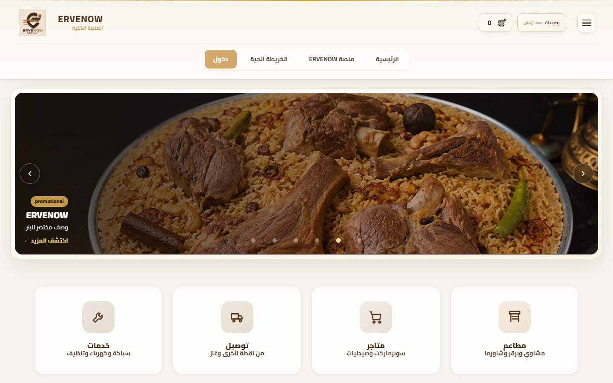
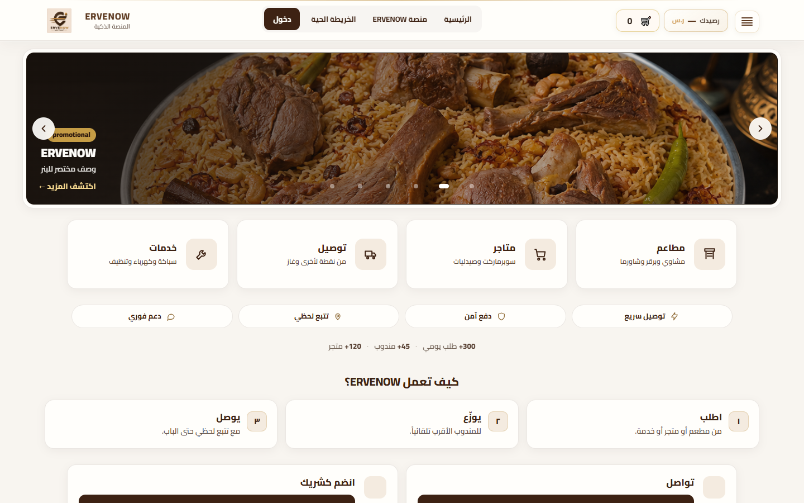

# ERVENOW — Desktop VIP Update

**التاريخ:** 2026-09-04  
**النطاق:** Frontend Styling / Layout فقط  
**الأساس:** `docs/ERVENOW_HOME_VIP_AUDIT.md`  
**الشاشات:** `docs/audit-assets/home-desktop-vip-2026-09-04/`

لا حذف مكوّنات. لا Backend. لا APIs. لا Routes. لا Business Logic.

---

## الملفات المعدّلة

| ملف | نوع التغيير |
|---|---|
| `public/assets/home-desktop-vip.css` | **جديد** — كل تنسيق VIP معزول بـ `html:not(.erv-mobile-shell)` |
| `public/index.html` | رابط stylesheet فقط بعد `home-stage-expand.css` |
| `ervenow-frontend/assets/home-desktop-vip.css` | نسخة مطابقة للنشر |
| `ervenow-frontend/index.html` | نفس رابط الـ CSS |

لم يُمس: HTML الهيكل، JS، `server/`، `apps/`، Marketing Studio schema، الشريط السفلي، `mobile-foundation.js`.

---

## تغييرات Desktop (1025px+)

### Header

- صفّان (ارتفاع **187px**) أصبحت **صفاً واحداً (73px)** عبر `display: contents` على `.lp-header__top-row` دون حذف عناصر DOM.
- الترتيب الأفقي: شعار → اسم المنصة → روابط الناف (الرئيسية · منصة ERVENOW · الخريطة الحية · دخول) → سلة / محفظة / حساب → قائمة ☰.
- الشعار `max-height: 44px` بدل 64px.
- زر الدخول موحّد كلون أساسي داكن (`#3d2213`) بدل تدرج ذهبي ثقيل.
- **لم يُحذف أي رابط.** الروابط في الناف وفي الهامبرغر كما هي.

### Banner

- الارتفاع: **~380–402px → 258–272px** (سقف 300px / 32vh).
- النسبة `2.8 / 1` بدل إجبار `21/9` مع `min-height` سينمائي.
- إطار أخف: حشوة 6px، ظل أخف، زوايا 20/14.
- الأسهم 40px بيضاء أوضح. النقطة النشطة شريط صغير بدل دائرة فقط.
- المصدر الديناميكي كما هو: `GET /api/core/banners?target=home`. لا تغيير Marketing Studio.

### بطاقات الخدمات

- 4 بطاقات متساوية في صف واحد.
- تخطيط أفقي (أيقونة + عنوان + وصف) بدل بطاقة عمودية ضخمة (`min-height` 188–208 → **120–124px**).
- أيقونة 56px، نصف قطر 16px، حد `rgba(61,34,19,.10)`، ظل خفيف، hover رفع 3px مع حد ذهبي.
- نفس الروابط: `/restaurants` · `/stores` · `/delivery-services.html` · `/services`.

### نظام البطاقات والألوان

| التوكين | القيمة |
|---|---|
| حبر | `#3d2213` |
| ذهبي | `#b9872f` (حدود hover وشريط الهيدر) |
| خلفية | `#f6f1e9` مسطحة بدل تدرج طويل |
| بطاقة | `#fffefb` |
| نصف قطر موحّد | 16px البطاقات · 12px الأزرار |
| ظل | `0 4px 16px rgba(45,26,14,.055)` |

Trust / How it works / Join تستخدم نفس الحدود والظل. Trust بلا صندوق خارجي ثقيل. أزرار Primary: بني داكن، ارتفاع 44px، بدون تدرج نيون.

### المسافات والعرض

- محتوى البطاقات `max-width: 1280px` (1320 عند 1920).
- الهيدر/البنر حتى 1360–1400.
- قسم How: padding علوي 28px بدل 48–72px.
- ارتفاع الصفحة 1440: **1824 → 1215px** — إيقاع أضيق دون فراغ مبالغ.

الخدمات + الثقة + الإحصائيات + «كيف تعمل» أصبحت داخل الطية على 1440×900.

---

## تغييرات Tablet (641–1024)

ضبط Responsive فقط — ليست إعادة تصميم:

- هيدر **88 → 84px**.
- بنر 768: **315 → 302px** · 1024: **302 → 268px**.
- Hub يبقى **4 أعمدة** على 768 و 1024 (ارتفاع البطاقات 148 → 136).
- بطاقتا التواصل/الشراكة تُجبران على عمودين لتفادي شبكة 3 فارغة موروثة.
- `min-width: 0` لمنع overflow.

الناف الأفقي يبقى مخفياً على التابلت كما كان (الوصول عبر ☰).

---

## تأكيد أن Mobile لم يتضرر

كل قواعد VIP داخل `html:not(.erv-mobile-shell)` و/أو `min-width: 1025px` / `641–1024`.

قياس الجوال **قبل = بعد** (نفس الجلسة المحلية):

| المقياس | 390 قبل | 390 بعد | 430 بعد | 375 بعد |
|---|---|---|---|---|
| هيدر | 93 | **93** | 93 | 93 |
| بنر | 202 | **202** | 222 | 194 |
| Hub 2×2 | 216 @ y=345 | **216 @ y=345** | 220 @ y=366 | 216 @ y=336 |
| Bottom nav | 97 @ y=737 | **97 @ y=737** | 97 @ y=825 | 97 @ y=705 |
| ارتفاع المستند | 1914 | **1914** | 1943 | 1903 |
| `erv-mobile-shell` + FAB | نعم | نعم | نعم | نعم |

لم يُغيَّر: ترتيب الجوال، الشريط السفلي، FAB، إخفاء السلة في هيدر الجوال (سلوك معتمد سابقاً)، بطاقات 2×2 العمودية.

---

## Screenshots

المجلد: `docs/audit-assets/home-desktop-vip-2026-09-04/`

### Before / After — Above the Fold

| الجهاز | قبل | بعد |
|---|---|---|
| Desktop 1440 |  |  |
| Desktop 1280 | `desktop-1280-atf-before.png` | `desktop-1280-after-atf.png` |
| Tablet 768 | `tablet-768-atf-before.png` | `tablet-768-after-atf.png` |
| Mobile 390 | `mobile-390-atf-before.png` | `mobile-390-after-atf.png` |

### Full Page

| الجهاز | قبل | بعد |
|---|---|---|
| 1440 | `desktop-1440-full-before.png` | `desktop-1440-after-full.png` |
| 1280 | `desktop-1280-full-before.png` | `desktop-1280-after-full.png` |
| 768 | `tablet-768-full-before.png` | `tablet-768-after-full.png` |
| 390 | `mobile-390-full-before.png` | `mobile-390-after-full.png` |

قياسات بعد التنفيذ: `after-metrics.json`.

---

## Regression tests

تحقق يدوي بعد التنفيذ (ضيف، localhost:4000):

- [x] Desktop 1440 / 1280: هيدر صف واحد، كل روابط الناف ظاهرة، ☰ يفتح القائمة.
- [x] السلة `#indexDraftBadge` → `/checkout`.
- [x] دخول → `/login?role=customer`.
- [x] منصة ERVENOW → `/dashboard`.
- [x] الخريطة الحية في الناف (بعد `paintIndexNav`).
- [x] بطاقات Hub الأربع بنفس الـ href.
- [x] بنر العروض ما زال يتحرّك ويُجلب من API.
- [x] Trust + Stats + How + واتساب + سجّل متجرك + فوتر قانوني/اجتماعي موجودة.
- [x] Tablet 768/1024: 4 بطاقات، لا تداخل، لا bottom nav.
- [x] Mobile 375/390/430: نفس الهيدر 93px، نفس Hub 2×2، نفس الشريط السفلي + FAB.
- [ ] جلسة مسجّلة (حسابي / محفظة / طلباتي) — لم تُختبر هنا (تتطلب توكن). المنطق لم يُلمس.
- [ ] نقر بنر impression/click — مسار API لم يُغيَّر.

---

## ما لم يُنفَّذ (خارج هذه المرحلة)

- نقل البنر تحت الخدمات (كان مقترحاً في التدقيق؛ هذه المرحلة تحسين بصري مع بقاء الترتيب).
- Location / Search جديدان.
- إظهار السلة على هيدر الجوال.
- أي تغيير Backend.

**STOP.** لا مرحلة تالية حتى طلب جديد.
