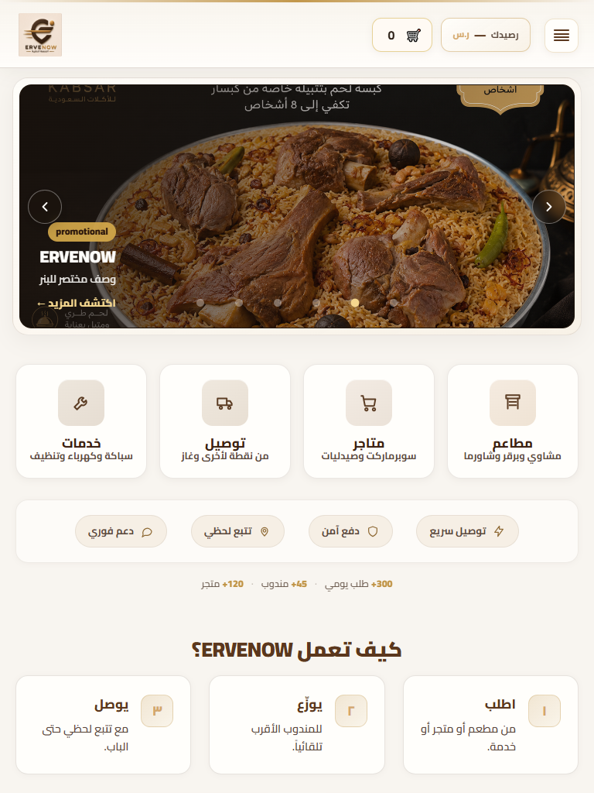
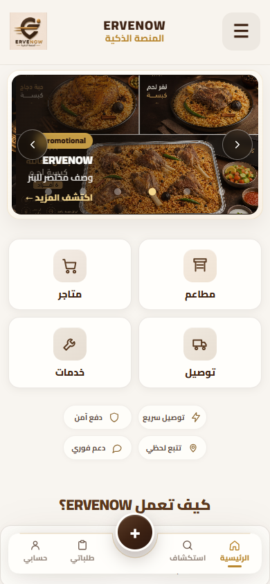

# ERVENOW — تدقيق واجهة الصفحة الرئيسية قبل إعادة تصميم VIP

**الحالة:** AUDIT / REPORT فقط — لا تنفيذ.  
**التاريخ:** 2026-09-04  
**الموقع المفحوص:** http://localhost:4000/  
**المصدر الأساسي:** `public/index.html` (يُنسخ إلى `ervenow-frontend/` عبر `npm run frontend:sync`)  
**الشاشات:** `docs/audit-assets/home-vip-2026-09-04/`  
**القياسات:** `docs/audit-assets/home-vip-2026-09-04/layout-metrics.json`

---

## 1. Executive Summary

الصفحة الرئيسية الحالية **ليست صفحة تطبيق توصيل**، بل **Landing Page تسويقية** فوق أربعة مداخل طلب (`مطاعم / متاجر / توصيل / خدمات`). الهوية البصرية (كريم، بني، ذهب) جاهزة وجميلة، والمكوّنات موجودة وتعمل، لكن **التسلسل البصري يعكس شركة تعرّف نفسها قبل أن تخدم العميل**.

خلال الثواني الأولى على Desktop 1440:

| ما يراه العميل | المساحة تقريباً |
|---|---|
| هيدر مزدوج الصف (شعار + قائمة + سلة + دخول) | **187px** |
| بنر ترويجي عريض (عروض/صور أكل) | **~402px** |
| بطاقات الخدمات الأربع | تبدأ عند **y ≈ 637** داخل شاشة 900px |

الخلاصة: العميل **يرى صورة ثم هوية ثم خدمات**. لا يرى بحثاً، ولا موقعاً جغرافياً، ولا قائمة مطاعم/متاجر. نقطة البداية الحقيقية هي بطاقات الـ Hub — وهي تحت البنر وليست CTA واحداً واضحاً بعنوان «ابدأ طلبك».

على الجوال الوضع أفضل جزئياً (هيدر 93px + بنر ~216px + Hub 2×2 داخل الطية)، لكن:

- السلة و«دخول» و«منصة ERVENOW» و«الخريطة الحية» **تُخفى من الهيدر** وتُنقل للقائمة / الشريط السفلي.
- الشريط السفلي **موجود أصلاً** (`الرئيسية · استكشاف · + · طلباتي · حسابي`) — لا نحتاج بناءه من الصفر.
- تبويب «استكشاف» يفتح `/start-now` وهي **نسخة مكررة** من بطاقات الرئيسية.
- لا يوجد Location ولا Search على الرئيسية.
- أرقام المنصة مخفية بـ CSS على الجوال (`display: none`) وليست محذوفة.

**التوصية التنفيذية (قسم أخير): B — إعادة ترتيب الصفحة الحالية مع المحافظة على كل المكوّنات.**  
ليست A لأن المشكلة معمارية لا تجميلية. وليست C لأن إعادة بناء HTML من الصفر تكسر Marketing Studio، السلة، الدخول، الشريط السفلي، وبنرات الأدمن دون فائدة.

---

## 2. Current Homepage Structure

الترتيب الفعلي في DOM بعد تطبيق Marketing Studio (`data/marketing/experiences/home.json`):

```
header#top                          ← sticky
[announcement_bar]                  ← مخفي حالياً
#homeMainBannerWrap / hero_banner   ← بنر عروض (API)
.sn-section--hub                    ← مقفل في الـ schema
  h2 «اختر ما يناسبك»               ← مخفي بصرياً (aria-hidden)
  #snHomeHub                        ← 4 بطاقات خدمات
  #trust                            ← شريط الثقة
  #stats                            ← أرقام المنصة (مخفي على الجوال)
main
  [promotional_cards]               ← مخفي
  [featured_collections]            ← مخفي
  [featured_merchants]              ← مخفي
  [app_promotion]                   ← مخفي
  [footer_promotions]               ← مخفي
  #why                              ← كيف تعمل ERVENOW
  #contact + #register-store-cta    ← واتساب + سجّل متجرك
footer.lp-footer
[جوال فقط] #ervMobileBottomNav      ← يُحقن عبر JS
```

لا يوجد في الصفحة:

- حقل بحث
- محدّد موقع / عنوان توصيل
- قائمة مطاعم أو متاجر (البطاقات روابط لأقسام أخرى)
- CTA «انضم كمندوب» (يوجد «انضم كشريك» = تسجيل متجر فقط)

---

## 3. Component Inventory

| المكوّن | موجود؟ | أين | ملاحظات |
|---|---|---|---|
| Header | نعم | `header.lp-header` | sticky · صفّان على Desktop · صف واحد على Tablet/Mobile |
| Navigation | نعم | `#lpNavWrap` + `ErvenowGuestShell.paintIndexNav` | Desktop ظاهر · Tablet/Mobile `display:none` |
| Logo | نعم | `.lp-header__logo-slot` → `/assets/ervenow-logo.png` | رابط `/` |
| Brand wordmark | نعم | `.lp-header__brand-mid` | «ERVENOW / المنصة الذكية» · مخفي على Tablet |
| Location selector | **لا على الرئيسية** | موجود في checkout / delivery-services / gas | فجوة UX مركزية |
| Search | **لا على الرئيسية** | موجود في `/restaurants` و `/stores` (`.stores-search`) | فجوة UX مركزية |
| Cart | نعم | `#indexDraftBadge` → `/checkout` | مسودة طلب (`order-draft-badge`) · **مخفي على جوال الرئيسية** |
| Login / account | نعم | `#authArea` + زر «دخول» في الناف + قائمة الهامبرغر | ضيف: دخول/تسجيل · مسجّل: حسابي حسب الدور |
| Hamburger menu | نعم | `#lpQuickNav` / `#lpQuickNavBtn` | `mobile-harmony.js` يفتح اللوحة |
| Hero / promotional slider | نعم | `#homeMainBanner` | `GET /api/core/banners?target=home` |
| Restaurants | نعم كمدخل | بطاقة → `/restaurants` | ليست قائمة على الرئيسية |
| Stores | نعم كمدخل | بطاقة → `/stores` | ليست قائمة على الرئيسية |
| Delivery | نعم كمدخل | بطاقة → `/delivery-services.html` | يشمل غاز كنقطة فرعية في FAB |
| Services | نعم كمدخل | بطاقة → `/services` | |
| Trust indicators | نعم | `#trust` | توصيل سريع · دفع آمن · تتبع لحظي · دعم فوري |
| Statistics | نعم | `#stats` | 300+ / 45+ / 120+ · **مخفي CSS على الجوال** |
| How ERVENOW works | نعم | `#why` | اطلب → يوزّع → يوصل |
| WhatsApp / support | نعم | `#contact` + فوتر | `https://wa.me/966505745650` |
| Join as partner | نعم | `#register-store-cta` → `/register-store` | متجر فقط |
| Join as driver | **لا على الرئيسية** | التسجيل عبر `/login` (حقول مندوب موجودة) | يجب الإبقاء على المسار وعدم اختراعه من الصفر |
| Footer | نعم | نسختان Desktop / Mobile | قانوني + اجتماعي + حقوق |
| Social | نعم | X · Snapchat · Telegram · WhatsApp | |
| Privacy / Terms / Returns | نعم | `/privacy-policy` · `/terms-of-use` · `/payments-refund-policy` | |
| Live map | نعم في الناف | `/live-map` (بعد `paintIndexNav`) | الـ HTML الثابت كان `/track` ثم يُستبدل |
| تتبع الحي | نعم في القائمة | `/track` يبقى في الهامبرغر | رابطان متقاربان للمستخدم |
| Wallet | نعم | `#lpHeaderWallet` | مخفي للضيف العادي · يظهر حسب الجلسة |
| User phone mid | نعم | `#lpHeaderUserMid` | يظهر بعد الدخول |
| Bottom nav + FAB | نعم على ≤640px | `mobile-foundation.js` | الرئيسية / استكشاف / + / طلباتي / حسابي |
| Plus sheet | نعم | مطاعم · متاجر · خدمات · توصيل · غاز | |
| Marketing placeholders | نعم مخفية | 6 slots | تُفعَّل من لوحة التسويق دون كود جديد |
| Pre-registration banner | كود جاهز | `guest-shell.js` → `/api/core/public-config` | **لا يعمل على الرئيسية** لأن `ErvenowGuestShell.init()` غير مستدعى |
| Notification center | كود جاهز | `guest-shell.js` | نفس السبب: init غير مستدعى على `/` |
| Orders badge + صوت | نعم | `#ordersBadge` + `#newOrderSound` | polling كل 5 ثوانٍ لـ `/api/order/orders` |
| Guest browse | نعم في JS | `continueAsGuest()` → `/start-now` | عناصر UI `#lpStartNow` غير موجودة — كود ميت |

---

## 4. Functional Dependencies

### 4.1 روابط ثابتة (HTML)

| من | إلى | نوع |
|---|---|---|
| شعار / اسم | `/` | تنقل |
| دخول (ناف) | `/login?role=customer` | Auth |
| دخول (قائمة) | `/login` | Auth |
| إنشاء عضوية | `/login?mode=register&role=customer` | Auth |
| طلباتي (ضيف) | `/login?role=customer&next=/my-orders` | Auth + redirect |
| طلباتي (عميل) | `/my-orders` | طلبات |
| الإعدادات | `/dashboard` | منصة |
| تواصل | `#contact` | مرساة |
| الثقة / كيف تعمل | `#trust` `#why` | مرساة |
| تتبع الحي | `/track` | خريطة/تتبع |
| الخريطة الحية (بعد paint) | `/live-map` | خريطة عامة · `GET /api/core/live-map-public` |
| مطاعم | `/restaurants` | قسم |
| متاجر | `/stores` | قسم |
| توصيل | `/delivery-services.html` | قسم |
| خدمات | `/services` | قسم |
| سلة/مسودة | `/checkout` | Commerce |
| محفظة | `/wallet.html` أو `/driver-wallet` أو `#wallet` حسب الدور | محفظة |
| واتساب | `wa.me/966505745650` | خارجي |
| سجّل متجرك | `/register-store` | شريك |
| قانوني | `/privacy-policy` `/terms-of-use` `/payments-refund-policy` | قانوني |
| اجتماعي | x.com/ervenow · snapchat/add/ervenow · t.me/ervenow | خارجي |

### 4.2 Handlers في `public/index.html`

| دالة / مستمع | الوظيفة | خطر حذف/كسر |
|---|---|---|
| `goLogin` / `goRegister` | تحويل لـ login | منخفضة (لا أزرار تستدعيها حالياً في DOM) |
| `continueAsGuest` | `ErvenowGuestBrowse` + `/start-now` | متوسطة — مسار التصفح كضيف |
| `goDashboard` / `goAccountHome` / `goAdminDashboard` | `ErvenowAccountDest` | **عالي** — أزرار `#authArea` |
| `logout` | `ErvenowGuestShell.performGuestLogout` + مسودة الطلب + tokens | **عالي** |
| `checkAuth` | `GET /api/core/me` ثم رسم الحساب/المحفظة/القائمة | **عالي** |
| `refreshHeaderWallet` | `/api/wallet` أو `/api/driver/wallet` أو merchant-dashboard | **عالي** |
| `loadOrdersCount` | polling `/api/order/orders` كل 5s + صوت طلب جديد | متوسط/عالي للمناديب |
| `[data-type]` click | `/browse?type=` إلا إذا href يبدأ بـ restaurants/stores/services/delivery | منخفض — البطاقات الحالية لا تستخدم `data-type` |
| `.lp-reveal` IntersectionObserver | أنيميشن ظهور | منخفض |
| `#lpStartNow` dropdown | كود ميت — العناصر غير موجودة | منخفض |
| `applyStartMenuAuthState` | إخفاء `data-guest-only` وإظهار `data-nav-role` | **عالي** |

### 4.3 سكربتات خارج الصفحة

| ملف | ماذا يفعل على `/` |
|---|---|
| `guest-shell.js` | `paintIndexNav` يُستدعى من `checkAuth` — **بدون** `init()` |
| `mobile-harmony.js` | يربط زر الهامبرغر (`setupHomeQuickNav`) |
| `mobile-foundation.js` | يحقن الشريط السفلي + FAB على ≤640px |
| `guest-offers-carousel.js` | يحمّل البنر: `GET /api/core/banners?target=home` + نقرات impression/click في الأدمن |
| `marketing-studio/home-renderer.js` | `GET /api/core/marketing/home` — ترتيب/إخفاء slots |
| `order-draft-badge.js` | شارة السلة → `/checkout` |
| `account-destinations.js` | توجيه الحساب حسب الدور |
| `platform-access.js` | حراسة مسارات الأدوار |
| `mobile-orders-nav-badge.js` | شارة طلباتي في الشريط السفلي |
| `ervenow-toggle.js` | وحدات المنصة |

### 4.4 Backend الذي تلمسه الرئيسية (قراءة فقط)

هذه استدعاءات **موجودة اليوم**. إعادة التصميم يجب ألا تغيّر عقودها:

- `GET /api/core/me`
- `GET /api/core/banners?target=home`
- `POST /api/core/banners/:id/impression` و `/click` (إن وُجدت في الكاروسيل)
- `GET /api/core/marketing/home`
- `GET /api/core/live-map-public`
- `GET /api/wallet` / `/api/driver/wallet` / `/api/store/merchant-dashboard`
- `GET /api/order/orders`
- `GET /api/core/public-config` (لا يُستدعى حالياً على `/` بسبب غياب `init`)

**لا Socket.IO على الرئيسية. لا OTP. لا إنشاء طلب.**

---

## 5. Desktop Audit (1440 / 1280)

قياسات حقيقية من التشغيل المحلي (Chrome headless، ضيف غير مسجّل):

| المقياس | 1440×900 | 1280×800 |
|---|---|---|
| ارتفاع الهيدر | 187px (صفّان) | 187px |
| البنر (غلاف) | 402px عند y=207 | 360px |
| Hub cards | y=672، ارتفاع 208، صف واحد × 4 | y=626، ارتفاع 190 |
| Trust داخل الطية؟ | لا (y=912 > 900) | لا (y=847 > 800) |
| بحث / موقع | غير موجود | غير موجود |
| Bottom nav | لا | لا |
| ارتفاع المستند | 1824px | 1772px |

**ما يعمل جيداً**

- بطاقات الخدمات الأربع واضحة وكبيرة وروابطها صحيحة.
- الهوية متسقة (Cairo، كريم، بني، ذهب).
- الناف الثاني يعطي وصولاً مباشراً: منصة · خريطة حية · دخول.
- الفوتر القانوني مرتب وليس مزدحماً.

**ما يضعف الإحساس بتطبيق توصيل**

1. **هيدر ثقيل جداً (187px)** قبل أي محتوى طلب. صف علوي + صف ناف عائم.
2. **البنر يأخذ ~45% من الشاشة** قبل الخدمات. CTA البنر هو «اكتشف المزيد» وليس «اطلب».
3. **لا Search ولا Location** — العميل لا يعرف أين يُخدم ولا كيف يبدأ بالاسم.
4. **ازدحام أدوات:** هامبرغر + سلة + محفظة (حتى لو فارغة في DOM) + دخول في الناف + دخول مكرر داخل القائمة.
5. **«الرئيسية» داخل ناف الصفحة الرئيسية** — رابط ميت وظيفياً يستهلك انتباهاً.
6. CSS قديم لـ `.lp-hero` ما زال داخل `index.html` (~مئات الأسطر) بينما الـ Hero الحقيقي هو الكاروسيل.
7. الصفحة قصيرة نسبياً (أقل من شاشتين) — ليست مزدحمة بالمحتوى، بل **مرتّبة بترتيب تسويقي**.

على 1280 السلوك مطابق 1440 مع بنر أقصر قليلاً. لا انكسار تخطيط.

---

## 6. Tablet Audit (1024 / 768)

الـ CSS في `home-stage-expand.css` يعامل 641–1024 كوسيط حقيقي (إخفاء الناف السفلي، هيدر صف واحد). هذا اتجاه صحيح.

| المقياس | 1024×768 | 768×1024 |
|---|---|---|
| هيدر | 88px · صف واحد | 88px |
| Brand wordmark | مخفي | مخفي |
| ناف `#lpNavWrap` | مخفي | مخفي |
| بنر | 320px | 333px |
| Hub | صف × 4، ارتفاع ~148–150 | نفس الشبكة × 4 |
| Trust داخل الطية | نعم | نعم |
| How it works داخل الطية | لا | نعم جزئياً |
| Bottom nav | لا | لا |
| بحث / موقع | لا | لا |

**مشاكل التابلت الخاصة**

1. **الناف الأفقي يُخفى بالكامل.** الوصول لـ «منصة ERVENOW» و«الخريطة الحية» و«دخول» يصبح عبر الهامبرغر فقط. التابلت الأفقي 1024 يملك مساحة لهذه الروابط دون ازدحام.
2. **Hub بأربع بطاقات ضيقة على 768.** الوصف يظهر لكن الأيقونات/النصوص تضغط. شبكة 2×2 أنسب عمودياً عند 768، و4 أعمدة تبقى مناسبة لـ 1024.
3. **لا شريط سفلي ولا ناف ظاهر** — التابلت ليس «جوالاً مصغّراً» في الـ CSS، لكنه أيضاً ليس Desktop كامل الأدوات. المستخدم يضيع بين النموذجين.
4. على 1024 البنر ما زال البطل البصري (~42% من ارتفاع الشاشة) قبل أن تكتمل قراءة الخدمات.
5. Brand text مخفي والاعتماد على الشعار فقط — مقبول إذا بقي الشعار واضحاً.

---

## 7. Mobile Audit (430 / 390 / 375)

`html.erv-mobile-shell` يُفعَّل عبر `mobile-foundation.js` عند `(max-width: 640px)`.

| المقياس | 430×932 | 390×844 | 375×812 |
|---|---|---|---|
| هيدر | 93px | 93px | 93px |
| سلة / محفظة / ناف | مخفية | مخفية | مخفية |
| بنر | 236px | 216px | 208px |
| Hub 2×2 | y≈366، ارتفاع 220 · النص وصف مخفي | مشابه | مشابه |
| Trust | داخل الطية | داخل الطية | داخل الطية |
| Stats | `display:none` | `display:none` | `display:none` |
| How it works | العنوان داخل الطية · الخطوات تتداخل مع الشريط السفلي | نفس | نفس |
| Bottom nav | ثابت أسفل الشاشة | ثابت | ثابت |
| FAB + | نعم | نعم | نعم |

**ما يعمل جيداً**

- الخدمات الأربع تظهر في الطية (بعد البنر).
- الشريط السفلي يعطي: رئيسية / استكشاف / طلب جديد / طلباتي / حسابي.
- FAB يغطي الغاز أيضاً (غير ظاهر كبطاقة مستقلة في الـ Hub).
- أزرار اللمس ≥ 44px (هامبرغر 55px، FAB 56px).

**مشاكل الجوال الحرجة**

1. **السلة غير مرئية.** `#indexDraftBadge` داخل `.lp-header__actions` المخفي بـ `mobile-harmony.css`. الشريط السفلي **لا يحتوي سلة**. العميل لا يرى أن لديه طلباً قيد التأكيد إلا من صفحة أخرى أو من القائمة إن وُجد مسار.
2. **«استكشاف» = تكرار الرئيسية.** `/start-now` يعيد نفس البطاقات الأربع. عدسة البحث في الأيقونة **توحي بوجود بحث وهي ليست بحثاً**.
3. **البنر ما زال قبل الخدمات** (~25% من الشاشة) رغم ضغطه.
4. **لا موقع جغرافي.** العميل لا يحدد حيّه قبل الدخول للأقسام.
5. **كيف تعمل ERVENOW تبدأ تحت الشريط السفلي.** على 390: `#why` عند y=691 والشريط عند y=737 داخل 844px — العنوان يظهر والخطوات تُقطع.
6. **ازدحام نقاط الدخول:** Hub + FAB + استكشاف + هامبرغر كلها تؤدي لنفس الأقسام.
7. **دخول / خريطة حية / منصة** مدفونة في الهامبرغر. مقبول للجوال إذا بقي الحساب في الشريط السفلي — بشرط ألا تُحذف.

---

## 8. Screenshots

جميع الملفات تحت:

`docs/audit-assets/home-vip-2026-09-04/`

### Above the Fold (مطلوبة)

| الجهاز | الملف |
|---|---|
| Desktop 1440 |  |
| Tablet 768 |  |
| Mobile 390 |  |

### Full Page (مطلوبة)

| الجهاز | الملف |
|---|---|
| Desktop 1440 | `audit-assets/home-vip-2026-09-04/desktop-1440-full.png` |
| Tablet 768 | `audit-assets/home-vip-2026-09-04/tablet-768-full.png` |
| Mobile 390 | `audit-assets/home-vip-2026-09-04/mobile-390-full.png` |

### قياسات إضافية (مراجعة responsive)

| المقياس | ATF | Full |
|---|---|---|
| 1280 | `desktop-1280-atf.png` | `desktop-1280-full.png` |
| 1024 | `tablet-1024-atf.png` | `tablet-1024-full.png` |
| 430 | `mobile-430-atf.png` | `mobile-430-full.png` |
| 375 | `mobile-375-atf.png` | `mobile-375-full.png` |

القياسات الرقمية: `layout-metrics.json`.

---

## 9. UX Problems Ranked by Priority

| # | المشكلة | الأثر | الجهاز |
|---|---|---|---|
| P0 | الصفحة تُقرأ كـ Landing لا كتطبيق طلب | العميل لا يفهم «ماذا أضغط لأطلب» خلال 3–5 ثوان | الكل |
| P0 | لا Location على الرئيسية | لا يعرف هل الخدمة تغطي منطقته | الكل |
| P0 | لا Search على الرئيسية | لا يبدأ بالاسم (مطعم/صنف) | الكل |
| P0 | البنر فوق الخدمات ويسرق الطية | Hero أكبر من فائدته · CTA «اكتشف المزيد» ينافس الطلب | Desktop خصوصاً |
| P0 | السلة مخفية على جوال الرئيسية | كسر وظيفة موجودة بصرياً (ليست حذفاً برمجياً) | Mobile |
| P1 | هيدر Desktop صفّان / 187px | ازدحام · تكرار دخول (ناف + قائمة) | Desktop |
| P1 | «استكشاف» يكرر Hub | ارتباك · أيقونة بحث كاذبة | Mobile |
| P1 | التابلت بلا ناف ظاهر وبلا bottom nav | أدوات المنصة والخريطة تُدفن | Tablet |
| P1 | لا قوائم مطاعم/متاجر على الرئيسية | إحساس موقع تعريفي لا كتالوج | الكل |
| P2 | Trust + Stats + How it works قبل أن يكتمل فعل الطلب | محتوى تعريفي ينافس الانتباه بعد الـ Hub مباشرة | الكل |
| P2 | رابطان: `/live-map` و `/track` | تسمية متقاربة | قائمة |
| P2 | لا CTA مندوب على الرئيسية | «انضم كشريك» = متجر فقط | الكل |
| P2 | Stats مخفية على الجوال | الرقم موجود لكن لا يُستخدم | Mobile |
| P3 | CSS/JS ميت (`.lp-hero`، `#lpStartNow`) | وزن وتعقيد بلا فائدة | — |
| P3 | `ErvenowGuestShell.init()` غير مستدعى على `/` | بنر التسجيل المسبق والإشعارات لا تُحمَّل هنا | Home only |

---

## 10. Proposed VIP Information Architecture

الفكرة المبدئية (Header → Location → Search → Services → Promo → Content → Trust → How → Join → Footer) **صحيحة في جوهرها**، مع تعديلات من واقع المشروع:

1. **لا نحذف البنر** — نُنزله تحت الخدمات (Marketing slot يبقى، `display_order` يتغيّر).
2. **Location و Search ليسا مكوّنين موجودين على `/`** — نضيفهما كواجهة رقيقة فوق سلوك موجود (صفحات الأقسام + أنماط تحديد الموقع في التوصيل/الدفع)، **بدون API جديد**.
3. **قوائم المطاعم/المتاجر** إن أُضيفت للرئيسية يجب أن تُعيد استخدام نفس جلب `/restaurants` و `/stores` الحالي، أو تبقى روابط Hub فقط في المرحلة 1 (أقل خطراً).
4. **Bottom nav موجود** — نعيد توزيع التسميات/المقاصد، لا نبني شريطاً ثانياً.
5. **Trust / How / Join / Footer** تبقى بعد المحتوى التشغيلي.

### التسلسل المقترح (جميع الأجهزة، يختلف العرض لا الوجود)

```
1. HEADER المضغوط          شعار · موقع (رقاقة) · سلة · قائمة/حساب
2. LOCATION (واضح)         «التوصيل إلى: …» — يفتح نفس أسلوب تحديد الموقع القائم
3. SEARCH                  حقل واحد → يوجّه لنتائج المطاعم/المتاجر الحالية
4. MAIN SERVICES           مطاعم · متاجر · توصيل · خدمات   ← CTA الأساسي
5. PROMOTIONAL             البنر الحالي كما هو (مصغّر)
6. CONTENT                 مجموعات/تجار مميزون إن فُعّلت من Marketing Studio
                           وإلا: لا نخترع قوائم وهمية
7. TRUST + STATS           شريط الثقة ثم الأرقام
8. HOW ERVENOW WORKS       اطلب / يوزّع / يوصل
9. JOIN / SUPPORT          سجّل متجرك + واتساب + (رابط تسجيل مندوب عبر /login الموجود)
10. FOOTER                 كما هو
```

هذا يحقق الأسئلة الخمس:

| سؤال العميل | الجواب البصري |
|---|---|
| ما هي ERVENOW؟ | اسم + رقاقة موقع + أربع خدمات — ليس مقالاً |
| ماذا يطلب؟ | مطاعم / متاجر / توصيل / خدمات فوق الطية |
| أين يضغط ليبدأ؟ | البطاقة أو البحث أو FAB |
| أين موقعه؟ | رقاقة الموقع تحت الهيدر مباشرة |
| كيف يصل للأقسام؟ | Hub + FAB + (بحث) — نفس الروابط الحالية |

---

## 11. Desktop Proposed Layout

عرض مفيد 1280–1440، هيدر **صف واحد** ≈ 72–80px:

```
[Logo] [التوصيل إلى: الرياض / حدد موقعك]     [بحث ........]  [سلة] [دخول] [☰]
────────────────────────────────────────────────────────────────────────
[ مطاعم ] [ متاجر ] [ توصيل ] [ خدمات ]     ← بطاقات أعرض وأقل ارتفاعاً من 208px
────────────────────────────────────────────────────────────────────────
[ بنر العروض — ارتفاع سقف ~220–280px بدل 380–420 ]
────────────────────────────────────────────────────────────────────────
Trust pills + stats (سطر واحد)
How it works (3 أعمدة مضغوطة)
تواصل | سجّل متجرك
Footer
```

- الناف الحالي (`منصة ERVENOW` · `الخريطة الحية` · `دخول`) **لا يُحذف**:  
  - دخول يبقى في الهيدر.  
  - منصة + خريطة حية تبقى في الهامبرغر **و/أو** كروابط نصية صغيرة بجانب الشعار، لا كصف ثانٍ كامل العرض.
- بطاقات Hub: ارتفاع أقل (≈140–160px) وعرض أكبر — إحساس شريط أقسام لا ملصقات تسويقية عملاقة.
- لا مساحة فارغة مبالغ فيها تحت الفوتر (الـ flex الحالي على 1025px+ مقبول).

---

## 12. Tablet Proposed Layout

التابلت **ليس Desktop مصغّراً ولا جوالاً بلا شريط**.

**1024 (أفقي):** هيدر صف واحد: شعار + موقع + بحث مختصر + سلة + دخول. Hub 4 أعمدة. بنر متوسط. لا bottom nav.

**768 (عمودي):** Hub **2×2** (مثل الجوال لكن أكبر لمسا). الموقع + البحث تحت الهيدر بعرض كامل. أدوات المنصة/الخريطة في الهامبرغر. لا bottom nav إلا إذا ثبت بالاختبار أن الإبهام لا يصل للهامبرغر — القرار الافتراضي: **بدون** شريط سفلي على ≥641px حتى لا نكرر أدوات الجوال على جهاز يُمسك باليدين.

---

## 13. Mobile Proposed Layout

```
[Logo]  [رقاقة الموقع ▼]              [☰]
[  بحث: مطعم، متجر، طبق …           ]
[مطاعم][متاجر]
[توصيل][خدمات]
[بنر مضغوط ~140–160px أو شريط أفقي لا 16:9 كامل]
Trust (سطر أفقي قابل للتمرير لا شبكة 2×2 تضغط الطية)
… باقي الصفحة
━━━━━━━━━━━━━━━━━━━━━━━━━━━━━━━━━━
الرئيسية | بحث | (+) | طلباتي | حسابي
```

### Bottom Navigation — هل نحتاجه؟

**نعم، وهو موجود اليوم.** لا ننشئ شريطاً جديداً.

| التبويب الحالي | المقصد الحالي | المقترح VIP | ماذا يحدث للوظيفة |
|---|---|---|---|
| الرئيسية | `/` | تبقى | كما هي |
| استكشاف `/start-now` | تكرار Hub | **تصبح بحثاً حقيقياً** (`/restaurants` مع فوكس حقل البحث، أو فتح حقل الرئيسية) | صفحة `/start-now` **لا تُحذف** — تُربط من القائمة/الهابرغر أو تبقى كمقصد احتياطي |
| FAB + | sheet الأقسام + غاز | يبقى نقطة «طلب جديد» | لا حذف |
| طلباتي | `/my-orders` أو login+next | يبقى | لا حذف |
| حسابي | `/login` أو `/dashboard` | يبقى | يغطي الدخول + المنصة حسب الجلسة |

**أين تذهب الوظائف التي تُخفى من الهيدر؟**

| وظيفة | الجوال VIP |
|---|---|
| سلة | تُعاد إلى الهيدر كأيقونة (أو شارة على FAB عند وجود مسودة) — **ممنوع إبقاؤها مخفية** |
| دخول | تبويب حسابي |
| منصة ERVENOW | داخل حسابي بعد الدخول، وفي الهامبرغر للضيف |
| الخريطة الحية | الهامبرغر (بند ثابت) |
| تتبع الحي | الهامبرغر (بند منفصل حتى لا ندمج مسارين) |
| محفظة | داخل الحساب / الهيدر بعد الدخول |
| واتساب | الفوتر + بطاقة التواصل (كما هي) |

لا نحتاج شريطاً رباعياً جديداً «رئيسية بحث طلباتي حساب» **فوق** الشريط الحالي — ذلك يضاعف الأدوات. نُعيد تسمية «استكشاف» إلى بحث ونُظهر السلة في الهيدر.

---

## 14. Components to Move

| مكوّن | من | إلى | لماذا |
|---|---|---|---|
| Hero banner | فوق Hub | تحت Hub (وبعد Search/Location) | الخدمات أولاً |
| Trust + Stats | مباشرة تحت Hub | بعد البنر / قبل How | لا ينافسان نقطة البدء |
| ناف Desktop الصف الثاني | تحت الهيدر | داخل الهامبرغر أو روابط نصية في الصف الأول | تقليل الارتفاع 187→~80 |
| `#why` على الجوال | يبدأ تحت الشريط السفلي | padding-bottom كافٍ + ترتيب بعد الثقة | لا يُقطع |
| وصف بطاقات Hub على الجوال | مخفي أصلاً | يبقى مخفياً على ≤640، يظهر من 641 | جيد |

نقل Marketing: تغيير `display_order` في `data/marketing/experiences/home.json` **و** ترتيب DOM الاحتياطي في `index.html` حتى يبقى الترتيب صحيحاً إذا فشل الـ API.

---

## 15. Components to Resize

| مكوّن | Desktop الآن | هدف VIP |
|---|---|---|
| Header | 187px | 72–80px صف واحد |
| Banner shell | min 300–460px، 21:9 | سقف ~240–280px، 21:9 أو 3:1 |
| Banner mobile | 16:9 حتى 220px | ~140–168px أو شريط 2.5:1 |
| Hub cards desktop | min-height 188–208px | ~132–156px، أيقونة أصغر قليلاً |
| Hub cards mobile | ~96–110px في 2×2 | تبقى لمسية (≥96) دون مبالغة |
| Trust pills | بار كبير | سطر مضغوط |
| How-it-works cards | واسعة | أضيق، 3 أعمدة Desktop / صف أفقي Tablet / عمود Mobile |
| CTA cards تواصل/شريك | 140px ارتفاع | أبقى مع تقليل الحشو |
| FAB | 56px | يبقى (لمس) |

---

## 16. Components to Keep As-Is

(السلوك والعقد — يمكن نقل المكان/الحجم)

- روابط الأقسام الأربعة ووجهاتها
- FAB + sheet (مطاعم/متاجر/خدمات/توصيل/غاز)
- `checkAuth` / `logout` / `refreshHeaderWallet` / `loadOrdersCount`
- شارة المسودة → `/checkout`
- Marketing slots المخفية (لا تُحذف من DOM)
- الفوتر القانوني والاجتماعي (نسختا Desktop/Mobile)
- واتساب الرقم الحالي
- `/register-store`
- `paintIndexNav` وبناء الروابط حسب الدور (`data-nav-role` للمندوب/مزود الخدمة)
- ألوان الهوية: `#3d2213` · `#b9872f` · `#f8f4ee`
- `dir="rtl"` و Cairo

---

## 17. Components That Must Never Be Removed

حتى لو اختفت من الطية أو تغيّر شكلها:

1. بطاقات Hub الأربع وروابطها
2. بنر العروض (`#homeMainBanner` + API البنرات)
3. شريط الثقة `#trust`
4. أرقام المنصة `#stats` (حتى وهي مخفية CSS على الجوال)
5. `#why` اطلب/يوزّع/يوصل
6. `#contact` واتساب
7. `#register-store-cta`
8. الفوتر + السياسات الثلاث + الاجتماعي
9. الهامبرغر وكل بنوده (دخول، عضوية، طلباتي، إعدادات، خريطة حية، تتبع الحي، أدوار مخفية، خروج)
10. السلة `#indexDraftBadge` / مسار `/checkout`
11. المحفظة `#lpHeaderWallet`
12. `#authArea` ووسط رقم الجوال
13. الشريط السفلي + FAB + الغاز في الـ sheet
14. `/start-now` كصفحة (حتى لو غيّرنا مقصد تبويب استكشاف)
15. `/dashboard` · `/live-map` · `/track` · `/login` · `/my-orders`
16. Marketing placeholders الستة
17. polling الطلبات والصوت `#newOrderSound`
18. `data-nav-role` لمزود الخدمة والمندوب

**إخفاء CSS حسب الجهاز مسموح. حذف من DOM أو من المسارات ممنوع في هذه المرحلة.**

---

## 18. Risk Assessment

### SAFE UI

- CSS: أحجام، ترتيب flex/grid، إظهار السلة على الجوال، ضغط البنر، هيدر صف واحد، Hub 2×2 على 768.
- نقل DOM داخل نفس الأب لـ Hub / Trust / Stats / Why / CTA (مع بقاء `data-marketing-slot`).
- تصغير padding/min-height للبطاقات.

### UI WITH BEHAVIOR DEPENDENCY

| تغيير | التبعية |
|---|---|
| إعادة ترتيب البنر مقابل Hub | `home-renderer.js` + `home.json` `display_order` |
| إظهار السلة على الجوال | `mobile-harmony.css` يخفي `.lp-header__actions` عن قصد |
| ضغط الهيدر لصف واحد | `index-header-banner.css` + `mobile-harmony.css` + `home-stage-expand.css` طبقات متراكمة |
| تغيير مقصد «استكشاف» | `mobile-foundation.js` `NAV_LEFT` |
| رقاقة موقع جديدة | يجب أن تكتب/تقرأ نفس مفاتيح الموقع المستخدمة في السلة/الدفع إن وُجدت — وإلا تبقى UI فقط حتى مرحلة لاحقة |
| حقل بحث يوجّه لـ `/restaurants` | لا API جديد · يجب ألا يكسر بحث صفحة المطاعم |
| ربط تسجيل مندوب | `/login` مع وضع التسجيل الحالي — لا صفحة جديدة |
| استدعاء `ErvenowGuestShell.init()` على الرئيسية | قد يحقن بنر تسجيل مسبق / إشعارات — اختبر عدم ازدواج الهيدر |

### HIGH RISK (خارج نطاق VIP البصري)

- أي تعديل على `checkAuth` / `logout` / tokens
- `order-draft-badge.js` / `order-draft-store.js`
- عقود `/api/core/banners` · `/api/core/me` · `/api/wallet` · `/api/order/orders`
- Socket.IO، OTP، checkout engine، queues
- حذف `data-marketing-slot` أو إعادة كتابة `home-renderer.js`
- بناء `index.html` جديد من الصفر
- تغيير `body` class `lp-home-premium` (عشرات ملفات CSS مربوطة به)

**قاعدة:** لا إعادة كتابة المشروع. لا نسخة ثانية من الصفحة. تطوير `public/index.html` الحالي.

---

## 19. Files Expected to Change

عند الموافقة لاحقاً — تقدير فقط:

| ملف | التصنيف | ماذا |
|---|---|---|
| `public/index.html` | UI + ترتيب DOM | نقل البنر، إضافة أغلفة موقع/بحث، هيدر صف واحد |
| `public/assets/home-stage-expand.css` | SAFE UI | بنر/Hub/breakpoints |
| `public/assets/home-polish-p1a.css` … `p1c` + `final` | SAFE UI | تخفيف تعارضات |
| `public/assets/index-header-banner.css` | UI+behavior | صف الهيدر |
| `public/assets/mobile-harmony.css` | UI+behavior | إظهار السلة على الجوال بحذر |
| `public/assets/mobile-home-conversion.css` | SAFE UI | طية الجوال |
| `public/assets/start-now-landing.css` | SAFE UI | بطاقات Hub المشتركة |
| `public/assets/guest-offers-carousel.css` | SAFE UI | ارتفاع البنر |
| `public/assets/mobile-foundation.js` | UI+behavior | تسمية/href تبويب البحث فقط |
| `data/marketing/experiences/home.json` | UI+behavior | `display_order` للبنر بعد الـ Hub |
| `ervenow-frontend/*` | نسخة نشر | عبر `npm run frontend:sync` بعد استقرار `public/` — **لا تحرير يدوي مزدوج** |

**لا يُمس:** `server/` · `apps/` · `shared/` · OTP · Socket · SQL · `cart.js` checkout logic · `login.html` (إلا رابط querystring موجود).

إن أُضيفت رقاقة موقع تعيد استخدام منطق موجود، الملف المرشّح للقراءة (لا للنسخ): أنماط geo في `public/delivery-services.html` / حفظ الموقع في `public/assets/cart.js` — استدعاء مشترك لا نسخ منطق الدفع.

---

## 20. Implementation Plan

بعد اعتماد هذا التقرير فقط:

**المرحلة 0 — حماية**  
جرد روابط + اختبار يدوي للضيف/العميل/المندوب/الأدمن على `/` قبل لمس DOM.

**المرحلة 1 — ترتيب الطية (VIP core)**  
Hub أولاً، بنر ثانياً، هيدر صف واحد Desktop، Hub 2×2 على 768. صفر APIs.

**المرحلة 2 — إظهار الوظائف المخفية**  
إعادة شارة السلة على الجوال. الإبقاء على الهامبرغر لكل بنود المنصة/الخريطة.

**المرحلة 3 — Location + Search (أغلفة UI)**  
رقاقة موقع + حقل بحث يوجّهان لسلوك قائم. إن تعذّر ربط الموقع بالسلة بأمان في نفس المرحلة: الرقاقة تفتح تدفقاً موجوداً أو تبقي «حدد موقعك» كدخول لصفحة التوصيل/الخريطة **دون** كسر checkout.

**المرحلة 4 — الشريط السفلي**  
إعادة تسمية استكشاف → بحث مع بقاء `/start-now` في القائمة. لا شريط ثانٍ.

**المرحلة 5 — التنظيف البصري**  
Trust/How/Join بعد التشغيل. تصغير البنر. لا حذف CSS الميت إلا بقرار منفصل (ليس شرطاً لـ VIP).

**المرحلة 6 — قبول**  
مصفوفة 1440 / 1024 / 768 / 430 / 390 / 375 + مسارات الدخول/السلة/الطلبات/الخريطة.

كل مرحلة قابلة للرجوع. لا «big bang».

---

## 21. Acceptance Criteria

بعد التنفيذ لاحقاً:

- [ ] المستخدم يفهم خلال 3–5 ثوانٍ أن ERVENOW منصة طلب: مطاعم، متاجر، توصيل، خدمات.
- [ ] نقطة البداية مرئية دون بحث عن الزر: بطاقات Hub (+ بحث/موقع إن نُفّذا).
- [ ] تحديد الموقع واضح في الطية (Desktop و Mobile).
- [ ] البحث واضح في الطية أو في تبويب البحث (أيقونة البحث = بحث حقيقي).
- [ ] لا تختفي أي وظيفة من القسم 17.
- [ ] كل الروابط في القسم 4.1 تبقى سليمة.
- [ ] لا تغيير Backend / APIs / Login logic / Cart persistence / Orders / Socket.IO / OTP / Live map backend.
- [ ] السلة مرئية على الجوال عند وجود مسودة.
- [ ] الخريطة الحية ومنصة ERVENOW تصلان من الهيدر أو الهامبرغر على كل جهاز.
- [ ] Marketing Studio ما زال يتحكم بالبنر والإخفاء.
- [ ] **Mobile:** زر البدء (Hub أو FAB) داخل الشاشة الأولى دون تمرير طويل.
- [ ] **Tablet:** 768 بشبكة 2×2 أو تجربة وسيطة حقيقية — ليس تصغير Desktop فقط؛ 1024 يستفيد من العرض لأربع بطاقات دون صف ناف 187px.
- [ ] **Desktop:** هيدر صف واحد، خدمات فوق البنر، لا فراغ مبالغ ولا ازدحام صفّين.

---

## التوصية الواحدة

# B — إعادة ترتيب الصفحة الحالية مع المحافظة على المكوّنات

**لماذا B وليس A:**  
المشكلة ليست ألواناً ولا ظلالاً. الترتيب الحالي (هيدر مزدوج → بنر سينمائي → خدمات) يمنع الإحساس بتطبيق توصيل. تحسين تدريجي داخل نفس الترتيب لن يضع الموقع والبحث والخدمات في الثواني الأولى، ولن يُظهر السلة على الجوال.

**لماذا B وليس C:**  
`public/index.html` مربوط بـ Marketing slots، `paintIndexNav`، مسودة الطلب، محفظة، أدوار، بنرات أدمن، شريط سفلي، وـ CSS متراكم على `lp-home-premium`. إعادة بناء Frontend للصفحة يعني نسخ كل هذه العقود يدوياً مع احتمال كسر ما لا يظهر في الشكل (polling الطلبات، `data-nav-role`, guest-only, draft badge). يمكن تحقيق IA الـ VIP بنقل DOM + CSS + أغلفة موقع/بحث فوق المسارات الحالية.

**ماذا تعني B عملياً:**  
نفس الملف، نفس المكوّنات، نفس الـ APIs — ترتيب جديد، أحجام جديدة، توزيع مختلف لكل جهاز، وإضافة سطحين فقط (موقع + بحث) يعيدان استخدام ما هو مبني في `/restaurants` و `/stores` وتدفقات الموقع القائمة — بدون حذف وببدون مشروع موازٍ.

---

**STOP.** لا تنفيذ حتى اعتماد هذا التقرير.
