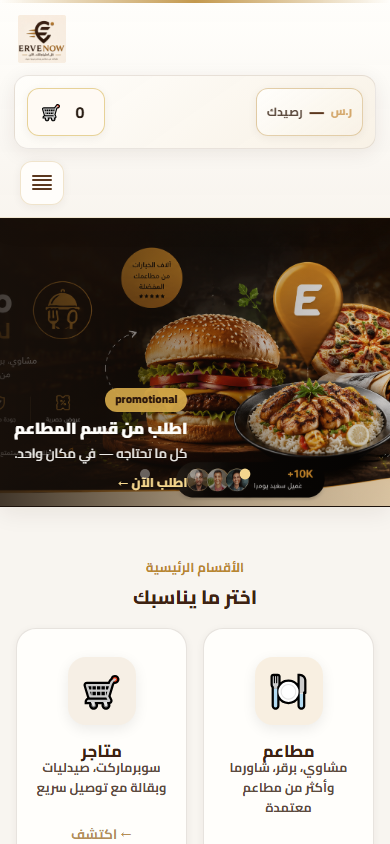
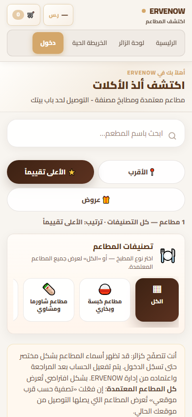
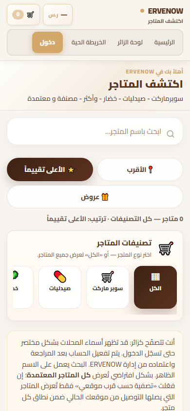
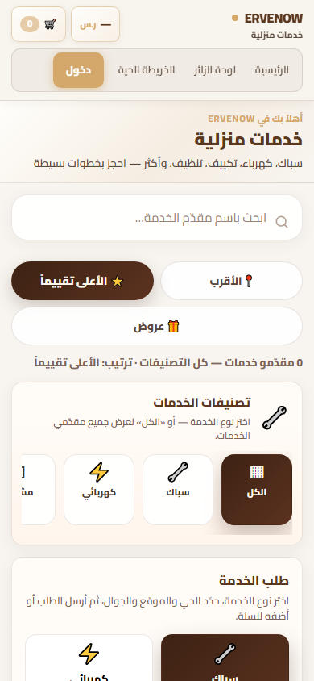
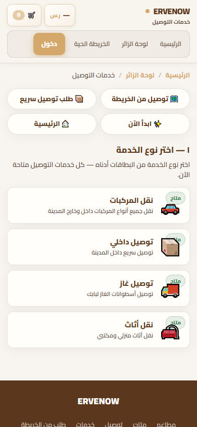
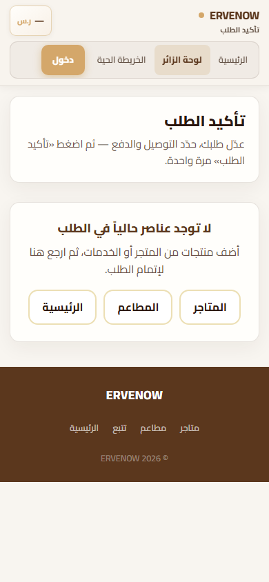
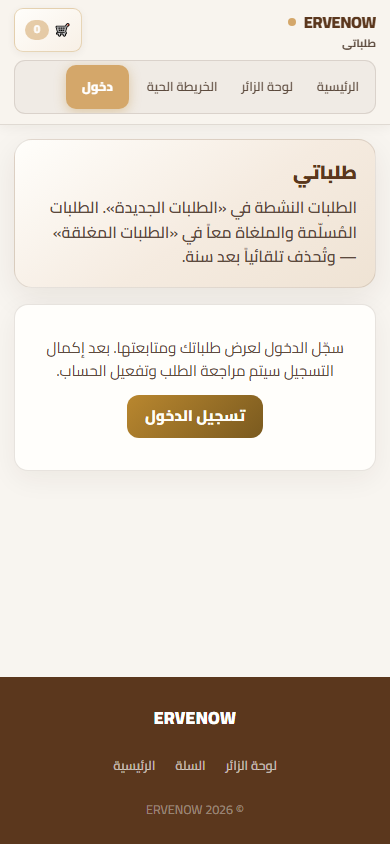
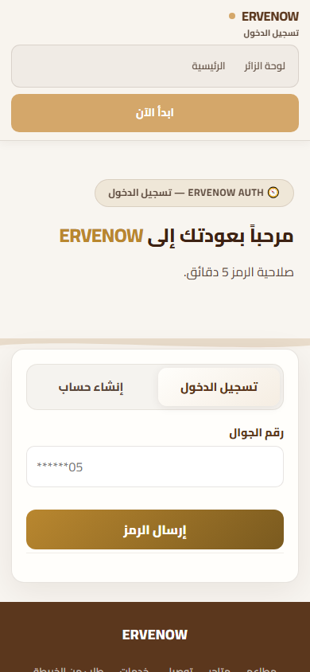
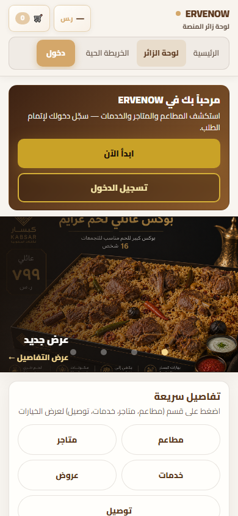

# ERVENOW — Mobile Excellence  
## تقرير مراجعة وتحليل تجربة الجوال (قبل التنفيذ)

**التاريخ:** 2026-06-11  
**النطاق:** تجربة الزائر على الجوال (390×844)  
**الحالة:** تحليل فقط — **لا تعديل · لا Commit · لا Push**  
**اللقطات:** `docs/screenshots/mobile-excellence/before/`

---

## ملخص تنفيذي

عند فتح ERVENOW على الجوال خلال **أول 10 ثوانٍ**، يرى المستخدم:

1. هيدراً يستهلك **20–26%** من الشاشة قبل المحتوى الأساسي  
2. بنراً ترويجياً جيداً (على الرئيسية) أو **كتلة نصية طويلة** (على صفحات الأقسام)  
3. تنقّلاً يشبه **موقع ويب مصغّر** أكثر من تطبيقاً حديثاً  

المنصة **وظيفياً قوية** (أقسام متعددة، سلة، توصيل، خدمات)، لكن **الانطباع الأول** لا يعكس بعدُ مستوى «منصة حديثة واحترافية» المستهدف.

**التقييم الإجمالي للجوال (الانطباع الأول):** 6.5 / 10

---

## 1. الصفحة الرئيسية `/`

### اللقطة المرجعية


### الانطباع الأول (0–10 ثوانٍ)

| الثانية | ماذا يرى المستخدم؟ |
|---------|-------------------|
| 0–2 | شعار ERVENOW + شريط رصيد/سلة + زر ☰ منفصل |
| 2–5 | بنر طعام كبير مع «اطلب من قسم المطاعم» |
| 5–10 | عنوان «الأقسام الرئيسية» + بطاقتا مطاعم/متاجر |

**الانطباع العام:** دافئ ومألوف لكن **غير حاسم** — لا يقول فوراً «هذا تطبيق توصيل شامل» بل «موقع فيه عروض وأقسام».

### وضوح الهوية

| ✅ قوة | ⚠️ ضعف |
|--------|--------|
| شعار ERVENOW واضح | شعار «المنصة الذكية» غير ظاهر على الجوال (مخفي في الهيدر المضغوط) |
| ألوان بنية/ذهبية متسقة | لا يوجد شعار بصري موحّد (أيقونة تطبيق) بجانب الاسم في كل الصفحات |
| بنر يعكس نشاط المنصة | الهوية تختلف بين الرئيسية (`lp-header`) وباقي الصفحات (`dash-site-header`) |

### وضوح الأقسام

| ✅ قوة | ⚠️ ضعف |
|--------|--------|
| 4 بطاقات أقسام بأيقونات واضحة | تظهر **بطاقتان فقط** في أول الشاشة (مطاعم + متاجر) |
| نص «اختر ما يناسبك» مباشر | توصيل وخدمات **تحت الطيّ** — يحتاج تمرير |
| بنر يوجّه للمطاعم | لا يوجد شريط أقسام سريع ثابت (sticky) |

### سهولة التنقل

| ✅ قوة | ⚠️ ضعف |
|--------|--------|
| قائمة ☰ تحتوي روابط مهمة | ☰ **منفصل** عن شريط السلة/الرصيد — 3 مناطق تفاعل في الأعلى |
| سلة ظاهرة دائماً | لا يوجد **شريط سفلي** للأقسام الرئيسية |
| | المحتوى التسويقي الطويل (لماذا/كيف) يبعد عن الإجراء |

### نقاط القوة
- بنر شرائح احترافي بصور عالية الجودة  
- بطاقات أقسام جميلة مع CTA «اكتشف»  
- شريط ثقة (+10K عميل) يبني مصداقية  
- لا تمرير أفقي  

### نقاط الضعف
- هيدر **218px** — أعلى من المعيار المثالي (~100–120px)  
- زر القائمة ☰ صغير ومنعزل  
- أقسام التوصيل/الخدمات غير مرئية فوراً  
- تجربتان: رئيسية ≠ لوحة الزائر (ازدواجية)

---

## 2. الصفحات الرئيسية

### 2.1 المطاعم `/restaurants`

**اللقطة:** `screenshots/mobile-excellence/before/restaurants-mobile-390.png`

| المعيار | التقييم | ملاحظة |
|---------|---------|--------|
| الانطباع الأول | 5/10 | نص ترحيبي + فلاتر قبل أي مطعم |
| الوصول للنتيجة | ⚠️ بطيء | ~70% الشاشة الأولى = واجهة وليس مطعماً |
| البحث | ✅ جيد | حقل واضح 16px |
| الفلاتر | ⚠️ | 3 أزرار كبيرة عمودية — تستهلك مساحة |
| التصنيفات | ✅ | شريط أفقي — نمط تطبيقي |
| النتائج | ⚠️ | «1 مطاعم» صغير · كتلة نص طويلة للزائر |

**مشكلة مرئية:** المستخدم يقرأ فقرة تفسيرية كاملة قبل رؤية بطاقة مطعم.

---

### 2.2 المتاجر `/stores`

**اللقطة:** `screenshots/mobile-excellence/before/stores-mobile-390.png`

نفس بنية المطاعم تقريباً — **نفس المشاكل**:

- Hero نصي طويل  
- فلاتر مكررة (أقرب · تقييم · عروض)  
- «0 متاجر» في بيئة تطوير — حالة فارغة غير محفّزة  
- تكرار CSS وبنية مع المطاعم (إحساس قالب لم يُصقل للجوال)

---

### 2.3 الخدمات `/services`

**اللقطة:** `screenshots/mobile-excellence/before/services-mobile-390.png`

| المعيار | التقييم |
|---------|---------|
| الانطباع الأول | 5/10 |
| الوضوح | جيد نظرياً — «سباك، كهرباء…» |
| التعقيد | ⚠️ عالٍ — تصنيفات + نموذج طلب في نفس الصفحة |
| الحالة الفارغة | «0 مقدمو خدمات» — لا يدعو للاستكشاف |

**مشكلة مرئية:** بطاقة «طلب الخدمة» تظهر جزئياً في الأسفل — المستخدم لا يفهم أين يبدأ خلال 10 ثوانٍ.

---

### 2.4 التوصيل `/delivery-services.html`

**اللقطة:** `screenshots/mobile-excellence/before/delivery-mobile-390.png`

| المعيار | التقييم |
|---------|---------|
| الانطباع الأول | 6/10 |
| الوضوح | 4 خدمات مع «متاح» — واضح |
| التشتيت | ⚠️ 4 روابط سريعة + breadcrumbs + 4 بطاقات كاملة |
| المسار | طويل قبل النموذج |

**مشكلة مرئية:** عند الدخول تظهر **كل الخدمات الأربع** + روابط سريعة — كثافة قرار عالية في أول شاشة.

---

### 2.5 السلة `/checkout` (السلة موحّدة مع الدفع)

**اللقطة:** `screenshots/mobile-excellence/before/checkout-mobile-390.png`

| المعيار | التقييم |
|---------|---------|
| الانطباع الأول | 6/10 |
| الحالة الفارغة | واضحة لكن **بطاقتان** قبل الإجراء |
| CTA | 3 أزرار أفقية صغيرة (متاجر · مطاعم · رئيسية) |
| الهيدر | نفس guest-shell الثقيل |

**مشكلة مرئية:** «تأكيد الطلب» يظهر مرتين (عنوان صفحة + بطاقة تعليمات) قبل رسالة «السلة فارغة».

---

### 2.6 الطلبات `/my-orders`

**اللقطة:** `screenshots/mobile-excellence/before/my-orders-mobile-390.png`

| المعيار | التقييم |
|---------|---------|
| الانطباع الأول (زائر) | 4/10 |
| الرسالة | تشرح الأقسام قبل الدخول |
| CTA | زر «تسجيل الدخول» واضح |
| القيمة الفورية | **صفر** — لا معاينة لطلبات |

**مشكلة مرئية:** للزائر غير المسجّل الصفحة = حاجز وليس دعوة للاستكشاف.

---

### 2.7 الحساب `/login` + `/dashboard`

**اللقطات:**
- `login-mobile-390.png`
- `dashboard-mobile-390.png`

| الصفحة | التقييم | ملاحظة |
|--------|---------|--------|
| **login** | 7/10 | نموذج OTP واضح · تبويب دخول/تسجيل جيد |
| **dashboard** | 5/10 | تكرار الرئيسية: ترحيب + بنر + تبويبات |

**مشكلة مرئية:** لوحة الزائر = نسخة ثانية من الرئيسية مع محتوى إضافي — لا قيمة مميزة في أول 10 ثوانٍ.

---

## 3. عناصر «نسخة مصغّرة من الكمبيوتر»

هذه العناصر تجعل المنصة **لا تشعر Mobile-First**:

| # | العنصر | أين يظهر | اللقطة |
|---|--------|----------|--------|
| 1 | **شريط تنقل نصي أفقي** (رئيسية · لوحة · خريطة · دخول) | كل صفحات guest-shell | restaurants, stores, checkout |
| 2 | **هيدر 3 صفوف** (شعار + أدوات + روابط + زر دخول) | guest-shell | dashboard, delivery |
| 3 | **Hero نصي طويل** قبل المحتوى | أقسام Hub | restaurants, stores, services |
| 4 | **فلاتر كأزرار كبيرة عمودية** بدل chips أفقية | أقسام Hub | restaurants |
| 5 | **كتل نص تفسيرية** للزائر | أسفل الأقسام | restaurants, stores |
| 6 | **بطاقتان تعليميتان** قبل الإجراء | checkout | checkout |
| 7 | **فوتر كامل بروابط** على كل صفحة | معظم الصفحات | login, my-orders |
| 8 | **هيدران مختلفان** (lp vs dash) | رئيسية vs باقي | home vs restaurants |
| 9 | **ازدواجية رئيسية/لوحة زائر** | مساران لنفس الهدف | home vs dashboard |
| 10 | **لا شريط سفلي ثابت** | — | كل المنصة |

### الفرق بين Mobile-First والوضع الحالي

```
الوضع الحالي (مصغّر):          Mobile-First المطلوب:
┌─────────────────┐            ┌─────────────────┐
│ هيدر 3 صفوف     │            │ هيدر مضغوط 1 صف │
│ روابط نصية      │            │ شعار + سلة + ☰  │
├─────────────────┤            ├─────────────────┤
│ نص ترحيبي طويل  │            │ محتوى/إجراء فوري│
│ فلاتر كبيرة     │            │ بحث + chips     │
│ شرح للزائر      │            │ نتائج مباشرة    │
│ ...نتائج...     │            ├─────────────────┤
│ فوتر طويل       │            │ ■ ■ ■ ■ شريط سفلي│
└─────────────────┘            └─────────────────┘
```

---

## 4. فرص رفع البقاء والاستكشاف (أول 10 ثوانٍ)

### ما يعمل اليوم ✅
- بنر الرئيسية يجذب العين فوراً  
- بطاقات الأقسام مفهومة بصرياً  
- ألوان دافئة موثوقة  
- شارة «+10K عميل» اجتماعية  

### فرص عالية التأثير 🎯

| # | الفرصة | التأثير المتوقع | التنفيذ المقترح |
|---|--------|-----------------|-----------------|
| 1 | **شريط سفلي ثابت** | +40% استكشاف أقسام | 🏠 🔍 🛒 👤 |
| 2 | **هيدر مضغوط ≤110px** | +25% محتوى فوق الطيّ | دمج سلة+قائمة في صف واحد |
| 3 | **أقسام 2×2 فورية** على الرئيسية | +30% نقر قسم | إظهار 4 بطاقات في أول شاشة |
| 4 | **نتائج فورية** في Hub | −3 ثوانٍ للوصول | إزالة hero · sticky search |
| 5 | **حالة فارغة محفّزة** | تقليل الخروج | «ابدأ من هنا» + أيقونات كبيرة |
| 6 | **CTA واحد رئيسي** | وضوح قرار | «اطلب الآن» بدل 3 أزرار متساوية |
| 7 | **دمج رئيسية/لوحة زائر** | −ازدواجية | مسار واحد للزائر |
| 8 | **معاينة طلبات** (حتى للزائر) | فضول + دخول | «سجّل لحفظ طلباتك» بعد معاينة |

### مسار الـ 10 ثوانٍ المثالي (مقترح)

```
ثانية 0:  شعار + شريط سفلي يظهر فوراً
ثانية 1:  بنر واحد أو 4 أيقونات أقسام
ثانية 3:  المستخدم ينقر «مطاعم» أو «توصيل»
ثانية 5:  يرى بحث + أول نتيجة/خدمة
ثانية 10: في السلة أو نموذج طلب — بدون قراءة فقرات
```

---

## 5. تحسينات مرتبة حسب الأولوية

### 🔴 أولوية عالية (تأثير فوري على الانطباع الأول)

| # | التحسين | الصفحات | اللقطة الحالية |
|---|---------|---------|----------------|
| H1 | هيدر مضغوط موحّد (صف واحد + ☰) | الكل | `home-mobile-390.png` · `restaurants-mobile-390.png` |
| H2 | شريط تنقل سفلي للزائر | الكل | — (غير موجود) |
| H3 | إزالة/طي Hero النصي في Hub | مطاعم · متاجر · خدمات | `restaurants-mobile-390.png` |
| H4 | Sticky search — نتائج فوراً | Hub pages | `stores-mobile-390.png` |
| H5 | فلاتر → chips أفقية مضغوطة | Hub pages | `services-mobile-390.png` |
| H6 | دمج الرئيسية ولوحة الزائر | home · dashboard | `home` vs `dashboard` |
| H7 | حالة سلة فارغة مبسّطة — CTA واحد كبير | checkout | `checkout-mobile-390.png` |
| H8 | توصيل: عرض خدمة واحدة أو grid 2×2 مضغوط | delivery | `delivery-mobile-390.png` |

### 🟡 أولوية متوسطة (نضج بصري وتشغيلي)

| # | التحسين | الصفحات |
|---|---------|---------|
| M1 | Design System موحّد (أزرار · بطاقات · نماذج) |
| M2 | إزالة كتل النص التفسيرية — tooltip أو «؟» |
| M3 | توحيد الهيدر: إلغاء `lp-header` / `dash-site-header` المزدوج |
| M4 | فوتر مضغوط على الجوال (أيقونات فقط) |
| M5 | صفحة طلبات: معاينة محفّزة قبل الدخول |
| M6 | login: إزالة «ابدأ الآن» المكرر أعلى النموذج |
| M7 | تحميل lazy للبنرات · تقليل وقت الظهور |
| M8 | إزالة CSS غير مستخدم (`index-header-banner` على guest pages) |

### 🟢 أولوية منخفضة (تحسينات لاحقة)

| # | التحسين |
|---|---------|
| L1 | رسوم micro-interactions (انتقالات بطاقات) |
| L2 | وضع ليلي |
| L3 | اقتراحات ذكية حسب الموقع |
| L4 | PWA / Add to Home Screen |
| L5 | تقليل المحتوى التسويقي الطويل في الرئيسية |
| L6 | توحيد `ervenow-frontend` مع `public` |

---

## 6. دليل اللقطات — مشكلة بمشكلة

| المشكلة | اللقطة | المسار |
|---------|--------|--------|
| هيدر مزدحم + ☰ منفصل |  | `before/home-mobile-390.png` |
| أقسام جزئية (2 من 4) | نفس اللقطة أعلاه | |
| Hero قبل النتائج |  | `before/restaurants-mobile-390.png` |
| فلاتر عمودية كبيرة | نفس اللقطة | |
| كتلة نص زائر | نفس اللقطة | |
| 0 نتائج — حالة فارغة |  | `before/stores-mobile-390.png` |
| تعقيد خدمات |  | `before/services-mobile-390.png` |
| كثافة قرار توصيل |  | `before/delivery-mobile-390.png` |
| سلة فارغة مزدوجة |  | `before/checkout-mobile-390.png` |
| طلبات = حاجز دخول |  | `before/my-orders-mobile-390.png` |
| تسجيل دخول مزدحم أعلى |  | `before/login-mobile-390.png` |
| لوحة زائر مكررة |  | `before/dashboard-mobile-390.png` |

> **للمعاينة:** افتح المجلد `docs/screenshots/mobile-excellence/before/` في المستكشف أو IDE.

---

## 7. خطة التنفيذ المقترحة (بعد الاعتماد فقط)

```
المرحلة 1 — Quick Wins (أسبوع 1)
  H1 هيدر مضغوط
  H2 شريط سفلي
  H3 إزالة hero Hub
  → لقطات After + مقارنة

المرحلة 2 — Hub Excellence (أسبوع 2)
  H4 H5 بحث + chips
  M2 إزالة نصوص تفسيرية
  → لقطات After

المرحلة 3 — مسارات حرجة (أسبوع 3)
  H7 H8 سلة + توصيل
  H6 دمج رئيسية/لوحة
  → لقطات After

المرحلة 4 — Design System (أسبوع 4)
  M1 توحيد مكونات
  → توثيق + After نهائي

❌ Commit فقط بعد:
   ✓ اعتماد الخطة
   ✓ Before + After لكل مرحلة
   ✓ شرح التعديلات
```

---

## 8. التزام المشروع

| المطلوب | الحالة |
|---------|--------|
| مراجعة وتحليل فقط | ✅ هذا التقرير |
| لا تعديل على الكود | ✅ لم يُغيّر شيء |
| لا Commit / Push | ✅ |
| لقطات Before | ✅ `docs/screenshots/mobile-excellence/before/` |
| لقطات After | ⏳ بعد الاعتماد والتنفيذ |
| تنفيذ التحسينات | ⏳ بانتظار اعتمادكم |

---

## 9. التوصية للخطوة التالية

لتحقيق **أقصى أثر في أول 10 ثوانٍ** بأقل مجهود، ننصح باعتماد **الحزمة الثلاثية**:

1. **هيدر مضغوط موحّد** (H1)  
2. **شريط سفلي للأقسام** (H2)  
3. **Hub بدون hero — بحث + نتائج فوراً** (H3 + H4)  

بعد موافقتكم نبدأ **المرحلة 1** مع لقطات After قبل أي Commit.

---

*تقرير تحليلي — ERVENOW Mobile Excellence · لا يتضمن تنفيذاً*
