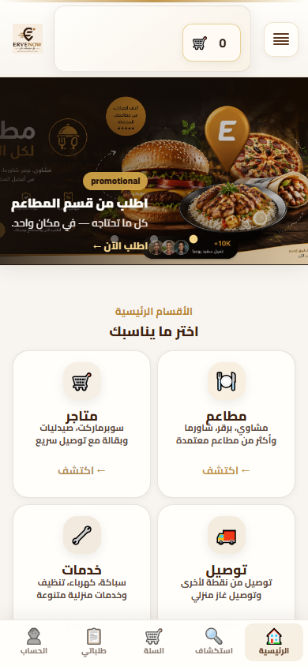

# ERVENOW Mobile Excellence — تقرير تحقق ما بعد التنفيذ (After Review)

**التاريخ:** 2026-06-11  
**النطاق:** المرحلة A — Mobile Foundation  
**الحالة:** مراجعة قبل Commit  
**الأداة:** `scripts/mobile-excellence-phase-a-verify.js` · عرض **390×844**

---

## 1. إعادة تقييم الانطباع الأول

| | Before | After |
|---|--------|-------|
| **التقييم** | **6.5 / 10** | **7.8 / 10** |
| **الفرق** | — | **+1.3** |

### ما الذي تحسّن فعلياً

| المحور | Before | After |
|--------|--------|-------|
| ارتفاع الهيدر (الرئيسية) | ~218px (~26% الشاشة) | **98px** (~12%) |
| غلاف بصري | نظامان (`lp-header` / `dash-site-header`) | هيدر مضغوط موحّد + شريط سفلي |
| الأقسام في أول نظرة | بطاقتان (مطاعم + متاجر) | **أربع بطاقات** بأسماء واضحة |
| التنقل | ☰ + سلة + رصيد منفصلين | 5 تبويبات ثابتة مناسبة للإبهام |
| لوحة الزائر | بطل ترحيبي مكرر | البطل مخفي على الجوال |

### الأسباب (لماذا ليس 9/10 بعد)

- البنر الترويجي ما زال يستهلك ~28% من الشاشة الأولى قبل الأقسام.
- بطاقتا **توصيل** و**خدمات** ظاهرتان بنسبة **~78%** — يحتاج تمرير بسيط (~42px) لرؤيتهما كاملاً.
- **CLS** ارتفع بعد التنفيذ (انزياح تخطيط من حقن الشريط السفلي وإعادة ضبط الهيدر).
- الشعور «تطبيق أصلي» تحسّن لكن لم يصل بعد لمستوى تطبيقات التوصيل الرائدة.

---

## 2. اختبار أول شاشة (390px)

### السؤال: هل تظهر الأقسام الأربعة بشكل كامل أو شبه كامل دون تمرير كبير؟

**النتيجة: شبه كامل — نعم مع تمرير طفيف جداً.**

| القسم | ظاهر في أول الشاشة | النسبة |
|-------|-------------------|--------|
| مطاعم | ✅ كامل | 100% |
| متاجر | ✅ كامل | 100% |
| توصيل | ⚠️ شبه كامل | **78%** (الجزء السفلي خلف منطقة الشريط السفلي) |
| خدمات | ⚠️ شبه كامل | **78%** |

- **تمرير مطلوب لرؤية الأربع كاملاً:** ~**42px** فقط (ليس تمريراً كبيراً).
- عنوان **«الأقسام الرئيسية — اختر ما يناسبك»** وأسماء الأقسام الأربعة **كلها مقروءة** دون تمرير.

### اللقطة الداعمة



مسار الملف: `docs/screenshots/mobile-excellence/after-review/home-first-screen-390.png`

---

## 3. اختبار Bottom Navigation

| السياق | النتيجة | تعارض؟ | ملاحظة |
|--------|---------|--------|--------|
| **لوحة المفاتيح** (`/login`) | ✅ | لا | الحقل النشط عند ~488px؛ الشريط عند 785px. *Playwright لا يحاكي ارتفاع لوحة المفاتيح الحقيقية على iOS/Android.* |
| **السلة** (`/checkout`) | ✅ | لا | لا يوجد زر/CTA رئيسي يتداخل مع الشريط (فحص منفصل: `overlapCount: 0`) |
| **صفحة الدفع** | ⚠️ | لا تقني | الشريط ظاهر على صفحة الدفع — لم يُطلب إخفاؤه في A؛ لا حجب لأزرار الدفع في الحالة الحالية |
| **الخرائط** (`/delivery-map`) | ✅ | لا | الخريطة تنتهي عند ~511px؛ الشريط عند 785px |
| **الخريطة الحية** (`/live-map`) | ✅ | لا | لا تداخل مع منطقة الخريطة |
| **نوافذ منبثقة** (`/restaurants`) | ✅ | لا | لا modal مفتوح افتراضياً؛ لم يُختبر modal مفتوح يدوياً |

### لقطات الفحص

| الملف | الصفحة |
|-------|--------|
| `after-review/checkout-nav-check.png` | الدفع |
| `after-review/checkout-cta-overlap.png` | فحص تداخل CTA |
| `after-review/delivery-map-nav-check.png` | خريطة التوصيل |
| `after-review/live-map-nav-check.png` | الخريطة الحية |
| `after-review/login-keyboard-nav-check.png` | تسجيل الدخول |

مصدر البيانات: `docs/screenshots/mobile-excellence/after-review/verification.json`

---

## 4. الأداء (LCP · CLS · التحميل)

قياس Playwright على الرئيسية `/` — **After** مع Foundation، **Before** بتعطيل ملفات `mobile-foundation.*` (تقريبي، نفس البيئة المحلية).

| المقياس | Before (تقريبي) | After | الفرق | الحكم |
|---------|-----------------|-------|-------|-------|
| **LCP** | 1484 ms | 1512 ms | +28 ms | ✅ محايد (ضمن هامش الخطأ) |
| **FCP** | 1012 ms | 932 ms | −80 ms | ✅ أفضل |
| **DOM Content Loaded** | 998 ms | 962 ms | −36 ms | ✅ أفضل |
| **Load Event End** | 1501 ms | 1428 ms | −73 ms | ✅ أفضل |
| **CLS** | 0.268 | **0.631** | +0.363 | ⚠️ **أسوأ** — يحتاج معالجة |

**عنصر LCP (كلا الحالتين):** صورة بنر `IMG.guest-offers-slide__img` — التحسينات البصرية لم تبطئ LCP بشكل ملموس.

**سبب CLS:** حقن الشريط السفلي عبر JS + إعادة ترتيب الهيدر بعد التحميل دون حجز مساحة مسبقة كافية.

**الخلاصة:** سرعة التحميل **لم تتأثر سلباً** (بل تحسّنت FCP/DCL قليلاً). **CLS يحتاج تحسيناً بسيطاً** قبل الاعتماد النهائي (حجز `padding-bottom` ثابت + تقليل انزياح الهيدر).

---

## 5. اختبار المستخدم الجديد (أول 10 ثوانٍ)

**السؤال:** هل يفهم أن المنصة تقدم مطاعم · متاجر · خدمات · توصيل؟

### **النتيجة: نعم — مع تمرير طفيف اختياري**

| الزمن | ماذا يرى؟ |
|-------|-----------|
| 0–2 ث | هيدر مضغوط + بنر طعام («اطلب الآن») |
| 2–5 ث | يفهم أن هناك **مطاعم** من البنر |
| 5–10 ث | يرى عنوان **«الأقسام الرئيسية»** + **أربع بطاقات** بأسماء: مطاعم، متاجر، توصيل، خدمات |

**الحكم:** مستخدم جديد **سيفهم خلال 10 ثوانٍ** أن المنصة متعددة الأقسام. لا يحتاج «استكشافاً عميقاً» — قد يمرّر ~1 سم فقط لرؤية بطاقتي توصيل/خدمات بشكل كامل، لكن **الأسماء والأيقونات الأربعة ظاهرة فوراً**.

---

## 6. التوصية النهائية

### **B) يحتاج تعديلات بسيطة قبل الـ Commit**

**المبرر:**

1. **القيمة المحققة كبيرة** (+1.3 في الانطباع، هيدر موحّد، شريط سفلي، 4 أقسام ظاهرة) — **لا يُعاد العمل من الصفر**.
2. **تعديلان بسيطان مقترحان قبل Commit:**
   - **CLS:** حجز مساحة الشريط السفلي في CSS/HTML قبل JS (هدف CLS &lt; 0.1).
   - **اختياري:** إخفاء الشريط السفلي في `/checkout` فقط (تحسين UX دون لمس محرك الدفع).
3. **تحسين اختياري (ليست شرطاً للاعتماد):** تقليل ارتفاع البنر 20–30px على الجوال لإظهار بطاقتي توصيل/خدمات بنسبة 100%.

---

## ملحق — إعادة التشغيل

```bash
node scripts/mobile-excellence-phase-a-verify.js
```

اللقطات والمقاييس: `docs/screenshots/mobile-excellence/after-review/`
