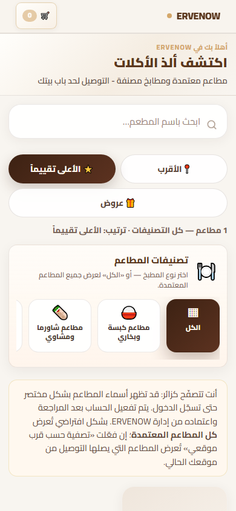
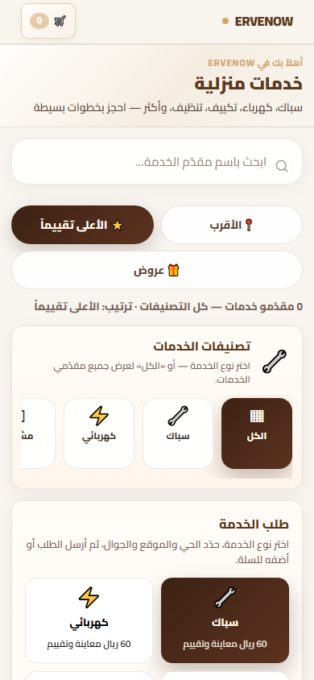
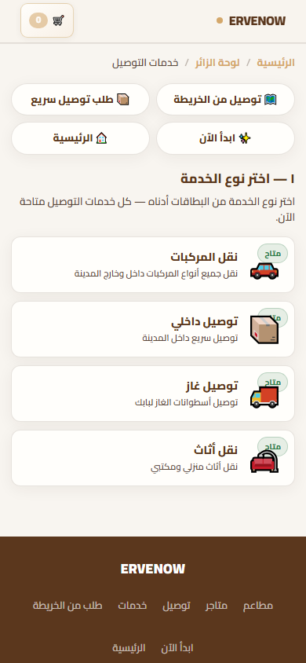

# ERVENOW Mobile Excellence — Phase B  
## Fast Discovery Audit (تحليل فقط)

**التاريخ:** 2026-06-11  
**الحالة:** تحليل · **لا تعديل · لا Commit**  
**العرض:** 390×844 (جوال)  
**اللقطات:** `docs/screenshots/mobile-excellence/phase-b-before/`  
**المقاييس:** `docs/screenshots/mobile-excellence/phase-b-before/audit-metrics.json`  
**الأداة:** `scripts/mobile-phase-b-fast-discovery-audit.js`

**الهدف:** تقليل زمن الوصول للخدمة **≥ 50%** عبر نموذج **بحث → نتائج → طلب**.

---

## ملخص تنفيذي

| الصفحة | زمن أول نتيجة (API) | تمرير لأول نتيجة | نقرات للإجراء | تقييم الاكتشاف |
|--------|---------------------|------------------|---------------|----------------|
| **المطاعم** | **1.4 ث** | **~748px** | **1** (+ تمرير) | ❌ بطيء |
| **المتاجر** | 0.7 ث | ~792px* | — (0 متاجر) | ❌ نفس القالب |
| **الخدمات** | 0.5 ث | **~661px** | **1–2** | ❌ ازدواجية |
| **التوصيل** | **0.5 ث** | **~245px** | **1** | ⚠️ الأفضل نسبياً |

\*تقدير بناءً على نفس «الكروم» قبل `#container` عند وجود نتائج.

**الخلاصة:** المطاعم والمتاجر والخدمات تتبع قالب **Hero → شرح → فلاتر → نتائج** يستهلك **~93%** من الشاشة الأولى قبل أي مطعم/متجر. التوصيل أقرب للهدف لكن ما زال يحمل breadcrumb واختصارات وعناوين مرقّمة.

---

## 1. قياس الزمن الفعلي — دخول → أول نتيجة

| الصفحة | DOM Ready | حتى أول نتيجة مرئية | أين تظهر؟ | % ظاهر دون تمرير |
|--------|-----------|---------------------|-----------|------------------|
| `/restaurants` | 892 ms | **1432 ms** | `top: 803px` | **15%** من البطاقة |
| `/stores` | 840 ms | 721 ms | لا بطاقة (0 متاجر) | 0% |
| `/services` | 924 ms | **535 ms** | `svc-order-card` @ 717px | 100% للبطاقة* |
| `/delivery-services.html` | 886 ms | **452 ms** | `ds-svc` @ 301px | **100%** |

\*البطاقة ظاهرة لكن **تحت** ~620px من واجهة تحكم (Hero + فلاتر + تصنيفات).

### زمن التجربة الكامل (تقدير مستخدم)

| الصفحة | قراءة + تمرير + انتظار | حتى «يمكنني الطلب» |
|--------|-------------------------|-------------------|
| مطاعم | ~3–4 ث تمرير/قراءة + 1.4 ث API | **~5–6 ث** |
| متاجر | ~3–4 ث (نفس الكروم) | **~5–6 ث** (إن وُجدت نتائج) |
| خدمات | ~4–5 ث (لوحة طلب 1059px) | **~6–7 ث** |
| توصيل | ~1 ث قراءة + 0.5 ث API | **~2–3 ث** (+ تعبئة نموذج) |

**هدف −50%:** مطاعم/متاجر/خدمات → **≤ 2.5–3 ث**؛ توصيل → **≤ 1.5 ث** لبدء النموذج.

---

## 2. عدد النقرات للوصول

### المطاعم — أول مطعم
```
0  دخول الصفحة
   └ Hero + بحث + 3 فلاتر + تصنيفات + فقرة زائر (كلها قبل النتائج)
1  نقرة «عرض المطعم» على store-card
```
- **الحد الأدنى: 1 نقرة** (لكن **~897px تمرير** مطلوب عملياً)
- **لا نقرات إلزامية** على الفلاتر — لكنها تشتت وتأخر الاكتشاف

### المتاجر — أول متجر
- **0 نقرات** حالياً (لا نتائج في بيئة القياس)
- بنفس القالب: **1 نقرة** + تمرير مماثل عند وجود متاجر

### الخدمات — أول خدمة
```
مسار أ (مضمّن — أقصر):
0  Hero + فلاتر + تصنيفات
1  اختيار svc-order-card (سباك/كهرباء…) + إرسال النموذج

مسار ب (شبكة مقدّمين):
0  نفس الكروم + لوحة طلب كاملة (~1059px)
1  تمرير ~1495px
2  نقرة «احجز» على store-card
```
- **ازدواجية:** نموذج طلب **+** شبكة مقدّمين — المستخدم لا يعرف أيهما «الرسمي»

### التوصيل — أول طلب
```
0  breadcrumb + 4 اختصارات + عنوان «١ — اختر…»
1  نقرة ds-svc (مثلاً «توصيل داخلي»)
2+ تعبئة حقول النموذج + إرسال
```
- **1 نقرة** لبدء الطلب — **الأقل** بين الأقسام الأربعة

---

## 3. عناصر قابلة للإزالة / التقليص (جوال 390px)

### مشترك — مطاعم · متاجر · خدمات

| العنصر | الارتفاع تقريباً | % الشاشة | التوصية |
|--------|------------------|----------|---------|
| `guest-section-hero` | **~102px** | 12% | **إخفاء** — العنوان في الهيدر/tag كافٍ |
| `guest-section-hero__eyebrow` + `__sub` | ~40px | 5% | **حذف** على الجوال |
| `#hubSortBar` (3 أزرار عمودية) | **~104px** | 12% | **شريط أفقي واحد** أو قائمة «ترتيب ▾» |
| `#hubCountLine` | ~19px | 2% | **دمج** داخل placeholder البحث |
| `#storesRestaurantCuisineBlock` / `#storesCategoryBlock` | **~186–203px** | 22% | **شرائح فقط** — حذف العنوان والشرح |
| `#guestNote` | **~160–182px** | 19% | **طيّ** «؟» أو إظهار مرة واحدة |
| مسافات `stores-toolbar` | ~40px | 5% | **−50%** padding/gap |
| **المجموع القابل للتوفير** | **~650–720px** | **~77–85%** | |



### خدمات — إضافي

| العنصر | الارتفاع | التوصية |
|--------|----------|---------|
| `#svcOrderPanel` (نموذج + بطاقات + حقول) | **~1059px** | **إزالة من أعلى الصفحة** — يظهر بعد اختيار مقدّم أو كخطوة 2 |
| تكرار تصنيفات (شريط + svc-order-cards) | ~300px | **مصدر واحد** للتصنيف |



### توصيل

| العنصر | الارتفاع | التوصية |
|--------|----------|---------|
| `.ds-crumb` | ~20px | **إخفاء** على الجوال |
| `.ds-quicklinks` (4 روابط) | **~91px** | **إخفاء** — Bottom Nav + هيدر يغطيان |
| `#dsQuickTitle` + `#dsLeadMuted` | ~60px | **سطر واحد** أو placeholder |
| `#dsFormTitle` «٢ — أكمل…» | ~40px | **Progress bar** بدل عنوان مرقّم |
| `#dsFormHint` | ~20px | **حذف** — الحقول self-explanatory |



---

## 4. نموذج Mobile-First المقترح

### المبدأ الموحّد

```
[ هيدر مضغوط 56px ]
[ 🔍 بحث sticky — دائماً ظاهر ]
[ 🏷️ شرائح تصنيف أفقية — سطر واحد ]
[ ═══ النتائج فوراً ═══ ]
[ بطاقة 1 ]
[ بطاقة 2 ]
…
```

**بدلاً من:**

```
Hero → شرح → بحث → 3 فلاتر → عداد → عنوان تصنيف + شرح → فقرة زائر → نتائج
```

### A) المطاعم · المتاجر (قالب Hub واحد)

| # | التغيير | تأثير متوقع |
|---|---------|-------------|
| 1 | إخفاء Hero على ≤640px | **−102px** · أول بطاقة ↑ |
| 2 | Sticky search + sort chip row | فلترة دون تمرير للأعلى |
| 3 | تصنيفات chips بدون `__head` | **−80px** |
| 4 | `#guestNote` collapsible | **−160px** |
| 5 | Skeleton → بطاقة خلال **≤800ms** | زمن API كما هو · UX أسرع |

**الهدف:** أول بطاقة @ **~120–180px** من الأعلى (تحت الهيدر+بحث) → تمرير **−75%** (~748 → **~180px**).

### B) الخدمات

| # | التغيير |
|---|---------|
| 1 | **مسار واحد:** شبكة مقدّمين **أو** طلب سريع — ليس الاثنين |
| 2 | المقترح: **بحث → بطاقات مقدّم → نموذج طلب** (modal/sheet) |
| 3 | نقل `svc-order-panel` إلى sheet بعد «احجز» |

**الهدف:** إزالة **~1059px** كروم قبل الشبكة.

### C) التوصيل

| # | التغيير |
|---|---------|
| 1 | أول شاشة = **4 بطاقات خدمة** مباشرة تحت الهيدر |
| 2 | breadcrumb + quicklinks → **إخفاء** على الجوال |
| 3 | بعد اختيار خدمة: **نموذج full-screen** (بدون «١/٢») |

**الهدف:** أول `ds-svc` @ **~70px** (تحت هيدر فقط) · **−75%** من 245px.

---

## 5. Before Screenshots

| الصفحة | أول paint | بعد التحميل | كامل |
|--------|-----------|-------------|------|
| مطاعم | `restaurants-first-paint-390.png` | `restaurants-loaded-390.png` | `restaurants-full-390.png` |
| متاجر | `stores-first-paint-390.png` | `stores-loaded-390.png` | `stores-full-390.png` |
| خدمات | `services-first-paint-390.png` | `services-loaded-390.png` | `services-full-390.png` |
| توصيل | `delivery-first-paint-390.png` | `delivery-loaded-390.png` | `delivery-full-390.png` |

المسار: `docs/screenshots/mobile-excellence/phase-b-before/`

---

## 6. هدف −50% — خطة قابلة للقياس

| المقياس | الآن (Before) | هدف Phase B | التوفير |
|---------|---------------|-------------|---------|
| تمرير لأول نتيجة (مطاعم) | 748px | **≤ 180px** | **−76%** |
| كروم قبل النتائج (مطاعم) | ~787px | **≤ 200px** | **−75%** |
| زمن UX حتى إجراء (مطاعم) | ~5–6 ث | **≤ 2.5 ث** | **−58%** |
| كروم خدمات قبل شبكة | ~3322px* | **≤ 200px** | **−94%** |
| تمرير توصيل | 245px | **≤ 60px** | **−75%** |
| نقرات مطعم/متجر | 1 + scroll | **1** (بدون scroll) | ✅ |

\*يشمل `#svcOrderPanel` المكرر.

---

## 7. أولويات التنفيذ (عند الموافقة — Phase B Implementation)

1. **P0 — Hub Template** (`section-hub.css` + HTML مشترك): إخفاء Hero، sticky search، chips مضغوطة، طي `#guestNote`.
2. **P0 — الخدمات:** فصل مسار الطلب عن شبكة المقدّمين.
3. **P1 — التوصيل:** إخفاء breadcrumb/quicklinks على الجوال؛ نموذج full-screen.
4. **P1 — المتاجر:** نفس Hub (لا كود منفصل).
5. **P2 — Empty states** محفّزة بدل فقرة زائر طويلة.

---

## 8. القيود (تم الالتزام بها)

- ✅ تحليل فقط — **لا تعديل في الكود**
- ✅ **لا Commit**
- ✅ لم تبدأ Phase B Implementation
- ✅ لقطات Before مرفقة

---

## إعادة التشغيل

```bash
node scripts/mobile-phase-b-fast-discovery-audit.js
```
