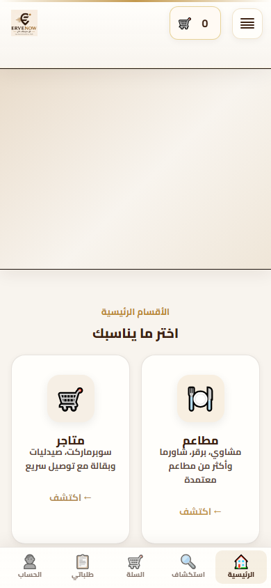

# ERVENOW Mobile Excellence — Phase C  
## Home Conversion Audit (تحليل فقط)

**التاريخ:** 2026-06-11  
**الحالة:** تحليل · **لا تعديل · لا Commit · لا Push**  
**الصفحة:** `/` (الرئيسية)  
**العرض:** 390×844 (جوال)  
**اللقطات:** `docs/screenshots/mobile-excellence/phase-c-before/`  
**المقاييس:** `docs/screenshots/mobile-excellence/phase-c-before/audit-metrics.json`  
**الأداة:** `scripts/mobile-phase-c-home-conversion-audit.js`  
**مرجع Phase A:** CLS الرئيسية **0.033** · LCP **1392ms** (عنصر LCP = صورة البنر)

---

## الحكم النهائي (سؤال التقرير)

> **هل الصفحة الرئيسية الحالية تساعد المستخدم على اكتشاف قوة ERVENOW خلال أول 10 ثوانٍ؟**

### **جزئياً — لا بشكل كافٍ**

| الهدف | الحكم | السبب |
|-------|--------|--------|
| **جذب خلال 5 ث** | ⚠️ **متوسط** | البنر + بطاقتا مطاعم/متاجر ظاهرتان؛ تصميم جذاب لكن البنر يستهلك **34%** من الشاشة |
| **شرح ERVENOW خلال 10 ث** | ❌ **ضعيف** | لا يوجد نص يشرح «ما هي المنصة» فوق الطية؛ «لماذا ERVENOW؟» وشريط الثقة **تحت** الشاشة الأولى |
| **دفع الاستكشاف** | ✅ **جيد نسبياً** | 4 بطاقات أقسام + شريط سفلي «استكشاف»؛ لكن **توصيل/خدمات** شبه مخفيتين (18% ظاهر) |

**الخلاصة:** الصفحة **تدفع نحو الأقسام** (مطاعم/متاجر) بسرعة، لكنها **لا تشرح قيمة ERVENOW كمنصة موحّدة** دون تمرير. المستخدم يفهم «أين أطلب» أسرع مما يفهم «لماذا ERVENOW».

---

## 1. First Impression Score

تقييم من **1 إلى 10** (10 = ممتاز) — بناءً على القياس الفعلي @390px وخط زمني 0→10 ث.

| البُعد | الدرجة | الملاحظة |
|--------|--------|----------|
| **الهوية** | **6/10** | شعار ERVENOW في الهيدر واضح؛ لكن **«المنصة الذكية»** مخفية على الجوال (`lp-header__brand-mid { display: none }`)؛ لا عنوان Hero نصّي |
| **الوضوح** | **5/10** | «اختر ما يناسبك» + 4 بطاقات = وضوح **الأقسام**؛ غموض **دور المنصة** (مطاعم + متاجر + مناديب + تتبع) |
| **الثقة** | **4/10** | شريط «توصيل سريع · دفع آمن · تتبع · دعم» يبدأ @ **1062px** — **خارج** الشاشة الأولى بالكامل |
| **الجاذبية** | **7/10** | بنر شرائح + بطاقات ملونة + هوية بصرية دافئة؛ LCP مستقر بعد Phase A |
| **الاستكشاف** | **6/10** | مطاعم/متاجر 100% ظاهران؛ توصيل/خدمات **18%** فقط؛ الشريط السفلي يغطي الصف الثاني |

### **المجموع المركّب: 5.6 / 10 (56%)**

---

## 2. Hero Analysis

### ما هو «الـ Hero» فعلياً؟

لا يوجد `lp-hero-shell` في HTML الحالي — الأنماط legacy غير مستخدمة. **الـ Hero الفعلي = بنر الشرائح** `#homeMainBanner` (guest-offers-carousel).

| المقياس | القيمة @390px |
|---------|----------------|
| **ارتفاع الهيدر** | **98px** (11.6% من 844) |
| **ارتفاع البنر** | **289px** (34.2% من 844) |
| **موضع البنر** | `top: 98px` → `bottom: 387px` |
| **مساحة البنر+الهيدر** | **387px** = **45.9%** من ارتفاع الشاشة |
| **أول بطاقة قسم** | `top: 509px` = **60.3%** من الشاشة |

### تأثير البنر

| | قبل تحميل الشرائح (0ms) | بعد تحميل (800ms+) |
|---|-------------------------|---------------------|
| محتوى البنر | placeholder فارغ (reserved) | 3 شرائح: «اطلب من قسم المطاعم…» |
| LCP | — | صورة `.guest-offers-slide__img` (~1.4 ث) |
| رسالة | لا شرح | **ترويج قسم** وليس «ما هي ERVENOW» |

### هل يساعد أم يؤخر؟

**كلاهما — بأوزان مختلفة:**

- ✅ **يساعد:** جاذبية بصرية، عروض، CTA «اطلب الآن» يوجّه للمطاعم  
- ❌ **يؤخر:** يدفع بطاقات الأقسام إلى **509px**؛ يستهلك نصف الشاشة قبل أي اختيار مباشر  
- ⚠️ **ازدواجية:** البنر يروّج للمطاعم بينما البطاقات تعرض 4 مسارات — رسالة غير موحّدة  

**التوصية التحليلية (P1 محتمل):** على الجوال، البنر **يعرقل** هدف Phase B (اكتشاف سريع) على **الصفحة الرئيسية** أيضاً — ليس بقدر صفحات Hub، لكنه السبب الرئيسي لإخفاء صفّين من البطاقات.

---

## 3. Fold Analysis — ماذا يرى المستخدم @390px؟

### خريطة الطية الأولى (بعد 10 ث، بدون تمرير)

```
  0px   ┌─────────────────────────────┐
        │  هيدر (98px) — شعار + قائمة + سلة │
 98px   ├─────────────────────────────┤
        │                             │
        │  بنر شرائح (289px)          │  ← 34% من الشاشة
        │  «اطلب من قسم المطاعم…»     │
387px   ├─────────────────────────────┤
        │  (فجوة ~51px)               │
438px   │  «الأقسام الرئيسية»         │
466px   │  «اختر ما يناسبك»          │
509px   ├──────────┬──────────────────┤
        │ 🍽 مطاعم │ 🛒 متاجر         │  ← 100% ظاهر
        │ (273px)  │ (273px)          │
781px   ├──────────┴──────────────────┤
785px   │ ▓▓▓▓ شريط سفلي (59px) ▓▓▓▓▓▓▓ │  ← يغطي أسفل الشاشة
797px   │ 🚚 توصيل │ 🔧 خدمات         │  ← 18% ظاهر فقط
844px   └─────────────────────────────┘
```

### عناصر **غير** مرئية في الطية الأولى

| العنصر | موضع `top` | ملاحظة |
|--------|------------|--------|
| شريط الثقة `.sn-trust` | 1062px | توصيل سريع · دفع آمن · … |
| عدّادات `#stats` | 1309px | 300+ طلب يومي · … |
| «لماذا ERVENOW؟» `#why` | ~1750px+ | الشرح الحقيقي للمنصة |
| «كيف تعمل؟» `#how` | أعمق | |

### لقطة الشاشة (Fold)



| لقطة | الملف |
|------|--------|
| الطية الأولى (0ms) | `phase-c-before/home-fold-390.png` |
| بعد 5 ث | `phase-c-before/home-at-5s-390.png` |
| بعد 10 ث | `phase-c-before/home-at-10s-390.png` |
| صفحة كاملة | `phase-c-before/home-full-390.png` |

---

## 4. Conversion Path — من الرئيسية إلى كل قسم

### مسار مباشر (بطاقات `#snHomeHub`)

| القسم | ظاهر في الطية؟ | موضع البطاقة | زمن الوصول للنقر* | زمن الانتقال (API) | **المجموع** |
|-------|----------------|--------------|-------------------|---------------------|-------------|
| **مطاعم** | ✅ 100% | 509px | ~**1.0–1.5 ث** | 171ms | **~1.7–2.0 ث** |
| **متاجر** | ✅ 100% | 509px | ~**1.0–1.5 ث** | 202ms | **~1.7–2.0 ث** |
| **خدمات** | ⚠️ 18% | 797px | ~**2.0–2.5 ث** (+ تمرير ~50px) | 108ms | **~2.5–3.0 ث** |
| **توصيل** | ⚠️ 18% | 797px | ~**2.0–2.5 ث** (+ تمرير) | 474ms | **~2.8–3.5 ث** |

\*زمن «رؤية → قرار → نقرة» — تقدير UX؛ البطاقات الظاهرة 100% أسرع بكثير من المقطوعة.

### مسار بديل (الشريط السفلي)

| الزر | الوجهة | ملاحظة |
|------|--------|--------|
| 🔍 **استكشاف** | `/start-now.html` | **غير مباشر** — خطوة إضافية قبل الأقسام |
| 🏠 الرئيسية | `/` | — |
| 🛒 السلة | `/checkout` | conversion مختلف |
| 📋 طلباتي | `/my-orders` | للمستخدم العائد |
| 👤 الحساب | `/login` | حاجز دخول |

### تقييم الأهداف الزمنية

| الهدف | مطاعم/متاجر | توصيل/خدمات |
|-------|-------------|-------------|
| **جذب 5 ث** | ✅ يصل للبطاقة وينقر | ⚠️ يحتاج تمريراً خفيفاً |
| **شرح 10 ث** | ❌ لا يقرأ «لماذا ERVENOW» | ❌ |

---

## 5. Opportunities — تحسينات دون تعقيد (تحليل P1)

مرتبة حسب **أثر/بساطة** — **لم تُنفَّذ**:

| # | الفرصة | الأثر المتوقع | التعقيد |
|---|--------|---------------|---------|
| 1 | **تقليص ارتفاع البنر على الجوال** (289→~180px) | إظهار 4/4 بطاقات + تقليل 130px تمرير | منخفض (CSS) |
| 2 | **سطر قيمة واحد** فوق البطاقات: «مطاعم · متاجر · توصيل · خدمات — في مكان واحد» | يجيب هدف **10 ث** شرح | منخفض |
| 3 | **إظهار «المنصة الذكية»** في الهيدر الجوال (حالياً مخفي) | تقوية الهوية | منخفض |
| 4 | **رفع شريط الثقة** (4 chips) مباشرة تحت العنوان | ثقة فوق الطية | منخفض |
| 5 | **padding-bottom** لشبكة البطاقات فوق الشريط السفلي | توصيل/خدمات 18%→~60%+ | منخفض |
| 6 | **مواءمة رسالة البنر** مع البطاقات (منصة شاملة vs مطاعم فقط) | وضوح | متوسط (محتوى) |
| 7 | **استكشاف → `/dashboard` أو anchor `#snHomeHub`** بدل `/start-now.html` | نقرة أقل | متوسط |

**ما لا ننصح به (تعقيد زائد):** Hero نصّي كامل منفصل، فيديو، onboarding متعدد الخطوات، أو إعادة تصميم كامل.

---

## 6. Before Screenshots + القياسات

### ملخص JSON

```json
{
  "domReadyMs": 1237,
  "headerH": 98,
  "bannerH": 289,
  "firstCardTop": 509,
  "cardsFullVisible": ["restaurants", "stores"],
  "cardsPartialVisible": { "delivery": "18%", "services": "18%" },
  "trustVisibleInFold": false,
  "whyErvenowVisibleInFold": false
}
```

### Phase A (مرجع)

| المقياس | القيمة |
|---------|--------|
| CLS | 0.033 ✅ |
| LCP | 1392ms |
| عنصر LCP | صورة البنر |

---

## مقارنة مع Phase B (اتساق التجربة)

| | Hub (مطاعم) بعد P0 | الرئيسية |
|---|---------------------|----------|
| Hero/بنر | مخفي | **289px بنر** |
| أول نتيجة/قسم | ~183px | **509px** (بطاقة مطاعم) |
| نموذج UX | Search → Results | Banner → Categories |

**فجوة:** Phase B سرّعت **صفحات الأقسام**؛ الرئيسية ما زالت تقدّم **طبقة بنر سميكة** قبل الاختيار — تجربة غير متسقة.

---

## التوصية للمراجعة

1. **اعتماد Phase C كتحليل** — لا تنفيذ حتى الموافقة على P1.  
2. **أولوية P1 المقترحة:** (1) بنر أقصر + (2) سطر قيمة + (5) إصلاح تداخل الشريط السفلي.  
3. **اختبار يدوي:** مسار «زائر جديد → هل يفهم ERVENOW؟» خلال 10 ث بدون تمرير.

---

**لا تعديل · لا Commit · لا Push**
