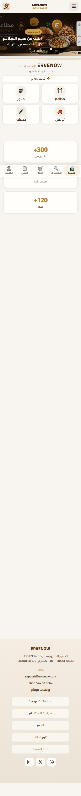
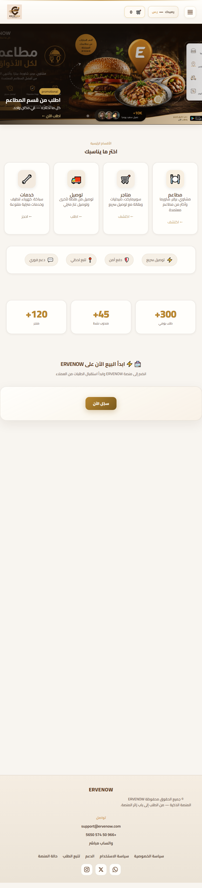
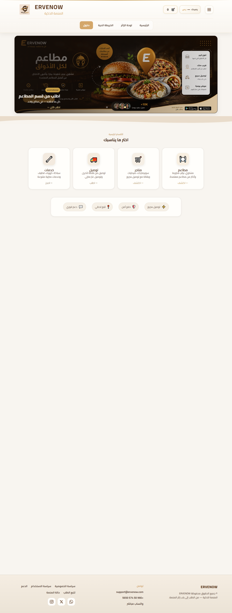
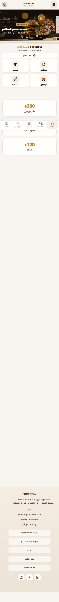
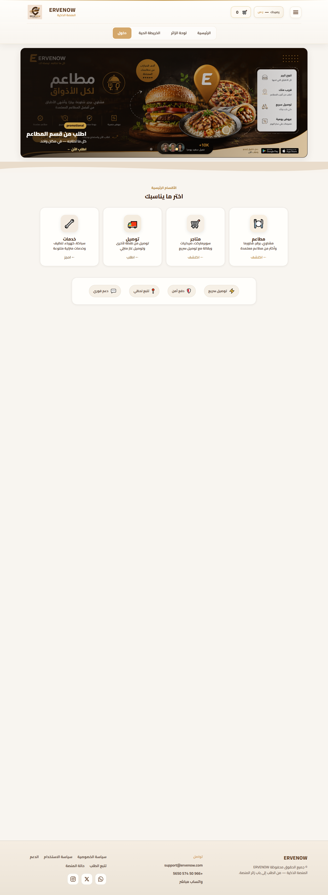

# ERVENOW Typography PR2 — Home Report

**Date:** 2026-06-12
**Scope:** Home (`/`) — Identity · Hero Text · Trust · Cards · Sections
**Font:** Cairo (unchanged)

## Tokens Applied (PR1 system)

| Role | Mobile | Tablet | Desktop | Weight |
|------|--------|--------|---------|--------|
| H1 | 24px | 28px | 32px | 700 |
| H2 | 18px | 20px | 22px | 700 |
| H3 | 16px | 18px | 18px | 600 |
| Body | 16px | 16px | 16px | 400–500 |
| Secondary | 14px | 14px | 14px | 400–500 |
| Caption | 12px | 12px | 12px | 400 |

## Identity Tag (special)

| | Mobile | Tablet | Desktop |
|--|--------|--------|---------|
| ERVENOW | 24px | 28px | 32px |
| المنصة الذكية | 14px | 16px | 18px |

## Screenshots — After

| Viewport | Screenshot |
|----------|------------|
| Mobile 390 |  |
| Tablet 768 |  |
| Desktop 1280 |  |

## Screenshots — Before

| Viewport | Screenshot |
|----------|------------|
| Mobile 390 |  |
| Tablet 768 |  |
| Desktop 1280 |  |

## Computed Typography (After)

### home@390

```json
{
  "identityName": {
    "fontSize": "24px",
    "fontWeight": "700",
    "lineHeight": "32.4px"
  },
  "identityNameHeader": {
    "fontSize": "14.72px",
    "fontWeight": "900",
    "lineHeight": "16.928px"
  },
  "identityTag": {
    "fontSize": "14px",
    "fontWeight": "500",
    "lineHeight": "20.3px"
  },
  "identityTagHeader": {
    "fontSize": "10.88px",
    "fontWeight": "700",
    "lineHeight": "13.056px"
  },
  "identityScope": {
    "fontSize": "12px",
    "fontWeight": "400",
    "lineHeight": "17.4px"
  },
  "heroSlideTitle": {
    "fontSize": "18px",
    "fontWeight": "700",
    "lineHeight": "24.3px"
  },
  "heroSlideSub": {
    "fontSize": "14px",
    "fontWeight": "500",
    "lineHeight": "20.3px"
  },
  "sectionLabel": {
    "fontSize": "12px",
    "fontWeight": "400",
    "lineHeight": "17.4px"
  },
  "sectionTitle": {
    "fontSize": "18px",
    "fontWeight": "700",
    "lineHeight": "24.3px"
  },
  "sectionLead": {
    "fontSize": "14px",
    "fontWeight": "500",
    "lineHeight": "20.3px"
  },
  "cardTitle": {
    "fontSize": "16px",
    "fontWeight": "600",
    "lineHeight": "21.6px"
  },
  "cardDesc": {
    "fontSize": "14px",
    "fontWeight": "500",
    "lineHeight": "20.3px"
  },
  "trustItem": {
    "fontSize": "14px",
    "fontWeight": "500",
    "lineHeight": "20.3px"
  },
  "whyH3": {
    "fontSize": "16px",
    "fontWeight": "600",
    "lineHeight": "21.6px"
  },
  "whyBody": {
    "fontSize": "14px",
    "fontWeight": "500",
    "lineHeight": "20.3px"
  },
  "_fontSizeHistogram": [
    {
      "size": "10.88px",
      "count": 1
    },
    {
      "size": "11.52px",
      "count": 2
    },
    {
      "size": "12px",
      "count": 18
    },
    {
      "size": "12.48px",
      "count": 1
    },
    {
      "size": "12.8px",
      "count": 1
    },
    {
      "size": "13.12px",
      "count": 4
    },
    {
      "size": "13.3333px",
      "count": 3
    },
    {
      "size": "13.6px",
      "count": 4
    },
    {
      "size": "13.76px",
      "count": 40
    },
    {
      "size": "14px",
      "count": 25
    },
    {
      "size": "14.08px",
      "count": 5
    },
    {
      "size": "14.4px",
      "count": 4
    },
    {
      "size": "14.72px",
      "count": 4
    },
    {
      "size": "16px",
      "count": 100
    },
    {
      "size": "16.8px",
      "count": 19
    },
    {
      "size": "17.6px",
      "count": 6
    },
    {
      "size": "18px",
      "count": 7
    },
    {
      "size": "19.2px",
      "count": 6
    },
    {
      "size": "20px",
      "count": 4
    },
    {
      "size": "21.6px",
      "count": 5
    },
    {
      "size": "24px",
      "count": 1
    },
    {
      "size": "32px",
      "count": 6
    }
  ],
  "_layout": {
    "bannerH": 205,
    "hubH": 191,
    "identityVisible": true
  }
}
```

### home@768

```json
{
  "identityName": {
    "fontSize": "28px",
    "fontWeight": "700",
    "lineHeight": "37.8px"
  },
  "identityNameHeader": {
    "fontSize": "28px",
    "fontWeight": "700",
    "lineHeight": "37.8px"
  },
  "identityTag": {
    "fontSize": "16px",
    "fontWeight": "500",
    "lineHeight": "23.2px"
  },
  "identityTagHeader": {
    "fontSize": "16px",
    "fontWeight": "500",
    "lineHeight": "23.2px"
  },
  "identityScope": {
    "fontSize": "12px",
    "fontWeight": "400",
    "lineHeight": "17.4px"
  },
  "heroSlideTitle": {
    "fontSize": "20px",
    "fontWeight": "700",
    "lineHeight": "27px"
  },
  "heroSlideSub": {
    "fontSize": "14px",
    "fontWeight": "500",
    "lineHeight": "20.3px"
  },
  "sectionLabel": {
    "fontSize": "12px",
    "fontWeight": "400",
    "lineHeight": "17.4px"
  },
  "sectionTitle": {
    "fontSize": "20px",
    "fontWeight": "700",
    "lineHeight": "27px"
  },
  "sectionLead": {
    "fontSize": "14px",
    "fontWeight": "500",
    "lineHeight": "20.3px"
  },
  "cardTitle": {
    "fontSize": "18px",
    "fontWeight": "600",
    "lineHeight": "24.3px"
  },
  "cardDesc": {
    "fontSize": "14px",
    "fontWeight": "500",
    "lineHeight": "20.3px"
  },
  "trustItem": {
    "fontSize": "14px",
    "fontWeight": "500",
    "lineHeight": "20.3px"
  },
  "whyH3": {
    "fontSize": "18px",
    "fontWeight": "600",
    "lineHeight": "24.3px"
  },
  "whyBody": {
    "fontSize": "14px",
    "fontWeight": "500",
    "lineHeight": "20.3px"
  },
  "_fontSizeHistogram": [
    {
      "size": "10.88px",
      "count": 1
    },
    {
      "size": "11.52px",
      "count": 1
    },
    {
      "size": "12px",
      "count": 9
    },
    {
      "size": "12.8px",
      "count": 1
    },
    {
      "size": "13.3333px",
      "count": 3
    },
    {
      "size": "13.76px",
      "count": 2
    },
    {
      "size": "14px",
      "count": 32
    },
    {
      "size": "14.08px",
      "count": 16
    },
    {
      "size": "14.4px",
      "count": 41
    },
    {
      "size": "14.72px",
      "count": 3
    },
    {
      "size": "16px",
      "count": 92
    },
    {
      "size": "16.8px",
      "count": 19
    },
    {
      "size": "17.6px",
      "count": 10
    },
    {
      "size": "18px",
      "count": 10
    },
    {
      "size": "19.2px",
      "count": 1
    },
    {
      "size": "20px",
      "count": 8
    },
    {
      "size": "28px",
      "count": 2
    },
    {
      "size": "32px",
      "count": 4
    },
    {
      "size": "38.4px",
      "count": 6
    }
  ],
  "_layout": {
    "bannerH": 382,
    "hubH": 273,
    "identityVisible": false
  }
}
```

### home@1280

```json
{
  "identityName": {
    "fontSize": "32px",
    "fontWeight": "700",
    "lineHeight": "43.2px"
  },
  "identityNameHeader": {
    "fontSize": "32px",
    "fontWeight": "700",
    "lineHeight": "43.2px"
  },
  "identityTag": {
    "fontSize": "18px",
    "fontWeight": "500",
    "lineHeight": "26.1px"
  },
  "identityTagHeader": {
    "fontSize": "18px",
    "fontWeight": "500",
    "lineHeight": "26.1px"
  },
  "identityScope": {
    "fontSize": "12px",
    "fontWeight": "400",
    "lineHeight": "17.4px"
  },
  "heroSlideTitle": {
    "fontSize": "22px",
    "fontWeight": "700",
    "lineHeight": "29.7px"
  },
  "heroSlideSub": {
    "fontSize": "14px",
    "fontWeight": "500",
    "lineHeight": "20.3px"
  },
  "sectionLabel": {
    "fontSize": "12px",
    "fontWeight": "400",
    "lineHeight": "17.4px"
  },
  "sectionTitle": {
    "fontSize": "22px",
    "fontWeight": "700",
    "lineHeight": "29.7px"
  },
  "sectionLead": {
    "fontSize": "14px",
    "fontWeight": "500",
    "lineHeight": "20.3px"
  },
  "cardTitle": {
    "fontSize": "18px",
    "fontWeight": "600",
    "lineHeight": "24.3px"
  },
  "cardDesc": {
    "fontSize": "14px",
    "fontWeight": "500",
    "lineHeight": "20.3px"
  },
  "trustItem": {
    "fontSize": "14px",
    "fontWeight": "500",
    "lineHeight": "20.3px"
  },
  "whyH3": {
    "fontSize": "18px",
    "fontWeight": "600",
    "lineHeight": "24.3px"
  },
  "whyBody": {
    "fontSize": "14px",
    "fontWeight": "500",
    "lineHeight": "20.3px"
  },
  "_fontSizeHistogram": [
    {
      "size": "10.88px",
      "count": 1
    },
    {
      "size": "11.52px",
      "count": 1
    },
    {
      "size": "12px",
      "count": 9
    },
    {
      "size": "12.8px",
      "count": 1
    },
    {
      "size": "13.3333px",
      "count": 3
    },
    {
      "size": "13.76px",
      "count": 2
    },
    {
      "size": "14px",
      "count": 32
    },
    {
      "size": "14.08px",
      "count": 16
    },
    {
      "size": "14.4px",
      "count": 41
    },
    {
      "size": "14.72px",
      "count": 3
    },
    {
      "size": "16px",
      "count": 94
    },
    {
      "size": "16.8px",
      "count": 19
    },
    {
      "size": "17.6px",
      "count": 10
    },
    {
      "size": "18px",
      "count": 12
    },
    {
      "size": "19.2px",
      "count": 1
    },
    {
      "size": "22px",
      "count": 8
    },
    {
      "size": "32px",
      "count": 6
    },
    {
      "size": "42.4px",
      "count": 6
    }
  ],
  "_layout": {
    "bannerH": 427,
    "hubH": 229,
    "identityVisible": false
  }
}
```

## Before → After (key roles)


| Viewport | Role | Before | After |
|----------|------|--------|-------|
| home@390 | identityName | 16px | 24px |
| home@390 | identityNameHeader | 14.72px | 14.72px |
| home@390 | identityTag | 12.48px | 14px |
| home@390 | identityTagHeader | 10.88px | 10.88px |
| home@390 | trustItem | 10.4px | 14px |
| home@390 | cardTitle | 14.08px | 16px |
| home@390 | cardDesc | 12.8px | 14px |
| home@390 | sectionTitle | 19.2px | 18px |
| home@390 | sectionLead | 15.2px | 14px |
| home@390 | heroSlideTitle | 16px | 18px |
| home@768 | identityName | 16px | 28px |
| home@768 | identityNameHeader | 19.968px | 28px |
| home@768 | identityTag | 16px | 16px |
| home@768 | identityTagHeader | 11.52px | 16px |
| home@768 | trustItem | 13.12px | 14px |
| home@768 | cardTitle | 16.8px | 18px |
| home@768 | cardDesc | 12.8px | 14px |
| home@768 | sectionTitle | 23.2px | 20px |
| home@768 | sectionLead | 16.896px | 14px |
| home@768 | heroSlideTitle | 21.6px | 20px |
| home@1280 | identityName | 16px | 32px |
| home@1280 | identityNameHeader | 21.12px | 32px |
| home@1280 | identityTag | 16px | 18px |
| home@1280 | identityTagHeader | 11.52px | 18px |
| home@1280 | trustItem | 13.12px | 14px |
| home@1280 | cardTitle | 16.8px | 18px |
| home@1280 | cardDesc | 12.8px | 14px |
| home@1280 | sectionTitle | 23.2px | 22px |
| home@1280 | sectionLead | 16.96px | 14px |
| home@1280 | heroSlideTitle | 21.6px | 22px |

## Layout & Harmony Checks

- Colors: unchanged
- Layout / Cards grid: unchanged
- Mobile Harmony: section reorder · hidden labels preserved
- Hero / Banner height: unchanged
- Bottom Nav: unchanged (typography untouched)

## Files

- `public/assets/design-system/erv-typography-pr1-tokens.css` (reused)
- `public/assets/design-system/erv-typography-home-pr2.css`
- `public/index.html` (body class + links)
