# ERVENOW Typography PR4 — Operations Report

**Date:** 2026-06-12
**Scope:** Admin · Driver · Store · Provider Dashboards
**Font:** Cairo (unchanged)

## Summary

Typography PR4 applies the unified PR1 token system to all operations dashboards via `body.erv-typography-pr4-operations`.
Operations-specific tokens extend PR1 for **KPI Cards** (20/24/24px · 700), **Tables** (14px), and **Status Badges** (12px).

### Key fixes

| Area | Before (issue) | After (target) |
|------|----------------|----------------|
| **Admin — title** | 21.6px mobile (clamp) | H1: 24 / 28 / 32px |
| **Admin — KPI values** | 19.52px | KPI: 20 / 24 / 24px |
| **Admin — tables** | 14.08–14.72px mixed | 14px uniform |
| **Driver — hero eyebrow** | 13.6px mobile | H1: 24 / 28 / 32px |
| **Driver — order sections** | 14.72px | H2: 18 / 20 / 22px |
| **Driver — status badges** | 11.52px | 12px caption |
| **Store — hero title** | 18.4px (clamp) | H1: 24 / 28 / 32px |
| **Store — KPI labels** | 12.48px | Secondary: 14px |
| **Provider — KPI values** | 18.4px | KPI: 20 / 24 / 24px |
| **Provider — section titles** | 24px (unstyled h2) | H2: 18 / 20 / 22px |

### Verification

- **Layout:** `mainW` unchanged across all 12 viewports
- **Colors / tables structure / KPI logic:** no changes
- **Cairo:** preserved (explicit link added to Provider)
- **Font-size diversity:** 38 → 32 unique sizes (−6)

## Tokens Applied

| Role | Mobile | Tablet | Desktop | Weight |
|------|--------|--------|---------|--------|
| H1 | 24px | 28px | 32px | 700 |
| H2 | 18px | 20px | 22px | 700 |
| H3 | 16px | 18px | 18px | 600 |
| Body | 16px | 16px | 16px | 500 |
| Secondary | 14px | 14px | 14px | 500 |
| Caption | 12px | 12px | 12px | 400 |
| KPI Value | 20px | 24px | 24px | 700 |
| Table (head/cell) | 14px | 14px | 14px | 500–700 |
| Status Badge | 12px | 12px | 12px | 600 |

## Screenshots — After

| Page | Mobile 390 | Tablet 768 | Desktop 1280 |
|------|------------|------------|--------------|
| Admin | 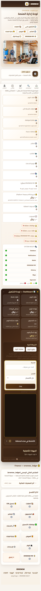 | 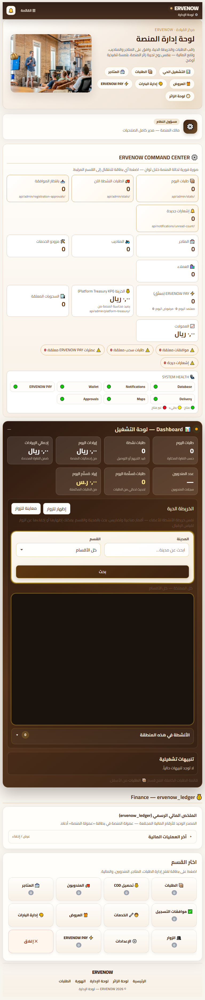 | 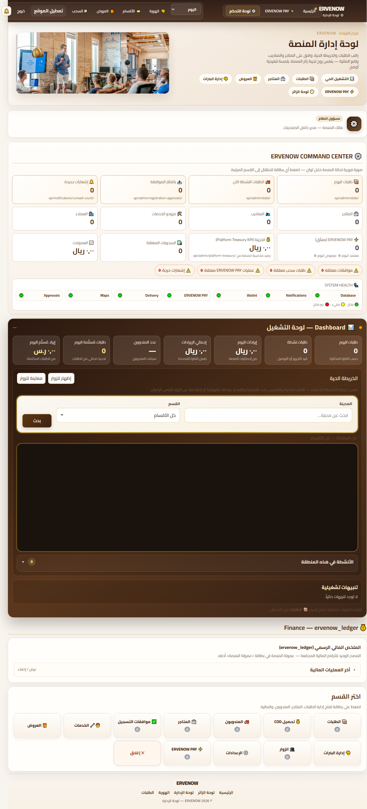 |
| Driver | 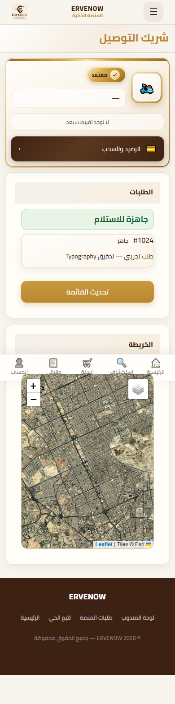 | 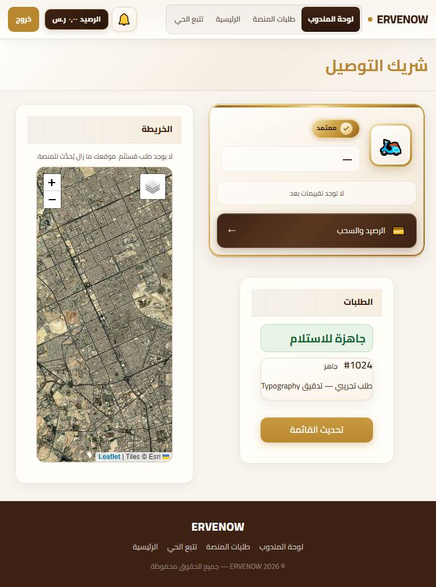 | 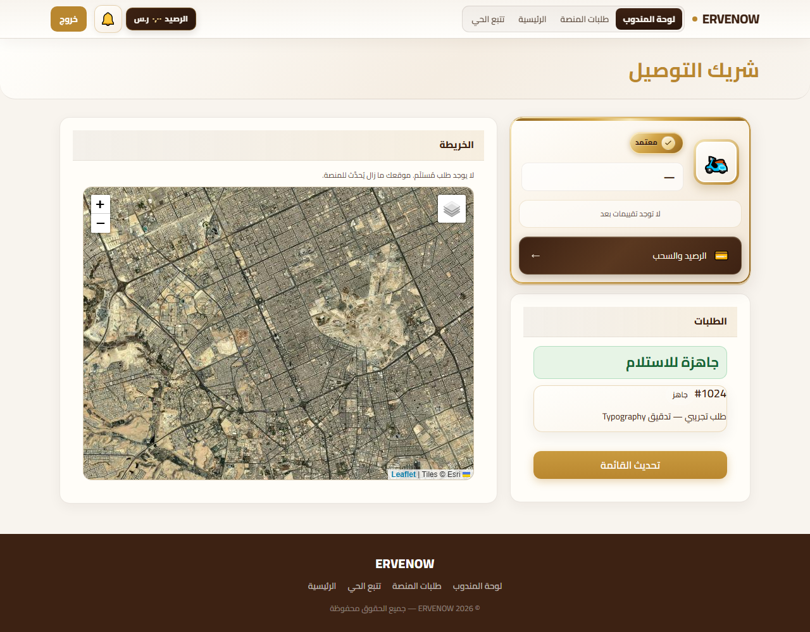 |
| Store | 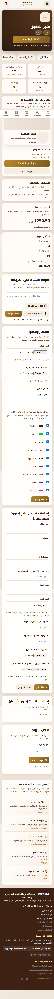 | 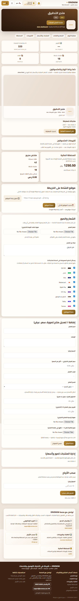 | 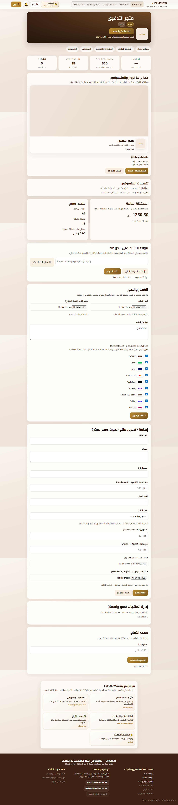 |
| Provider | 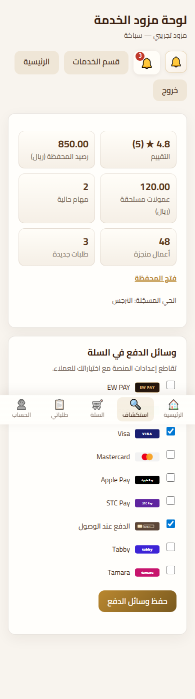 | 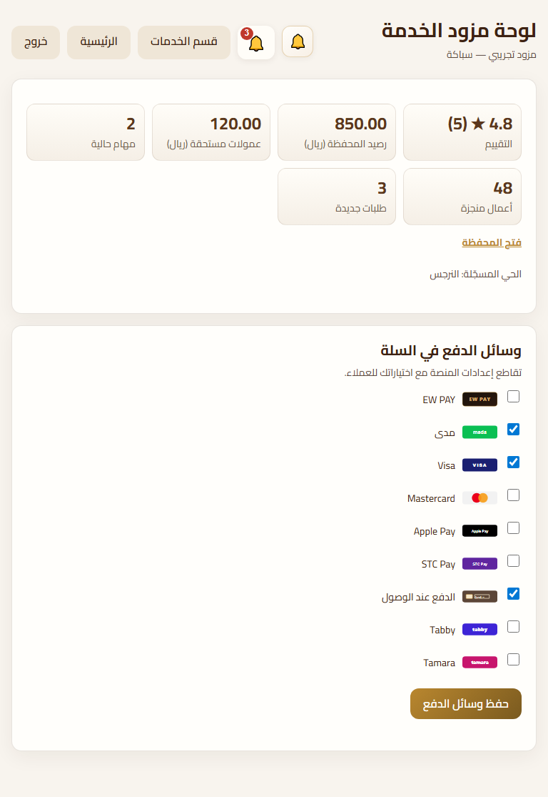 | 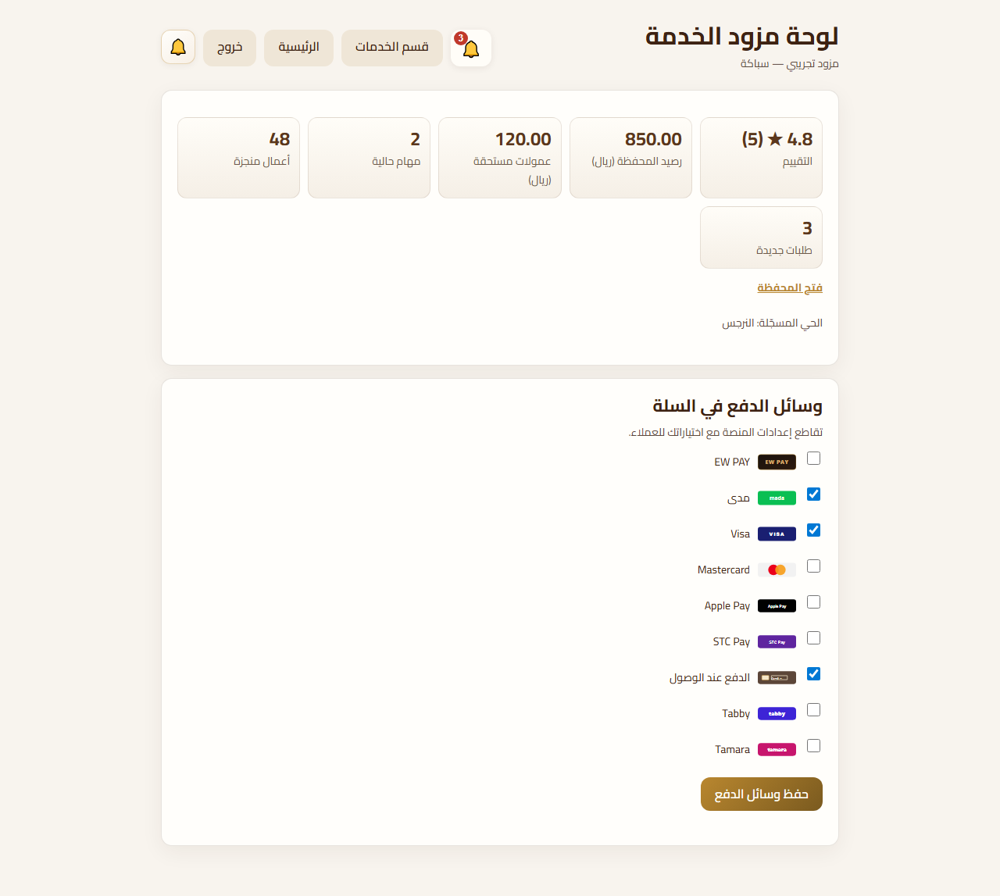 |

## Screenshots — Before

| Page | Mobile 390 | Tablet 768 | Desktop 1280 |
|------|------------|------------|--------------|
| Admin |  | 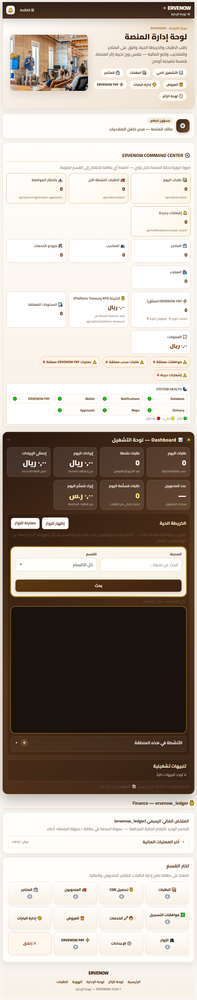 | 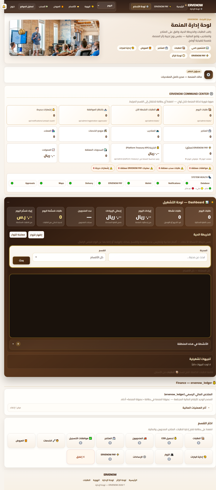 |
| Driver | 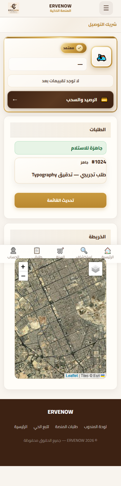 | 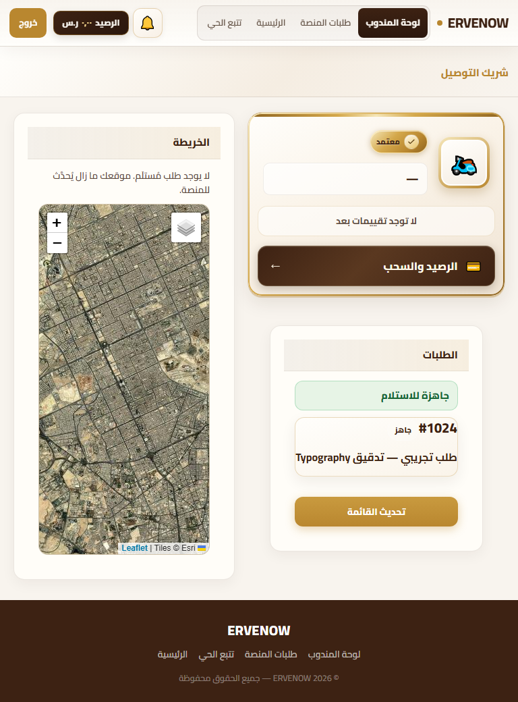 | 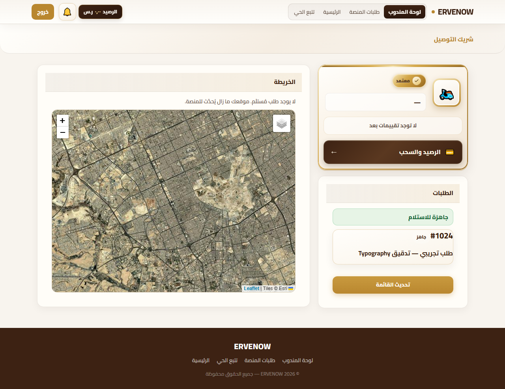 |
| Store | 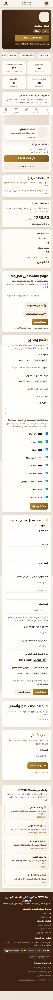 | 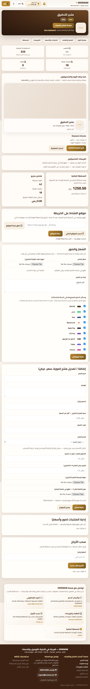 | 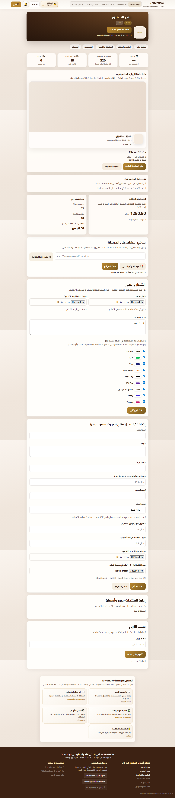 |
| Provider | 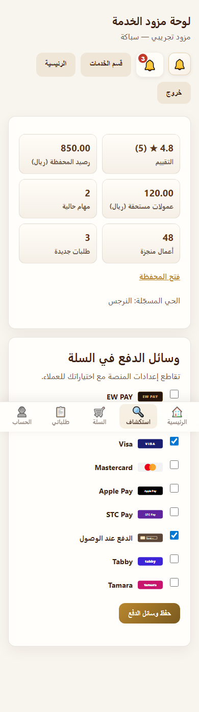 | 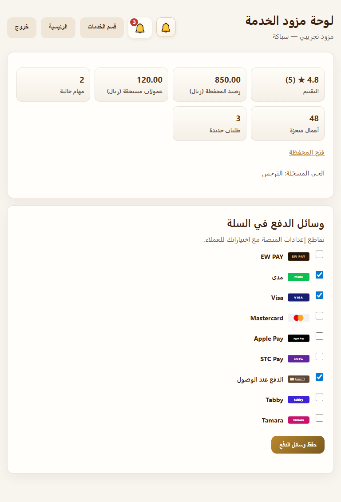 | 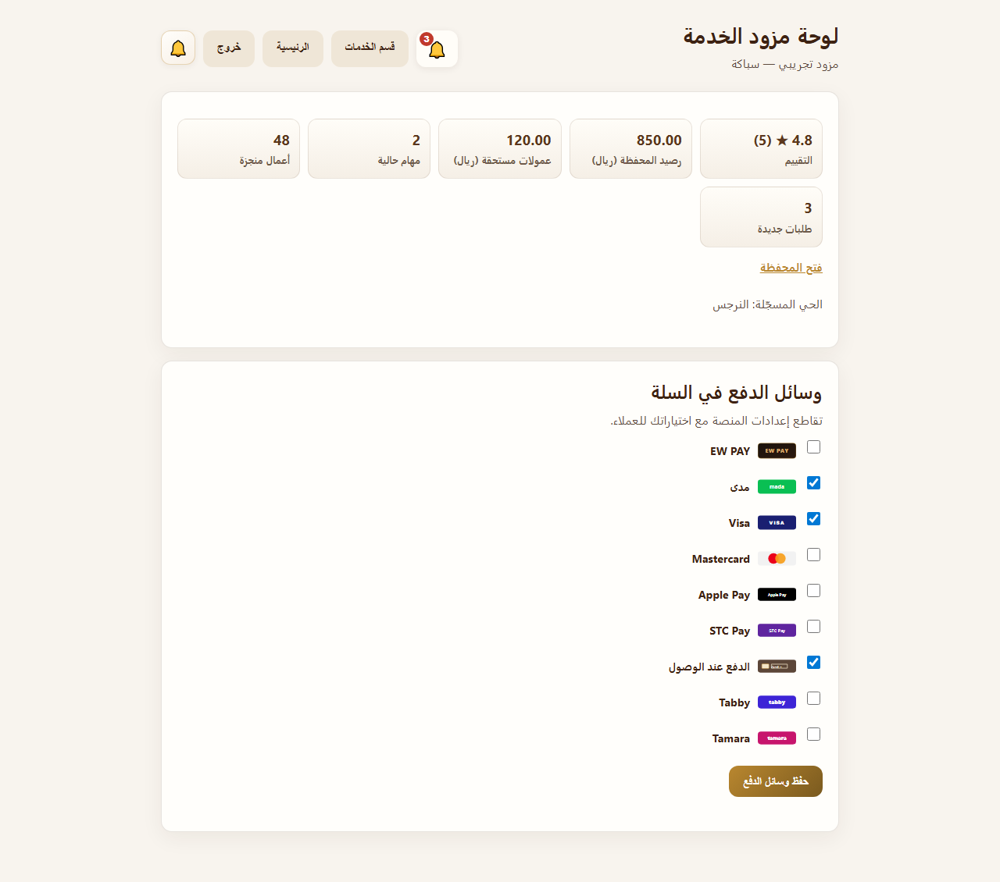 |

## Computed Typography (After)

### admin@390

```json
{
  "pageTitle": {
    "fontSize": "24px",
    "fontWeight": "700",
    "lineHeight": "32.4px"
  },
  "sectionH2": {
    "fontSize": "18px",
    "fontWeight": "700",
    "lineHeight": "24.3px"
  },
  "kpiValue": {
    "fontSize": "20px",
    "fontWeight": "700",
    "lineHeight": "25px"
  },
  "kpiLabel": {
    "fontSize": "14px",
    "fontWeight": "500",
    "lineHeight": "20.3px"
  },
  "tableHead": {
    "fontSize": "14px",
    "fontWeight": "700",
    "lineHeight": "21px"
  },
  "tableCell": {
    "fontSize": "14px",
    "fontWeight": "500",
    "lineHeight": "21px"
  },
  "badge": null,
  "alert": {
    "fontSize": "14px",
    "fontWeight": "600",
    "lineHeight": "20.3px"
  },
  "secondary": {
    "fontSize": "14px",
    "fontWeight": "500",
    "lineHeight": "20.3px"
  },
  "_fontSizeHistogram": [
    {
      "size": "11.52px",
      "count": 4
    },
    {
      "size": "12px",
      "count": 36
    },
    {
      "size": "12.48px",
      "count": 7
    },
    {
      "size": "12.8px",
      "count": 12
    },
    {
      "size": "13.12px",
      "count": 43
    },
    {
      "size": "13.3333px",
      "count": 15
    },
    {
      "size": "13.6px",
      "count": 12
    },
    {
      "size": "13.76px",
      "count": 14
    },
    {
      "size": "14px",
      "count": 98
    },
    {
      "size": "14.08px",
      "count": 47
    },
    {
      "size": "14.4px",
      "count": 4
    },
    {
      "size": "14.72px",
      "count": 2
    },
    {
      "size": "15.2px",
      "count": 4
    },
    {
      "size": "16px",
      "count": 236
    },
    {
      "size": "16.8px",
      "count": 3
    },
    {
      "size": "17.6px",
      "count": 4
    },
    {
      "size": "18px",
      "count": 19
    },
    {
      "size": "18.72px",
      "count": 4
    },
    {
      "size": "19.2px",
      "count": 14
    },
    {
      "size": "20px",
      "count": 27
    },
    {
      "size": "21.6px",
      "count": 3
    },
    {
      "size": "24px",
      "count": 2
    }
  ],
  "_layout": {
    "mainW": 370,
    "viewport": 390
  }
}
```

### driver@390

```json
{
  "pageTitle": {
    "fontSize": "24px",
    "fontWeight": "700",
    "lineHeight": "32.4px"
  },
  "sectionH2": {
    "fontSize": "18px",
    "fontWeight": "700",
    "lineHeight": "24.3px"
  },
  "kpiValue": null,
  "kpiLabel": null,
  "tableHead": null,
  "tableCell": null,
  "badge": {
    "fontSize": "12px",
    "fontWeight": "600",
    "lineHeight": "17.4px"
  },
  "alert": null,
  "secondary": null,
  "_fontSizeHistogram": [
    {
      "size": "10.88px",
      "count": 1
    },
    {
      "size": "11.52px",
      "count": 5
    },
    {
      "size": "12px",
      "count": 47
    },
    {
      "size": "12.48px",
      "count": 5
    },
    {
      "size": "12.8px",
      "count": 8
    },
    {
      "size": "13px",
      "count": 6
    },
    {
      "size": "14px",
      "count": 3
    },
    {
      "size": "14.08px",
      "count": 5
    },
    {
      "size": "14.4px",
      "count": 1
    },
    {
      "size": "14.72px",
      "count": 1
    },
    {
      "size": "15.2px",
      "count": 2
    },
    {
      "size": "16px",
      "count": 37
    },
    {
      "size": "17.6px",
      "count": 2
    },
    {
      "size": "18px",
      "count": 1
    },
    {
      "size": "19.2px",
      "count": 7
    },
    {
      "size": "21.6px",
      "count": 1
    },
    {
      "size": "22px",
      "count": 4
    },
    {
      "size": "24px",
      "count": 1
    },
    {
      "size": "26.4px",
      "count": 1
    }
  ],
  "_layout": {
    "mainW": 390,
    "viewport": 390
  }
}
```

### store@390

```json
{
  "pageTitle": {
    "fontSize": "24px",
    "fontWeight": "700",
    "lineHeight": "32.4px"
  },
  "sectionH2": {
    "fontSize": "18px",
    "fontWeight": "700",
    "lineHeight": "24.3px"
  },
  "kpiValue": {
    "fontSize": "20px",
    "fontWeight": "700",
    "lineHeight": "25px"
  },
  "kpiLabel": {
    "fontSize": "14px",
    "fontWeight": "500",
    "lineHeight": "20.3px"
  },
  "tableHead": null,
  "tableCell": null,
  "badge": {
    "fontSize": "12px",
    "fontWeight": "600",
    "lineHeight": "17.4px"
  },
  "alert": null,
  "secondary": {
    "fontSize": "14px",
    "fontWeight": "500",
    "lineHeight": "20.3px"
  },
  "_fontSizeHistogram": [
    {
      "size": "10.88px",
      "count": 2
    },
    {
      "size": "12px",
      "count": 16
    },
    {
      "size": "12.48px",
      "count": 11
    },
    {
      "size": "12.8px",
      "count": 5
    },
    {
      "size": "13.12px",
      "count": 9
    },
    {
      "size": "13.44px",
      "count": 12
    },
    {
      "size": "13.6px",
      "count": 14
    },
    {
      "size": "13.76px",
      "count": 3
    },
    {
      "size": "14px",
      "count": 53
    },
    {
      "size": "14.08px",
      "count": 15
    },
    {
      "size": "14.72px",
      "count": 4
    },
    {
      "size": "15.2px",
      "count": 7
    },
    {
      "size": "16px",
      "count": 116
    },
    {
      "size": "16.8px",
      "count": 2
    },
    {
      "size": "17.6px",
      "count": 2
    },
    {
      "size": "18px",
      "count": 4
    },
    {
      "size": "18.4px",
      "count": 1
    },
    {
      "size": "19.2px",
      "count": 7
    },
    {
      "size": "20px",
      "count": 4
    },
    {
      "size": "21.6px",
      "count": 4
    },
    {
      "size": "24px",
      "count": 6
    },
    {
      "size": "32px",
      "count": 1
    }
  ],
  "_layout": {
    "mainW": 390,
    "viewport": 390
  }
}
```

### provider@390

```json
{
  "pageTitle": {
    "fontSize": "24px",
    "fontWeight": "700",
    "lineHeight": "32.4px"
  },
  "sectionH2": {
    "fontSize": "18px",
    "fontWeight": "700",
    "lineHeight": "24.3px"
  },
  "kpiValue": {
    "fontSize": "20px",
    "fontWeight": "700",
    "lineHeight": "25px"
  },
  "kpiLabel": {
    "fontSize": "14px",
    "fontWeight": "500",
    "lineHeight": "20.3px"
  },
  "tableHead": null,
  "tableCell": null,
  "badge": {
    "fontSize": "12px",
    "fontWeight": "600",
    "lineHeight": "17.4px"
  },
  "alert": null,
  "secondary": {
    "fontSize": "14px",
    "fontWeight": "500",
    "lineHeight": "20.3px"
  },
  "_fontSizeHistogram": [
    {
      "size": "12px",
      "count": 11
    },
    {
      "size": "14px",
      "count": 41
    },
    {
      "size": "16px",
      "count": 43
    },
    {
      "size": "18px",
      "count": 2
    },
    {
      "size": "19.2px",
      "count": 6
    },
    {
      "size": "20px",
      "count": 7
    },
    {
      "size": "24px",
      "count": 1
    }
  ],
  "_layout": {
    "mainW": 390,
    "viewport": 390
  }
}
```

### admin@768

```json
{
  "pageTitle": {
    "fontSize": "28px",
    "fontWeight": "700",
    "lineHeight": "37.8px"
  },
  "sectionH2": {
    "fontSize": "20px",
    "fontWeight": "700",
    "lineHeight": "27px"
  },
  "kpiValue": {
    "fontSize": "24px",
    "fontWeight": "700",
    "lineHeight": "30px"
  },
  "kpiLabel": {
    "fontSize": "14px",
    "fontWeight": "500",
    "lineHeight": "20.3px"
  },
  "tableHead": {
    "fontSize": "14px",
    "fontWeight": "700",
    "lineHeight": "21px"
  },
  "tableCell": {
    "fontSize": "14px",
    "fontWeight": "500",
    "lineHeight": "21px"
  },
  "badge": null,
  "alert": {
    "fontSize": "14px",
    "fontWeight": "600",
    "lineHeight": "20.3px"
  },
  "secondary": {
    "fontSize": "14px",
    "fontWeight": "500",
    "lineHeight": "20.3px"
  },
  "_fontSizeHistogram": [
    {
      "size": "11.52px",
      "count": 5
    },
    {
      "size": "12px",
      "count": 26
    },
    {
      "size": "12.48px",
      "count": 4
    },
    {
      "size": "12.8px",
      "count": 7
    },
    {
      "size": "13.12px",
      "count": 48
    },
    {
      "size": "13.3333px",
      "count": 15
    },
    {
      "size": "13.6px",
      "count": 12
    },
    {
      "size": "13.76px",
      "count": 16
    },
    {
      "size": "14px",
      "count": 98
    },
    {
      "size": "14.08px",
      "count": 47
    },
    {
      "size": "14.4px",
      "count": 5
    },
    {
      "size": "14.72px",
      "count": 2
    },
    {
      "size": "15.2px",
      "count": 4
    },
    {
      "size": "16px",
      "count": 232
    },
    {
      "size": "16.8px",
      "count": 1
    },
    {
      "size": "17.6px",
      "count": 4
    },
    {
      "size": "18px",
      "count": 3
    },
    {
      "size": "18.72px",
      "count": 4
    },
    {
      "size": "19.2px",
      "count": 9
    },
    {
      "size": "20px",
      "count": 20
    },
    {
      "size": "20.48px",
      "count": 2
    },
    {
      "size": "21.6px",
      "count": 3
    },
    {
      "size": "24px",
      "count": 27
    },
    {
      "size": "28px",
      "count": 1
    }
  ],
  "_layout": {
    "mainW": 748,
    "viewport": 768
  }
}
```

### driver@768

```json
{
  "pageTitle": {
    "fontSize": "28px",
    "fontWeight": "700",
    "lineHeight": "37.8px"
  },
  "sectionH2": {
    "fontSize": "20px",
    "fontWeight": "700",
    "lineHeight": "27px"
  },
  "kpiValue": null,
  "kpiLabel": null,
  "tableHead": null,
  "tableCell": null,
  "badge": {
    "fontSize": "12px",
    "fontWeight": "600",
    "lineHeight": "17.4px"
  },
  "alert": null,
  "secondary": null,
  "_fontSizeHistogram": [
    {
      "size": "11.52px",
      "count": 5
    },
    {
      "size": "12px",
      "count": 37
    },
    {
      "size": "12.48px",
      "count": 5
    },
    {
      "size": "12.8px",
      "count": 1
    },
    {
      "size": "13px",
      "count": 6
    },
    {
      "size": "13.12px",
      "count": 4
    },
    {
      "size": "13.6px",
      "count": 4
    },
    {
      "size": "14px",
      "count": 3
    },
    {
      "size": "14.08px",
      "count": 1
    },
    {
      "size": "15.2px",
      "count": 2
    },
    {
      "size": "16px",
      "count": 35
    },
    {
      "size": "17.6px",
      "count": 1
    },
    {
      "size": "18px",
      "count": 1
    },
    {
      "size": "19.2px",
      "count": 2
    },
    {
      "size": "20px",
      "count": 2
    },
    {
      "size": "20.48px",
      "count": 2
    },
    {
      "size": "22px",
      "count": 4
    },
    {
      "size": "28px",
      "count": 1
    },
    {
      "size": "33.6px",
      "count": 1
    }
  ],
  "_layout": {
    "mainW": 768,
    "viewport": 768
  }
}
```

### store@768

```json
{
  "pageTitle": {
    "fontSize": "28px",
    "fontWeight": "700",
    "lineHeight": "37.8px"
  },
  "sectionH2": {
    "fontSize": "20px",
    "fontWeight": "700",
    "lineHeight": "27px"
  },
  "kpiValue": {
    "fontSize": "24px",
    "fontWeight": "700",
    "lineHeight": "30px"
  },
  "kpiLabel": {
    "fontSize": "14px",
    "fontWeight": "500",
    "lineHeight": "20.3px"
  },
  "tableHead": null,
  "tableCell": null,
  "badge": {
    "fontSize": "12px",
    "fontWeight": "600",
    "lineHeight": "17.4px"
  },
  "alert": null,
  "secondary": {
    "fontSize": "14px",
    "fontWeight": "500",
    "lineHeight": "20.3px"
  },
  "_fontSizeHistogram": [
    {
      "size": "10.88px",
      "count": 2
    },
    {
      "size": "11.52px",
      "count": 1
    },
    {
      "size": "12px",
      "count": 6
    },
    {
      "size": "12.48px",
      "count": 13
    },
    {
      "size": "12.8px",
      "count": 1
    },
    {
      "size": "13.12px",
      "count": 14
    },
    {
      "size": "13.44px",
      "count": 12
    },
    {
      "size": "13.6px",
      "count": 14
    },
    {
      "size": "13.76px",
      "count": 3
    },
    {
      "size": "14px",
      "count": 53
    },
    {
      "size": "14.08px",
      "count": 10
    },
    {
      "size": "14.72px",
      "count": 3
    },
    {
      "size": "15.2px",
      "count": 7
    },
    {
      "size": "16px",
      "count": 113
    },
    {
      "size": "16.8px",
      "count": 2
    },
    {
      "size": "17.6px",
      "count": 2
    },
    {
      "size": "18.4px",
      "count": 1
    },
    {
      "size": "19.2px",
      "count": 2
    },
    {
      "size": "20px",
      "count": 4
    },
    {
      "size": "20.48px",
      "count": 2
    },
    {
      "size": "21.6px",
      "count": 3
    },
    {
      "size": "24px",
      "count": 9
    },
    {
      "size": "28px",
      "count": 1
    },
    {
      "size": "32px",
      "count": 1
    }
  ],
  "_layout": {
    "mainW": 768,
    "viewport": 768
  }
}
```

### provider@768

```json
{
  "pageTitle": {
    "fontSize": "28px",
    "fontWeight": "700",
    "lineHeight": "37.8px"
  },
  "sectionH2": {
    "fontSize": "20px",
    "fontWeight": "700",
    "lineHeight": "27px"
  },
  "kpiValue": {
    "fontSize": "24px",
    "fontWeight": "700",
    "lineHeight": "30px"
  },
  "kpiLabel": {
    "fontSize": "14px",
    "fontWeight": "500",
    "lineHeight": "20.3px"
  },
  "tableHead": null,
  "tableCell": null,
  "badge": {
    "fontSize": "12px",
    "fontWeight": "600",
    "lineHeight": "17.4px"
  },
  "alert": null,
  "secondary": {
    "fontSize": "14px",
    "fontWeight": "500",
    "lineHeight": "20.3px"
  },
  "_fontSizeHistogram": [
    {
      "size": "12px",
      "count": 1
    },
    {
      "size": "14px",
      "count": 41
    },
    {
      "size": "16px",
      "count": 42
    },
    {
      "size": "19.2px",
      "count": 1
    },
    {
      "size": "20px",
      "count": 3
    },
    {
      "size": "24px",
      "count": 6
    },
    {
      "size": "28px",
      "count": 1
    }
  ],
  "_layout": {
    "mainW": 768,
    "viewport": 768
  }
}
```

### admin@1280

```json
{
  "pageTitle": {
    "fontSize": "32px",
    "fontWeight": "700",
    "lineHeight": "43.2px"
  },
  "sectionH2": {
    "fontSize": "22px",
    "fontWeight": "700",
    "lineHeight": "29.7px"
  },
  "kpiValue": {
    "fontSize": "24px",
    "fontWeight": "700",
    "lineHeight": "30px"
  },
  "kpiLabel": {
    "fontSize": "14px",
    "fontWeight": "500",
    "lineHeight": "20.3px"
  },
  "tableHead": {
    "fontSize": "14px",
    "fontWeight": "700",
    "lineHeight": "21px"
  },
  "tableCell": {
    "fontSize": "14px",
    "fontWeight": "500",
    "lineHeight": "21px"
  },
  "badge": null,
  "alert": {
    "fontSize": "14px",
    "fontWeight": "600",
    "lineHeight": "20.3px"
  },
  "secondary": {
    "fontSize": "14px",
    "fontWeight": "500",
    "lineHeight": "20.3px"
  },
  "_fontSizeHistogram": [
    {
      "size": "11.52px",
      "count": 5
    },
    {
      "size": "12px",
      "count": 26
    },
    {
      "size": "12.48px",
      "count": 4
    },
    {
      "size": "12.8px",
      "count": 11
    },
    {
      "size": "13.12px",
      "count": 43
    },
    {
      "size": "13.3333px",
      "count": 18
    },
    {
      "size": "13.44px",
      "count": 6
    },
    {
      "size": "13.6px",
      "count": 12
    },
    {
      "size": "13.76px",
      "count": 7
    },
    {
      "size": "14px",
      "count": 98
    },
    {
      "size": "14.08px",
      "count": 47
    },
    {
      "size": "14.4px",
      "count": 5
    },
    {
      "size": "14.72px",
      "count": 2
    },
    {
      "size": "15.2px",
      "count": 2
    },
    {
      "size": "16px",
      "count": 242
    },
    {
      "size": "16.8px",
      "count": 1
    },
    {
      "size": "17.6px",
      "count": 4
    },
    {
      "size": "18px",
      "count": 3
    },
    {
      "size": "18.72px",
      "count": 4
    },
    {
      "size": "20px",
      "count": 1
    },
    {
      "size": "20.48px",
      "count": 2
    },
    {
      "size": "21.6px",
      "count": 12
    },
    {
      "size": "22px",
      "count": 19
    },
    {
      "size": "24px",
      "count": 27
    },
    {
      "size": "32px",
      "count": 1
    }
  ],
  "_layout": {
    "mainW": 1280,
    "viewport": 1280
  }
}
```

### driver@1280

```json
{
  "pageTitle": {
    "fontSize": "32px",
    "fontWeight": "700",
    "lineHeight": "43.2px"
  },
  "sectionH2": {
    "fontSize": "22px",
    "fontWeight": "700",
    "lineHeight": "29.7px"
  },
  "kpiValue": null,
  "kpiLabel": null,
  "tableHead": null,
  "tableCell": null,
  "badge": {
    "fontSize": "12px",
    "fontWeight": "600",
    "lineHeight": "17.4px"
  },
  "alert": null,
  "secondary": null,
  "_fontSizeHistogram": [
    {
      "size": "11.52px",
      "count": 5
    },
    {
      "size": "12px",
      "count": 43
    },
    {
      "size": "12.48px",
      "count": 5
    },
    {
      "size": "13px",
      "count": 6
    },
    {
      "size": "13.44px",
      "count": 5
    },
    {
      "size": "13.6px",
      "count": 4
    },
    {
      "size": "14px",
      "count": 3
    },
    {
      "size": "14.08px",
      "count": 1
    },
    {
      "size": "15.2px",
      "count": 3
    },
    {
      "size": "16px",
      "count": 34
    },
    {
      "size": "17.6px",
      "count": 1
    },
    {
      "size": "18px",
      "count": 1
    },
    {
      "size": "19.2px",
      "count": 2
    },
    {
      "size": "20px",
      "count": 1
    },
    {
      "size": "20.48px",
      "count": 2
    },
    {
      "size": "22px",
      "count": 5
    },
    {
      "size": "32px",
      "count": 2
    }
  ],
  "_layout": {
    "mainW": 1280,
    "viewport": 1280
  }
}
```

### store@1280

```json
{
  "pageTitle": {
    "fontSize": "32px",
    "fontWeight": "700",
    "lineHeight": "43.2px"
  },
  "sectionH2": {
    "fontSize": "22px",
    "fontWeight": "700",
    "lineHeight": "29.7px"
  },
  "kpiValue": {
    "fontSize": "24px",
    "fontWeight": "700",
    "lineHeight": "30px"
  },
  "kpiLabel": {
    "fontSize": "14px",
    "fontWeight": "500",
    "lineHeight": "20.3px"
  },
  "tableHead": null,
  "tableCell": null,
  "badge": {
    "fontSize": "12px",
    "fontWeight": "600",
    "lineHeight": "17.4px"
  },
  "alert": null,
  "secondary": {
    "fontSize": "14px",
    "fontWeight": "500",
    "lineHeight": "20.3px"
  },
  "_fontSizeHistogram": [
    {
      "size": "10.88px",
      "count": 2
    },
    {
      "size": "11.52px",
      "count": 1
    },
    {
      "size": "12px",
      "count": 6
    },
    {
      "size": "12.48px",
      "count": 13
    },
    {
      "size": "13.12px",
      "count": 9
    },
    {
      "size": "13.44px",
      "count": 18
    },
    {
      "size": "13.6px",
      "count": 14
    },
    {
      "size": "13.76px",
      "count": 3
    },
    {
      "size": "14px",
      "count": 53
    },
    {
      "size": "14.08px",
      "count": 10
    },
    {
      "size": "14.72px",
      "count": 3
    },
    {
      "size": "15.2px",
      "count": 7
    },
    {
      "size": "16px",
      "count": 114
    },
    {
      "size": "16.8px",
      "count": 2
    },
    {
      "size": "17.6px",
      "count": 1
    },
    {
      "size": "18.4px",
      "count": 1
    },
    {
      "size": "19.2px",
      "count": 2
    },
    {
      "size": "20.48px",
      "count": 2
    },
    {
      "size": "21.6px",
      "count": 3
    },
    {
      "size": "22px",
      "count": 4
    },
    {
      "size": "24px",
      "count": 9
    },
    {
      "size": "32px",
      "count": 2
    }
  ],
  "_layout": {
    "mainW": 1280,
    "viewport": 1280
  }
}
```

### provider@1280

```json
{
  "pageTitle": {
    "fontSize": "32px",
    "fontWeight": "700",
    "lineHeight": "43.2px"
  },
  "sectionH2": {
    "fontSize": "22px",
    "fontWeight": "700",
    "lineHeight": "29.7px"
  },
  "kpiValue": {
    "fontSize": "24px",
    "fontWeight": "700",
    "lineHeight": "30px"
  },
  "kpiLabel": {
    "fontSize": "14px",
    "fontWeight": "500",
    "lineHeight": "20.3px"
  },
  "tableHead": null,
  "tableCell": null,
  "badge": {
    "fontSize": "12px",
    "fontWeight": "600",
    "lineHeight": "17.4px"
  },
  "alert": null,
  "secondary": {
    "fontSize": "14px",
    "fontWeight": "500",
    "lineHeight": "20.3px"
  },
  "_fontSizeHistogram": [
    {
      "size": "12px",
      "count": 1
    },
    {
      "size": "14px",
      "count": 41
    },
    {
      "size": "16px",
      "count": 42
    },
    {
      "size": "19.2px",
      "count": 1
    },
    {
      "size": "20px",
      "count": 1
    },
    {
      "size": "22px",
      "count": 2
    },
    {
      "size": "24px",
      "count": 6
    },
    {
      "size": "32px",
      "count": 1
    }
  ],
  "_layout": {
    "mainW": 900,
    "viewport": 1280
  }
}
```

## Before → After (key roles)

| Viewport | Role | Before | After |
|----------|------|--------|-------|
| admin@390 | pageTitle | 21.6px | 24px |
| admin@390 | sectionH2 | 16px | 18px |
| admin@390 | kpiValue | 19.52px | 20px |
| admin@390 | kpiLabel | 13.76px | 14px |
| admin@390 | tableHead | 14.08px | 14px |
| admin@390 | tableCell | 14.08px | 14px |
| admin@390 | alert | 13.3333px | 14px |
| admin@390 | secondary | 14.4px | 14px |
| driver@390 | pageTitle | 13.6px | 24px |
| driver@390 | sectionH2 | 14.72px | 18px |
| driver@390 | badge | 11.52px | 12px |
| store@390 | pageTitle | 18.4px | 24px |
| store@390 | sectionH2 | 16.8px | 18px |
| store@390 | kpiValue | 20px | 20px |
| store@390 | kpiLabel | 12.48px | 14px |
| store@390 | badge | 12.48px | 12px |
| store@390 | secondary | 15.2px | 14px |
| provider@390 | pageTitle | 21.6px | 24px |
| provider@390 | sectionH2 | 24px | 18px |
| provider@390 | kpiValue | 18.4px | 20px |
| provider@390 | kpiLabel | 13.12px | 14px |
| provider@390 | badge | 11.2px | 12px |
| provider@390 | secondary | 15.2px | 14px |
| admin@768 | pageTitle | 29.6px | 28px |
| admin@768 | sectionH2 | 17.92px | 20px |
| admin@768 | kpiValue | 19.52px | 24px |
| admin@768 | kpiLabel | 13.76px | 14px |
| admin@768 | tableHead | 14.08px | 14px |
| admin@768 | tableCell | 14.08px | 14px |
| admin@768 | alert | 13.3333px | 14px |
| admin@768 | secondary | 16px | 14px |
| driver@768 | pageTitle | 14.976px | 28px |
| driver@768 | sectionH2 | 14.72px | 20px |
| driver@768 | badge | 11.52px | 12px |
| store@768 | pageTitle | 23.2px | 28px |
| store@768 | sectionH2 | 16.8px | 20px |
| store@768 | kpiValue | 24px | 24px |
| store@768 | kpiLabel | 12.48px | 14px |
| store@768 | badge | 12.48px | 12px |
| store@768 | secondary | 15.2px | 14px |
| provider@768 | pageTitle | 28px | 28px |
| provider@768 | sectionH2 | 24px | 20px |
| provider@768 | kpiValue | 18.4px | 24px |
| provider@768 | kpiLabel | 13.12px | 14px |
| provider@768 | badge | 11.2px | 12px |
| provider@768 | secondary | 15.2px | 14px |
| admin@1280 | pageTitle | 29.6px | 32px |
| admin@1280 | sectionH2 | 17.92px | 22px |
| admin@1280 | kpiValue | 19.52px | 24px |
| admin@1280 | kpiLabel | 13.76px | 14px |
| admin@1280 | tableHead | 14.72px | 14px |
| admin@1280 | tableCell | 14.72px | 14px |
| admin@1280 | alert | 13.3333px | 14px |
| admin@1280 | secondary | 16px | 14px |
| driver@1280 | pageTitle | 14.976px | 32px |
| driver@1280 | sectionH2 | 14.72px | 22px |
| driver@1280 | badge | 11.52px | 12px |
| store@1280 | pageTitle | 23.2px | 32px |
| store@1280 | sectionH2 | 16.8px | 22px |
| store@1280 | kpiValue | 24px | 24px |
| store@1280 | kpiLabel | 12.48px | 14px |
| store@1280 | badge | 12.48px | 12px |
| store@1280 | secondary | 15.2px | 14px |
| provider@1280 | pageTitle | 28px | 32px |
| provider@1280 | sectionH2 | 24px | 22px |
| provider@1280 | kpiValue | 18.4px | 24px |
| provider@1280 | kpiLabel | 13.12px | 14px |
| provider@1280 | badge | 11.2px | 12px |
| provider@1280 | secondary | 15.2px | 14px |

## Font-size diversity (PR4 scope)

| | Unique sizes |
|--|--------------|
| Before | 38 |
| After | 32 |

## Layout & Operations Checks

- Colors: unchanged
- Layout / grid / operational cards: unchanged
- Tables structure: unchanged
- KPI data / stats logic: unchanged
- Order workflows: unchanged

## Files

- `public/assets/design-system/erv-typography-pr1-tokens.css` (reused)
- `public/assets/design-system/erv-typography-operations-pr4-tokens.css`
- `public/assets/design-system/erv-typography-operations-pr4.css`
- Dashboard pages: admin · driver · store · provider
